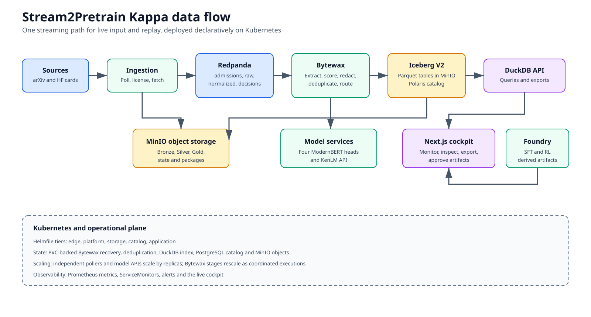

# Stream2Pretrain

Stream2Pretrain is a Kubernetes-native pipeline that turns continuous AI research sources into an auditable training-data corpus. It separates permissive pretraining data from grey-area and unlicensed inputs that may only ground derived post-training artifacts, applies source-aware quality rules, stores every decision in an Iceberg lakehouse, and serves the results through a monitoring cockpit.

## 1. Use Case and Motivation

Large language model training needs current, high-quality material. AI research changes continuously across papers and model or dataset documentation. A periodic manual export becomes stale quickly and gives weak evidence for why a document was accepted or rejected.

Stream2Pretrain solves this as a streaming curation service. Its users are data engineers and researchers who need a reproducible training-data view rather than another web crawler. The service preserves raw input, records every policy decision, and exposes only clean records as training output.

The deployed content adapters cover:

- arXiv full papers discovered through OAI-PMH and four RSS categories
- immutable README-blob revisions from Hugging Face model and dataset cards

Internal discovery envelopes do not appear as sources, documents, acceptances,
or quarantines.

The DHBW profile runs these content paths on CPU workers. Cloud validation uses
an isolated synthetic record that cannot enter the production corpus.

This is a Big Data problem because the input is continuous, heterogeneous, and unbounded. The deployed course system uses bounded resources, while its architecture separates the event log, object storage, processing state, table catalog, and query service so the same data path can grow without replacing the processing model.

## 2. Data Characteristics

The relevant Big Data characteristics are:

| Characteristic | Project meaning |
|---|---|
| Volume | Raw pages, extracted text, decisions, and table snapshots accumulate continuously. Measured values are reported separately from capacity estimates. |
| Velocity | Pollers create a live stream. Feed updates arrive in bursts rather than at a fixed rate. Redpanda buffers these bursts. |
| Variety | The pipeline handles HTML, PDF fallback, metadata, and Markdown documentation. Each format carries different extraction and quality signals. |
| Veracity | Near duplicates, personal data, extraction failures, missing licenses, and low-quality pages must remain visible as explicit decisions. |
| Value | Accepted records become a queryable training export. Rejected records remain useful for auditing and policy improvement. |

The frozen submission evidence records 39,743 durable decisions and 10,337
training-export documents across all policy generations. A separate bounded
27.5-minute measurement recorded 113 normalized events and 32 decision events.
The backlog grew during that interval, so sustained catch-up capacity is not
demonstrated. Event counts include replay and are not counts of new unique
documents.

## 3. Architecture Decision

Stream2Pretrain uses a Kappa architecture. Live records enter one streaming path and pass through the same transformations. There is no separate historical batch implementation. Reprocessing uses retained Redpanda events and versioned Iceberg decisions.



A companion Mermaid definition is included in
[`docs/architecture.mmd`](docs/architecture.mmd). The SVG remains visible when
the ZIP is read without Mermaid support.

The project makes four justified deviations from a conventional lecture stack:

1. Redpanda provides the Kafka API with a smaller operational surface for this cluster.
2. Bytewax keeps the stream logic in Python, where the extraction and classifier libraries already live.
3. MinIO replaces HDFS because the inputs and scientific artifacts are naturally object-shaped.
4. Iceberg V2 with Polaris provides table snapshots, schema evolution, and vendor-neutral catalog access.

These choices support the use case directly. They are not included only to increase the number of technologies.

Architecture references include the original [Kappa Architecture proposal](https://www.oreilly.com/radar/questioning-the-lambda-architecture/), the [Redpanda architecture guide](https://docs.redpanda.com/current/get-started/architecture/), the [Bytewax project documentation](https://github.com/bytewax/bytewax), and the [Apache Iceberg specification](https://iceberg.apache.org/spec/). The repository also retains the course material used for the deployment and storage decisions in [`lecture_slides/04 - Container Orchestration.md`](lecture_slides/04%20-%20Container%20Orchestration.md) and [`lecture_slides/04c - Storage and Networking.md`](lecture_slides/04c%20-%20Storage%20and%20Networking.md).

## 4. Components and Data Flow

| Component | Technology | Responsibility and rationale |
|---|---|---|
| Source pollers | Python and async HTTP | Discover new records while respecting source-specific formats and rate limits. |
| Licence admission | Redpanda and Iceberg | Log an immutable pretraining, transform-only, or quarantine route before any document-body request. |
| Bronze writer | MinIO | Preserve immutable compressed source material before transformation. |
| Event bus | Redpanda | Decouple ingestion, curation, storage, and replay through named topics. |
| Fetcher | Bytewax and Resiliparse | Load Bronze bytes, extract text and scientific structure, then emit normalized records. |
| Curator | Stateful Bytewax flow | Apply language, quality, PII, duplication, and routing policies with durable recovery and global dedup state. |
| Iceberg writer | PyIceberg | Persist all decisions and the accepted subset as Parquet-backed Iceberg tables. |
| Catalog | Apache Polaris | Resolve table metadata and snapshots through the Iceberg REST protocol. |
| Query service | DuckDB API | Read exact Iceberg metadata versions and expose typed read-only endpoints. |
| Web cockpit | Next.js and TanStack Query | Display durable results and operational activity through real API calls. |
| Observability | Prometheus | Scrape service metrics and evaluate workload availability alerts. |

The end-to-end flow is:

1. A poller discovers a content identity. Internal discovery envelopes schedule a full-content worker and produce no corpus decision.
2. The content worker resolves the exact item rights and publishes an immutable pre-fetch decision to `license.admissions`.
3. Permissive and posttrain-only items are compressed into Bronze and published to `raw.fetched`; explicit incompatible rights stop before body fetch.
4. The fetcher repeats the licence check, extracts text, and publishes a `SilverRecord` to `docs.normalized`.
5. The curator produces one auditable decision for every normalized record.
6. Every curation decision is published to `curation.decisions`.
7. Only eligible records are also published to `docs.curated`.
8. The writer persists `license_admissions`, `curation_decisions`, and `curated` as three physical Iceberg tables. The query API combines the first two into the corpus route ledger serving view.
9. DuckDB reads the catalog metadata and the UI displays the result.

The repository is organized by responsibility:

- [`ingest/`](ingest) contains live source adapters and shared ingestion code.
- [`processor/`](processor) contains Bytewax flows, policies, Iceberg persistence, and APIs.
- [`schemas/`](schemas) contains shared Pydantic event contracts.
- [`ui/`](ui) contains the Next.js cockpit.
- [`charts/stream2pretrain/`](charts/stream2pretrain) contains the application Helm chart.
- [`infra/`](infra) contains OpenStack, k3s, Helmfile, and platform configuration.
- [`scripts/`](scripts) contains deployment, bootstrap, smoke, and benchmark tools.
- [`docs/continuous-deployment.md`](docs/continuous-deployment.md) documents the main-branch image build, VPN, and application deployment workflow.
- [`docs/SOURCE_LICENSE_ADMISSION_MATRIX.md`](docs/SOURCE_LICENSE_ADMISSION_MATRIX.md) records the item-level licence resolver and pre-fetch boundary for every live source.
- [`docs/SOURCE_PROCESSING_POLICY.md`](docs/SOURCE_PROCESSING_POLICY.md) records the discovery-versus-content boundary, extraction path, exact classifier revision, non-applicable signals, and Gold reachability for every source.

## 5. Processing Logic

### Transformations

The fetcher turns raw bytes into normalized document records. It extracts readable text, headings, citations, figures, tables, and equations when the source provides them. The curator then creates segment scores and a final route.

We trained four independent ModernBERT-base classifiers on LLM-labeled paper
and card sections, with train/test separation by document. They run on CPU,
score every retained section on a 0-5 scale, and retain confidence and model
provenance for inspection.

| Custom classifier | Purpose | Pipeline use | Held-out section correlation / MAE |
|---|---|---|---|
| arXiv pretraining quality | Usefulness of scientific text | Token-weighted document mean >=3.0 | 0.711 / 0.417 |
| HF pretraining quality | Usefulness of model and dataset documentation | Token-weighted document mean >=3.5 | 0.913 / 0.311 |
| arXiv mathematical reasoning | Mathematical and derivation-rich content | Highlights promising sections for task generation | 0.875 / 0.553 |
| arXiv post-training suitability | Potential for grounded SFT/RL tasks | Mean ranks the daily queue; high sections guide generation | 0.824 / 0.497 |

Correlation is Spearman against the LLM judge, not a downstream training gain.
The held-out split contains 301 papers and 500 cards. Aggregate results and
the training procedure are in [the classifier guide](docs/CLASSIFIERS.md).

Cheap source-specific cleanup and deterministic rejection run first. Both
auxiliary arXiv heads run only after quality passes. Section hints do not
replace the paper supplied to the generator. RSS, OAI and Hub-list envelopes
are discovery only. See [the classifier guide](docs/CLASSIFIERS.md) for exact
input, aggregation and evaluation details.

The DHBW chart fails closed on missing models. Source-quality classifiers and KenLM
run from pinned immutable images behind independently scalable stateless
inference services; Presidio, MinHash, and tokenization stay with the
lightweight stateful curator. Every row records its classifier revision and
backend.

Before these transformations, the shared licence gate records both verbatim
pretraining rights and transform-only post-training rights. Permissive content
can reach pretraining. Grey-area licences, arXiv's non-exclusive distribution
grant, and missing item rights can only reach the derived post-training route.
Explicit incompatible, no-derivatives, contradictory, or provider-prohibited
rights quarantine. The
curator also redacts ordinary contact PII, quarantines high-risk identifiers,
applies licence policy, and performs MinHash near-duplicate detection. Language confidence gates natural-language profiles. Gopher, C4,
and KenLM gates apply only to ordinary web prose, where those
web-derived signals are meaningful.

### Stateful processing

Near-duplicate detection maintains state across documents. Bytewax snapshots
source progress and operator state into the fetcher and curator checkpoint
PVCs. Output is keyed by `doc_id`, so a crash between sink delivery and the
next recovery snapshot can replay a record without creating a second logical
decision. The Iceberg writer also uses the scoring, classifier, and policy
revisions to suppress deterministic replay duplicates.
The processor input batch is explicitly bounded to one record per Kafka
partition so expensive extraction and classification publish and checkpoint
continuously instead of inheriting Bytewax's 1,000-record default.

### Experimental post-training extension

An experimental foundry can turn selected `posttrain_candidate` papers into
grounded SFT trajectories and signed RL-verifiable environments. The same
resumable worker, durable queue, validation gates, MinIO packages, and audit UI
run locally or as a single-writer Kubernetes StatefulSet; the daily path ranks
candidates received in the preceding 24 hours with no fixed paper cap, then
continues until the cohort or provider capacity is exhausted. It generates
datasets but does not train a model. Deterministic routing prefers difficult,
finite, executable RL work; answerability and grounding reviewers never see the
hidden target, and every routed SFT or RL failure remains inspectable. See
[`docs/POSTTRAIN_FOUNDRY.md`](docs/POSTTRAIN_FOUNDRY.md) for the design and
operations guide.

### Windowing and late data

Corpus curation is a per-document stateful transformation, so it does not invent an event-time aggregation window. Prometheus supplies operational windows of five minutes, one hour, and twenty-four hours for the UI.

Unfinished pretraining work has a separate rolling 24-hour intake window.
Normalization and curation skip older queue records before further expensive
work; retries retain their original intake time. The expiry counter is separate
from quality rejection and does not remove completed corpus data.

Late documents are not discarded because their arrival time is newer than their publication time. Each record carries `valid_from` and optional `valid_to`. Iceberg queries reconstruct the corpus as of a selected timestamp. A replay therefore changes processing time without falsifying source time.

The source and writer use at-least-once replay. Idempotent document identifiers and decision keys provide deterministic table results. The project does not claim exactly-once delivery.

## 6. Storage Design

The storage model separates evidence from serving data:

| Layer | Storage | Contents |
|---|---|---|
| Bronze | Gzip objects in MinIO | Immutable source bytes and fetch metadata. |
| Licence admissions | Iceberg V2 with Parquet | Physical `license_admissions` table containing every item-level pre-fetch route, including quarantine before body retrieval. |
| Normalized stream | Redpanda | Extracted text and scientific structure for curation. |
| Curation decisions | Iceberg V2 with Parquet | Physical `curation_decisions` table containing every downstream accepted and rejected policy outcome. |
| Curated corpus | Iceberg V2 with Parquet | Physical `curated` table containing only trainable records. |
| Corpus route ledger | DuckDB serving view | Logical latest-per-document view over licence admissions and curation decisions, not a fourth Iceberg table. |

The curated and curation-decision tables partition by language, risk tier, and
month of `valid_from`; licence admissions partition by source, admission status,
and month of `observed_at`. These fields support the dominant filters while
avoiding a partition per document. The schemas store text, quality scores,
route reasons, licence provenance, PII flags, validity intervals, and exact
policy revisions.

Iceberg is appropriate because files alone do not provide reliable snapshot identity, schema evolution, or catalog discovery. Polaris provides the catalog boundary. DuckDB reads the exact metadata file selected by Polaris rather than guessing the latest object.

Polaris stores its catalog in PostgreSQL on a persistent volume. The database
holds durable table pointers and access metadata, while MinIO remains the
durable home of Iceberg metadata and Parquet data. Bootstrap is idempotent and
can re-register table pointers from retained Iceberg metadata during recovery.

The full field list is documented in [`docs/data-model.md`](docs/data-model.md).
Source bodies and transient extraction assets have a one-day audit window;
training text, decisions and post-training packages are not age-expired.
Eligible paper evidence is persisted in Gold before candidate publication and
cached in the Foundry queue. [Storage ownership](docs/storage-scaling.md)
defines retention and maintenance safety.

DuckDB maintains a persistent serving index. It bootstraps from Iceberg once,
then applies idempotent transactional deltas and caches corpus aggregates.
Document lists use server-side pagination. Requests do not scan full history.
Static totals use the latest durable decision per document across all policies;
Prometheus activity charts count processing events, which can include replay.

## 7. User-facing UI

The cockpit serves the result-viewer role. It is a separate container and a Kubernetes Deployment. It does not use mock data.

The dashboard calls the Next.js `/api/dashboard` route. That route combines durable Iceberg totals from DuckDB with Prometheus activity metrics. It shows corpus-route totals, recent processing activity, and a compact post-training summary. Other pages expose document search, read-only source status, strictly licence-filtered dataset export, and post-training inspection. Per-item licence evidence is available in each document's collapsed advanced audit view, including items quarantined before body fetch. All ordinary cockpit pages are monitoring-only; only named human approval or rejection of generated SFT and RL artifacts is interactive.

A typical user flow is:

1. Open the Dashboard and verify that decisions and accepted training documents are increasing.
2. Inspect per-source acceptance and rejection reasons.
3. Open Documents and filter by source, route, or decision.
4. Open Datasets and export a date-bounded pretraining, SFT, or RL dataset.
5. Open Post-training to inspect the daily ranked path. `Inspect` exposes tasks,
   trajectories, verifiers, validation evidence, provenance, and package files
   for named human review.

The API and dashboard screenshots in section 11 come from the same live cluster.

## 8. Kubernetes Deployment

| Kubernetes object | Components |
|---|---|
| Deployment | Fetcher, arXiv full-text worker, Hugging Face card poller, Iceberg writer, DuckDB API, SourceFeed controller, UI, and stateless quality and KenLM model services. |
| StatefulSet | Curator with a persistent global dedup index and decision cache; single-writer foundry with its durable queue, call cache, and append-only artifact audits; MinIO object storage; PostgreSQL for the Polaris catalog. |
| CronJob | Periodic arXiv RSS and OAI-PMH discovery polls plus per-table Iceberg snapshot and orphan-file maintenance. |
| ConfigMap | Feed definitions and runtime configuration. |
| Secret | MinIO, Polaris, Hugging Face, and Ed25519 credentials. |
| PVC | Curator and foundry recovery state, serving indexes, object storage, and the Polaris relational catalog. |
| ServiceMonitor and PrometheusRule | Metrics discovery and availability alerts. |

The Helm charts parameterize replica counts, resources, images, topics, endpoints, model settings, object storage, and ingress. Helmfile deploys edge, platform, storage, catalog, and application tiers in dependency order.

MinIO is a first-class release in that graph, not an external or manually
installed prerequisite. For a fresh installation, `./scripts/setup_dhbw_demo.sh
storage` installs the repository-owned StatefulSet, PVC, Service,
ServiceMonitor, and idempotent five-bucket bootstrap before Polaris and the
application. On 8 September 2026 the live cluster was migrated from its earlier
manifest-managed Deployment to this Helm release. The migration retained the
bound `minio-data` PVC and stable Service, inventoried all five buckets before
and after the handoff, required every object count and byte count to remain at
least unchanged, and removed the old Deployment only after `minio-0` became
Ready. The current live StatefulSet, Service, and PVC all carry Helm ownership.

The course deployment uses three Kubernetes nodes. Its frozen evidence contains
about 7.01 GiB across the five MinIO buckets. This is a point-in-time data
volume, not a capacity forecast.

Scaling is explicit per component:

| Component | Scaling mechanism | Submission evidence and limit |
|---|---|---|
| UI | Ordinary Deployment replicas | Demonstrated from one to three Ready replicas in 14 seconds, then restored to one. The replica field is declared in [`ui.yaml`](charts/stream2pretrain/templates/ui.yaml#L4-L18). |
| Quality and KenLM APIs | KEDA from active and waiting request metrics, or manual Deployment scaling | The submitted pod capture shows two Ready quality replicas. The measured DHBW range is two to three, declared in [`stream2pretrain.dev.yaml`](infra/helmfile-values/stream2pretrain.dev.yaml#L74-L89), with the Prometheus demand trigger in [`processor-model-service.yaml`](charts/stream2pretrain/templates/processor-model-service.yaml#L131-L159). |
| External `Qwen3.8-27B` Foundry API | Provider-managed service; Stream2Pretrain can change client concurrency manually | It is not a Kubernetes workload owned by this project, so no cluster autoscaling claim is made. |
| Source workers | Replica setting and partitioned source ownership | Independently committing workers can scale when each cursor or partition has one owner. The arXiv acquisition worker remains fixed because its shared input/output topic does not expose a safe lag signal. |
| Fetcher and curator | Coordinated Bytewax rescale using pre-created recovery partitions | They are stateful executions. Replica changes require a controlled stop, state handoff, and restart rather than independent Pods joining a consumer group. |
| Iceberg writer and Foundry | Single writer in the measured profile | Horizontal writers require external commit or queue coordination and are not claimed as demonstrated. |
| DuckDB API | Manual replicas after moving the retained serving index to shared or per-replica rebuildable storage | The measured `local-path` index pins the current profile to one replica. |
| MinIO and Polaris PostgreSQL | Stateful storage services | The course profile is single-instance. A distributed object store and database replication require separate storage capacity and failover validation. |

This distinguishes demonstrated horizontal scaling from components that still
need coordination. The implementation does not claim that increasing every
replica field is automatically safe.

Every component nevertheless has an explicit scale-out boundary. Stateless
HTTP services use Kubernetes replicas or KEDA. Partition-owning stream workers
scale through a coordinated Bytewax execution restart against the pre-created
recovery partitions. The single-writer services scale by replacing their local
coordination boundary: an external commit coordinator for Iceberg, a shared or
rebuildable serving index for DuckDB, a distributed object-store deployment for
MinIO, and a replicated PostgreSQL service for Polaris. The course deployment
demonstrates horizontal Pod scaling for the UI and classifier service and does
not present these stateful replacement paths as already demonstrated.

## 9. Deployment Guide

### Prerequisites

- OpenStack credentials for DHBWCloud
- Terraform, Ansible, kubectl, Helm 3, Helmfile, and uv
- GitHub CLI access to the repository, or container images built from the included Dockerfiles
- A reviewed `terraform.tfvars`
- The DHBW RFC2136 inventory when public DNS and TLS are required
- Kubernetes Secrets for MinIO, Polaris, and Hugging Face, plus the Foundry
  provider Secret when the Foundry is enabled. The signing identity is created
  once by deployment unless it is pre-provisioned.

Use `uv` for every Python command.

### Validate the repository

```bash
uv sync --all-packages --all-groups
make test
uv run ruff check schemas ingest processor tests scripts
uv run ruff format --check schemas ingest processor tests scripts
uv run python scripts/security_scan.py
./scripts/setup_dhbw_demo.sh validate
```

### Provision and deploy

```bash
export OPENRC_PATH=/absolute/path/to/openrc.sh
./scripts/setup_dhbw_demo.sh plan
./scripts/setup_dhbw_demo.sh cluster

export KUBECONFIG=$PWD/infra/kubeconfig-stream2pretrain.yaml
./scripts/setup_dhbw_demo.sh platform
```

For an existing cluster, apply only the changed ownership tier. The
[deployment workflow](docs/continuous-deployment.md) reuses unchanged images
and pinned model layers and deploys only changed application workloads.

Export the required values without writing them to repository files:

```bash
export MINIO_ACCESS_KEY='replace-me'
export MINIO_SECRET_KEY='replace-me'
export POLARIS_CREDENTIAL='client-id:client-secret'
export POLARIS_SCOPE='PRINCIPAL_ROLE:ALL'
export HF_TOKEN='replace-me'
export HETZNER_INFERENCE_API_KEY='replace-me'
export FOUNDRY_CONTROL_TOKEN='replace-me'
./scripts/configure_dhbw_secrets.sh
unset MINIO_ACCESS_KEY MINIO_SECRET_KEY POLARIS_CREDENTIAL POLARIS_SCOPE HF_TOKEN
unset HETZNER_INFERENCE_API_KEY FOUNDRY_CONTROL_TOKEN
```

The Foundry provider Secret is required by the submitted profile. To deploy
only the required streaming and pretraining pipeline without provider access,
set the committed core-only profile for both Secret creation and deployment:

```bash
export MINIO_ACCESS_KEY='replace-me'
export MINIO_SECRET_KEY='replace-me'
export POLARIS_CREDENTIAL='client-id:client-secret'
export POLARIS_SCOPE='PRINCIPAL_ROLE:ALL'
export HF_TOKEN='replace-me'
export S2P_CORE_ONLY=1
./scripts/configure_dhbw_secrets.sh
```

In this profile, `HETZNER_INFERENCE_API_KEY` and `FOUNDRY_CONTROL_TOKEN` are not
required. Keep `S2P_CORE_ONLY=1` exported through the application step below.
The override changes only `processor.foundry.enabled`.

For a direct fresh-cluster installation, install storage, catalog, topics, and
the application in dependency order:

```bash
./scripts/setup_dhbw_demo.sh storage
./scripts/setup_dhbw_demo.sh catalog
./scripts/setup_dhbw_demo.sh topics
./scripts/setup_dhbw_demo.sh application
./scripts/setup_dhbw_demo.sh verify
```

For the supported immutable-image path, push the reviewed revision to `main`
or run the included workflow explicitly:

```bash
gh workflow run deploy-main.yml --ref main -f mode=deploy
```

The workflow builds and pins application images, reconciles changed ownership
tiers, and verifies their readiness. On a fresh cluster it installs the
repository-owned MinIO release before checking the storage endpoint. Normal
releases now reconcile that chart directly through Helmfile and wait for the
StatefulSet rollout before continuing.

The deployment creates the persistent Foundry signing identity once if it was
not pre-provisioned; it is not an external provider credential.

### Run the end-to-end check

```bash
kubectl -n stream2pretrain exec -i deployment/stream2pretrain-duckdb -- \
  python - < scripts/cluster_smoke.py

kubectl -n stream2pretrain port-forward service/stream2pretrain-ui 3000:80
```

Open `http://127.0.0.1:3000/dashboard` after the port forward starts.

For a local equivalent, use [the Podman profile](local/README.md).
It replaces the cloud catalog with a local Iceberg catalog, not the classifiers
or extraction stages. Local runtime and integration tests are opt-in.

## 10. Key Code Sections

- [`fetch_and_publish`](ingest/common/bronze_pipeline.py#L44-L169) stores immutable Bronze bytes and publishes the admitted content event.
- [`normalize`](processor/fetcher.py#L408-L625) converts Bronze payloads into source-specific normalized records.
- [`curate_one`](processor/curate.py#L822-L1227) applies deterministic checks, learned scoring and routing.
- [`SourceQualityClassifier`](processor/operators/source_classifiers.py#L56-L145) and [`SourcePosttrainClassifier`](processor/operators/source_classifiers.py#L147-L162) implement the four section classifiers.
- [`IcebergWriter`](processor/iceberg_writer.py#L328-L879) defines schemas, buffering and commits for audit decisions and eligible rows.
- [`processor/foundry/`](processor/foundry) contains the experimental resumable paper-to-SFT/RL pipeline, validation gates, and deterministic packaging.
- [`docs/PIPELINE_IMPLEMENTATION_REFERENCE.md`](docs/PIPELINE_IMPLEMENTATION_REFERENCE.md) records every active projection, classifier, regular expression, routing rule, model prompt template, and deterministic SFT/RL check.
- [`ServingIndex.apply_decisions`](processor/serving_index.py#L168-L205) maintains transactional serving rows and cached aggregates.
- [`DuckDBQueryService`](processor/duckdb_api.py#L111-L1339) exposes catalog-backed query and export operations.
- [`GET`](ui/app/api/dashboard/route.ts#L82-L105) combines durable totals and activity metrics.
- [`DashboardPage`](ui/app/dashboard/page.tsx#L37-L235) renders the monitoring dashboard.
- [`processor-curate.yaml`](charts/stream2pretrain/templates/processor-curate.yaml#L8-L203) declares curator resources and recovery storage.
- [`charts/minio`](charts/minio) declares the object store, persistent volume, health checks, monitoring and bucket bootstrap.
- [`helmfile.yaml`](helmfile.yaml#L35-L133) orders the edge, platform, storage, catalog and application releases.
- [`cluster_smoke.main`](scripts/cluster_smoke.py#L209-L405) verifies an isolated end-to-end record without contaminating production topics.

## 11. Screenshots and Evidence

### Live UI

The 8 September 2026 capture uses the live DuckDB and Prometheus APIs.


### Kubernetes pods and horizontal scale

This capture shows the application workloads, including two independent Ready
quality-service replicas. The separate scale test moved the UI Deployment from
one to three Ready replicas in 14 seconds and restored it to one.


The curated platform-wide capture below combines Ready/Running Pod rows from a
successful read-only evidence workflow with Helm release records queried from
the same cluster immediately afterward. It covers the application, Redpanda,
MinIO, Polaris/PostgreSQL, ingress, KEDA, and monitoring namespaces. It shows
the deployed `minio` Helm release and Ready `minio-0` StatefulSet pod after the
verified PVC-preserving migration.


### Serving output

The current typed overview response came from the Iceberg-backed DuckDB serving
path. It reports durable latest-per-document decisions separately from the
training-export subset.


### Pipeline output

The 4 September cloud check observed this real arXiv candidate after active
classification. Its complete structured evidence was persisted in Gold and
cached at Foundry admission:

```json
{
  "doc_id": "sha256:1e5fdf860cba19d72f49655a3f91f3ecb28a04372caa5f7bfc0fbf9220aa7a93",
  "source": "arxiv-html-fetcher",
  "score": 3.482891290309436,
  "cutoff": 3.0,
  "sections": 27,
  "route": "posttrain_candidate",
  "eligible_routes": ["pretrain", "posttrain_candidate"],
  "reject_reasons": []
}
```

Additional live checks confirmed:

- Polaris exposed `gold.license_admissions`, `gold.curation_decisions`, and
  `gold.curated`.
- DuckDB returned the smoke document and corpus overview with HTTP 200.
- The UI scale-out from one to three ready replicas took 14 seconds.
- The availability alert fired during a controlled capacity shortfall and cleared after recovery.

The [submission evidence](docs/submission-evidence.md) records the latest
verification checks, resource measurements and content spot-check. Classifier
training code and held-out evaluation statistics are included; source corpora
and credentials are not.

## 12. Limits and Outlook

The system is production-oriented but intentionally deployed at course-project
scale. The limits below distinguish measured operation from future scale work.

Known limits are:

- The three-node DHBW profile bounds quality inference at two to three stateless replicas. This demonstrates a safe replica range for that service, not sustained end-to-end intake capacity.
- CI publishes immutable images to GHCR and provides the cluster pull secret when required. Cross-node fetcher scheduling still depends on worker egress and registry availability.
- Core Bytewax fetcher and curator scaling requires a coordinated restart;
  standard Kafka-lag KEDA is intentionally disabled for them. Iceberg remains
  a single writer until its commit coordination is externalized.
- Ingress, DNS, and TLS use Traefik, ExternalDNS with RFC2136, and the shared wildcard certificate. NetworkPolicy, Gatekeeper enforcement, Tempo, and Loki remain disabled in the measured profile.
- The measured curation rate trails normalized input. Sustainable fresh-input throughput, safe partition counts and maximum corpus size remain `needs-measurement`.
- Content filters are imperfect. Current PDF processing excludes pre-Abstract
  author blocks at extraction and curation boundaries; historical stored rows
  are not rewritten. The spot-check also found numerical PII false positives
  and older admissions below today's quality cutoffs.
- Post-training requires named human review after automated validation. No human-approved artifact is presented as final training output. Historical generated artifacts remain audit records rather than proof that the experimental Foundry is ready for unsupervised dataset publication.
- License detection is a curation heuristic. It is not legal advice or a compliance guarantee.

The next practical work is to measure processor scale under controlled backlog
and tune worker capacity from that measurement.

### Team contribution

- Chris led use-case research, source acquisition, schemas, processing logic, classifier routing, Iceberg integration, and the UI.
- Julian led OpenStack and k3s deployment, Helmfile and cluster configuration, operational fixes, cluster validation, and deployment policy.
- Tristan contributed source adapters, ingestion cursors, source-aware routing, Bytewax recovery and ingestion validation.
- Finn contributed the monitoring UI, DuckDB serving, source activity, browser audits and storage observability.
- Jan contributed CI/CD, immutable image reuse, stateless model services, Foundry scheduling and verifier validation.

These areas follow authored commit history and overlap across the team. The
accumulated agent-assisted classifier and pipeline work is attributed to Chris.

The submission includes source, manifests and embedded evidence. `make submission`
creates `dist/Stream2Pretrain-submission.zip` from tracked files only, adds a
per-file manifest, and writes a sidecar SHA-256 checksum. Running the system
requires external infrastructure and credentials; grading does not.

License: [Apache-2.0](LICENSE).
