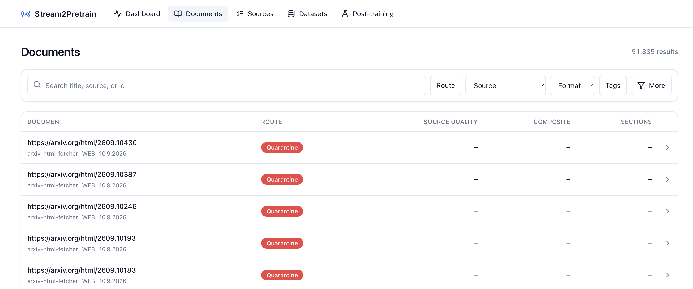
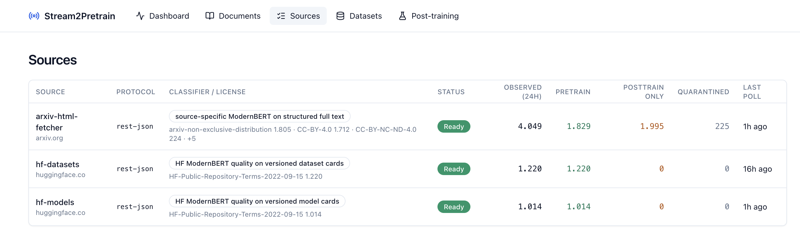
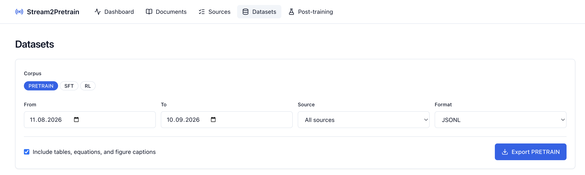
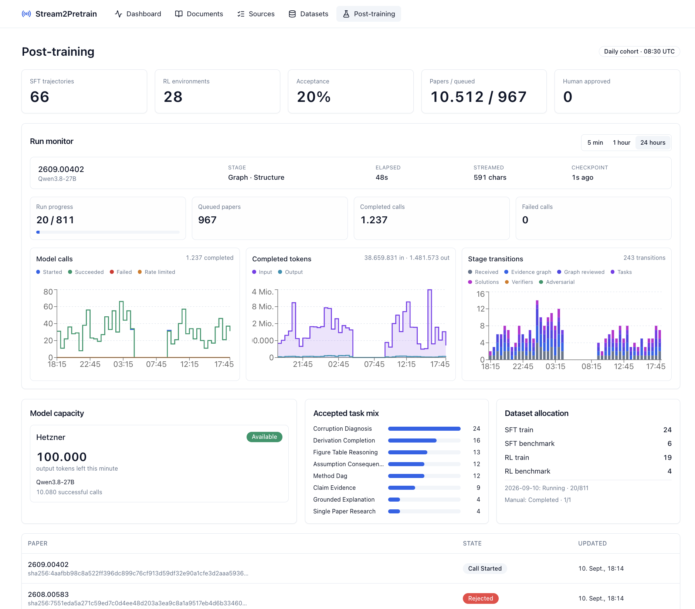
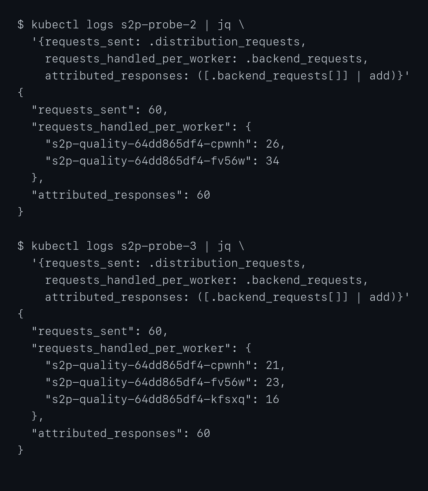
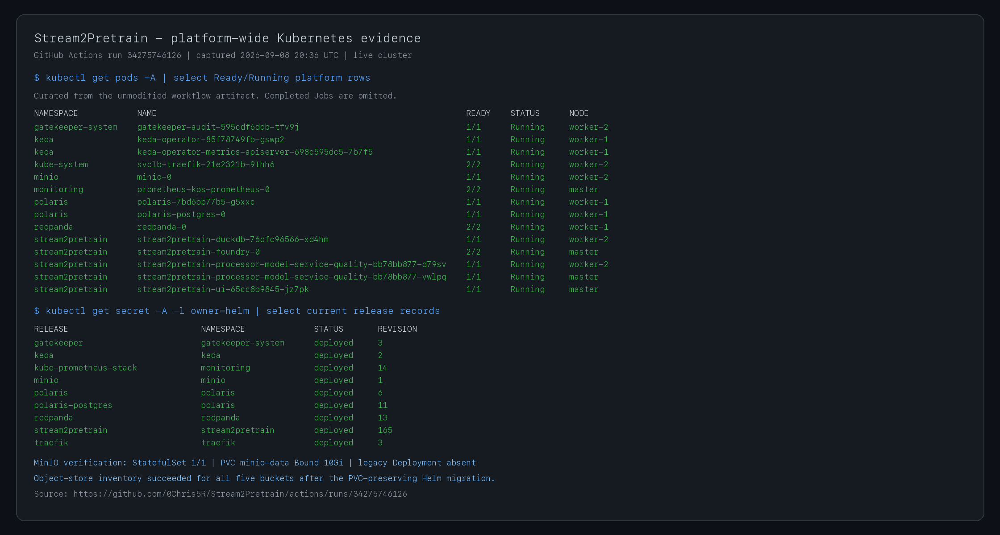

# Stream2Pretrain

Stream2Pretrain is a Kubernetes based data preparation pipeline for language models. The goal is to collect and prepare training data while honoring licenses and quality standards. Next to the text collection for pre-training, the pipeline also classifies which text passages are valuable Supervised-Fine-Tuning (SFT) trajectories for post-training. It also tries to construct Reinforcement Learning (RL) environments from applicable papers.

## 1. Use Case and Motivation

High-quality recent data is one of the most impactful pieces during the training process of language models. To create such a training corpus, fetched texts must go through licence verification, cleaning, quality assessment and curation. The compute intensive nature, the unbounded accumulation of data and highly parallelizable setting of the problem perfectly fit the streaming based Big Data architecture required. Documents can be processed independently, allowing extraction, cleaning and scoring to be distributed across workers. At the same time, checks such as duplicate detection depend on the continuously growing corpus.

The project focuses on the processing of the data and therefore obtains its data through open APIs, which are currently:
- Full arXiv papers in four AI related categories
- Hugging Face model and dataset card READMEs

Input adapters can be extended easily, but the current sources already create a processing backlog. During testing, normalized input grew faster than completed curation. Compared to crawling the web, these APIs also provide more structured source material.
The result is a continuously updating training data corpus of curated research material for language-model pre-training and selected post-training tasks.

## 2. Data Characteristics

Volume comes from the continuously growing number of documents. On the measured day, the cloud deployment wrote 1,971 MB of new Bronze source objects.

Velocity results from new and updated documents being fetched continuously. On the measured day, the source activity recorded 1,205 arXiv papers, equivalent to 0.84 papers per minute. The arrival rate can temporarily exceed the processing capacity of the more expensive extraction and quality assessment steps.

Variety results from the different source resource types the pipeline fetches and extracts.
So next to scientific papers, model cards, and dataset cards there are also equations, tables, figures, metadata in HTML, Markdown and many more.

## 3. Architecture Decision

Stream2Pretrain uses the Kappa architecture as the sources just either produce new entries or update existing ones. That means the processing path can be exactly reused for live updates and replay, so a lambda implementation would just implement everything twice.



The project makes the following deviations from the lecture stack:

1. Redpanda provides the Kafka API with fewer operational components.
2. Bytewax provides stateful stream processing and checkpoint recovery in the same Python environment as the extraction and classifier code.
3. MinIO fits immutable source bodies and scientific assets through an S3-compatible object interface.
4. Iceberg V2 provides atomic commits, history and schema evolution over Parquet, while Polaris exposes the catalog to the writer and DuckDB.

## 4. Components and Data Flow



Each ingress API has a Python discovery worker whose job is to find potentially new content on the API. It publishes the metadata as a discovery envelope for the processing pipeline.

### Pretraining Pipeline

The discovery workers produce work items for arXiv and Hugging Face. The pipeline checks the licence before downloading the source. Incompatible items are quarantined. For admitted items, the fetcher stores the source body in MinIO and publishes a Bronze pointer. The normalizer reads this pointer, extracts the usable text and scientific structure and publishes the normalized record. The curator applies the quality, privacy and duplicate checks and publishes a curation decision. Accepted records are written to the curated Iceberg table, while rejected records remain in the decision table for audit. Polaris provides the catalog for the Iceberg writer and DuckDB reads the stored results for the cockpit and dataset exports.

### Post-training Pipeline



The post-training path starts from Gold arxiv papers that were marked eligible for derived training use. These papers enter the Foundry queue, where the stateful worker creates and validates SFT trajectories or RL environments. The generated artifacts are persisted with their evidence and exposed for named human review.

## 5. Processing Logic

### Transformations

Stream2Pretrain uses 3 data quality levels: Bronze, Silver and Gold. The transformations are used to elevate the data through the quality stages and filter out low quality samples. In the first step, after licence admission, the source body is downloaded, compressed and stored unchanged as Bronze record, including source metadata and object location.

To move upwards to a Silver record the data is converted into a format more suitable for structured training. This process can differ between ingress sources. For arxiv papers, it only preserves the scientific sections, equations, tables, figures and captions. Each retained section receives a role, such as abstract, results or limitations. For Hugging Face, it removes metadata, code blocks and navigation elements, to be left with just the technical prose and section structure of the Readme. The Silver record also adds language information, a MinHash signature for similarity checks and keeps links to the original source and scientific artifacts.

A Gold record is a record which has passed all quality checks and is ready for use. To reach it, the curator runs checks like if the language is English, if the remaining paragraphs follow the expected structure and that there are no exact and near duplicates. It removes contact information and whole documents if are detected as containing credentials. After that it runs the text in sections through ModernBERT based models to score the retained sections in overlapping windows, where the whole document needs to meet an average quality gate. There are 4 self build models for arxiv quality, hugging face quality, mathematical reasoning and post training suitability.

From there the data can be either part of pre- or post-training. Permissive rights allow both, while missing or reviewed grey-area rights only allow derived post-training artifacts.

The post-training pipeline uses Gold record Arxiv papers marked by the classifier. These papers are then collected in a queue, sorted by their suitability score. The complete paper is then put into a graph like structure, that connects claims, equations, method steps, results and limitations. If the paper describes a task where the result can be validated using code, it is turned into a RL environment, otherwise if deemed suitable the paper is used as an SFT trajectory. The generated environment is programmatically validated and stored together with its evidence, where a human reviewer can approve it.

### State and replay

The pipeline uses at least once processing. Bytewax saves the progress of the fetcher and curator. After a restart, the workers continue from the latest checkpoint and Redpanda repeats records that were not completed. Each processing stage checkpoints only completed work. Document identifiers and a durable decision state prevent replayed records from creating duplicate outputs.

### Windowing and late data

The pretraining path does not use event-time aggregation windows because its transformations operate on individual documents. Its stateful operations are checkpoint recovery, exact and near-duplicate detection and deterministic replay handling. For each document, the curator checks its content identity and MinHash signature against the durable index of all previously processed documents, rejecting matches and adding new signatures for later comparisons without limiting the state. The post-training pipeline uses windowing with a fixed daily boundary to freeze and rank candidates received during the preceding 24 hours.

Late data is handled differently in the two pipelines. In the Foundry, candidates that enter the queue after the cutoff are considered in the next day's batch. In the pretraining pipeline the age of unfinished work is checked against its fetched_at timestamp. Work older than the configured cutoff is expired, while completed corpus data remains available. This is done to keep storage and compute needs under control as the limited resources leave no room for autoscaling compute and storage.

## 6. Storage Design

The data is stored in different places depending on what it is used for. MinIO stores the fetched data like papers and articles, Iceberg stores the decisions made during processing and the finished training data. DuckDB acts as the serving layer used by the cockpit:

| Layer | Storage | Contents |
|---|---|---|
| Bronze | Gzip objects in MinIO | Source files and fetched metadata. |
| Licence admissions | Iceberg V2 with Parquet | Each licence route, including quarantine before body retrieval. |
| Curation decisions | Iceberg V2 with Parquet | Accepted and rejected curation outcomes. |
| Curated corpus | Iceberg V2 with Parquet | Records that passed the curation gates. |
| Corpus route ledger | DuckDB serving view | The latest route for each document. |

The storage format depends on the data. The original source is saved as a Gzip object because it must remain available for the audit of the fetched content while the structured records are stored in Iceberg tables. DuckDB provides SQL access to the Iceberg tables and acts as a cache for frontend queries.

The curated and curation-decision tables are partitioned by language, risk tier and month of `valid_from`. Licence admissions are partitioned by source, admission status and month of `observed_at`. These fields are used by the cockpit and the exports.

The licence admission table stores the source information like URL, observation time and licence result before the body is fetched. The curation decision table records the document identity, quality results, rejection reasons, privacy findings, validity interval and the policy version the item was processed with. The curated table contains the retained training text, token information, origin and references to retained equations, tables, figures and captions.

As we require atomic table updates and historical versions for the decisions, Iceberg V2 with Polaris is used. MinIO stores the Parquet files and Iceberg metadata, while Polaris provides the catalog used by the writer and DuckDB.

The Iceberg tables store the licence admissions, curation decisions and curated training records. The Foundry keeps its queue and audits as persistent state for post-training work. DuckDB keeps a serving index over the Iceberg tables and can rebuild it from them.

The actual downloaded documents and extracted assets are kept for just one day for audit. Training text, decisions, retained paper evidence and post-training packages kept. Paper evidence is written to Gold before a Foundry candidate is published and is also cached with the queue. The one day retention period is a compromise between replay ability and the available storage on the instances. It drastically reduces required storage while decisions remain traceable.

DuckDB first builds its serving index from Iceberg and then only applies transactional updates. It contains the latest decision for each document and cached corpus aggregates to the cockpit.

## 7. User-facing UI

The cockpit runs as a separate Kubernetes Deployment and serves as the result viewer. It reads the live data.

The dashboard calls the Next.js /api/dashboard route. The route combines durable Iceberg totals from DuckDB with Prometheus activity metrics. The dashboard shows corpus-route totals, recent processing activity, and a compact post-training summary.
Other pages provide:
- Document search
- Read-only source status
- Licence-filtered dataset exports
- Post-training inspection

Each document includes per-item licence evidence in a collapsed advanced audit view, including documents quarantined before body retrieval.
The cockpit supports monitoring on all standard pages. Only named users can approve or reject generated SFT and RL artifacts.
Typical user flow:

1. Open the Dashboard and check whether decisions and accepted training documents are increasing.
2. Review acceptance rates and rejection reasons by source.
3. Open Documents and filter by source, route, or decision.
4. Open Datasets and export a date-bounded pretraining, SFT, or RL dataset.
5. Open Post-training and inspect the daily ranked path. The `Inspect` view shows tasks, trajectories, verifiers, validation evidence, provenance, and package files for human review.
The API and dashboard screenshots in Section 11 come from the same live cluster.

## 8. Kubernetes Deployment

| Kubernetes object | Components |
|---|---|
| Deployment | Fetcher, arXiv full-text worker, Hugging Face card poller, Iceberg writer, DuckDB API, SourceFeed controller, UI, and stateless quality and KenLM model services. |
| StatefulSet | Curator with a persistent global dedup index and decision cache; single-writer foundry with its durable queue, call cache, and append-only artifact audits; MinIO object storage; PostgreSQL for the Polaris catalog. |
| CronJob | Periodic arXiv RSS and OAI-PMH discovery polls plus per-table Iceberg snapshot and orphan-file maintenance. |
| ConfigMap | Feed definitions and runtime configuration. |
| Secret | MinIO, Polaris, Hugging Face, and Ed25519 credentials. |
| PVC | Curator and foundry recovery state, serving indexes, object storage, and the Polaris relational catalog. |
| ServiceMonitor and PrometheusRule | Metrics discovery and availability alerts. |

The Helm charts parameterize replica counts, resources, images, topics, endpoints, model settings, object storage, and ingress. Helmfile deploys edge, platform, storage, catalog, and application tiers in dependency order.

MinIO is a first-class release in that graph, not an external or manually
installed prerequisite. For a fresh installation, `./scripts/setup_dhbw_demo.sh
storage` installs the repository-owned StatefulSet, PVC, Service,
ServiceMonitor, and idempotent five-bucket bootstrap before Polaris and the
application. On 8 September 2026 the live cluster was migrated from its earlier
manifest-managed Deployment to this Helm release. The migration retained the
bound `minio-data` PVC and stable Service, inventoried all five buckets before
and after the handoff, required every object count and byte count to remain at
least unchanged, and removed the old Deployment only after `minio-0` became
Ready. The current live StatefulSet, Service, and PVC all carry Helm ownership.

The course deployment uses three Kubernetes nodes. Its frozen evidence contains
about 7.01 GiB across the five MinIO buckets. This is a point-in-time data
volume, not a capacity forecast.

Scaling is explicit per component:

| Component | Scaling mechanism | Submission evidence and limit |
|---|---|---|
| UI | Ordinary Deployment replicas | Demonstrated from one to three Ready replicas in 14 seconds, then restored to one. The replica field is declared in [`ui.yaml`](charts/stream2pretrain/templates/ui.yaml#L4-L18). |
| Quality and KenLM APIs | KEDA from active and waiting request metrics, or manual Deployment scaling | The submitted pod capture shows two Ready quality replicas. The curator discovers Ready model pods through a headless Service and leases at most one request to each replica, distributing independent batches while preserving input order and model provenance. The measured DHBW range is two to three, declared in [`stream2pretrain.dev.yaml`](infra/helmfile-values/stream2pretrain.dev.yaml#L74-L89), with the Prometheus demand trigger in [`processor-model-service.yaml`](charts/stream2pretrain/templates/processor-model-service.yaml#L131-L159). |
| External `Qwen3.8-27B` Foundry API | Provider-managed service; Stream2Pretrain can change client concurrency manually | It is not a Kubernetes workload owned by this project, so no cluster autoscaling claim is made. |
| Source workers | Replica setting and partitioned source ownership | Independently committing workers can scale when each cursor or partition has one owner. The arXiv acquisition worker remains fixed because its shared input/output topic does not expose a safe lag signal. |
| Fetcher and curator | Coordinated Bytewax rescale using pre-created recovery partitions | They are stateful executions. Replica changes require a controlled stop, state handoff, and restart rather than independent Pods joining a consumer group. |
| Iceberg writer and Foundry | Single writer in the measured profile | Horizontal writers require external commit or queue coordination and are not claimed as demonstrated. |
| DuckDB API | Manual replicas after moving the retained serving index to shared or per-replica rebuildable storage | The measured `local-path` index pins the current profile to one replica. |
| MinIO and Polaris PostgreSQL | Stateful storage services | The course profile is single-instance. A distributed object store and database replication require separate storage capacity and failover validation. |

The table separates demonstrated scaling from components that still require coordination. Increasing every replica field is not automatically safe.

## 9. Deployment Guide

### Prerequisites

- OpenStack credentials for DHBWCloud
- Terraform, Ansible, kubectl, Helm 3, Helmfile, and uv
- GitHub CLI access to the repository, or container images built from the included Dockerfiles
- A reviewed `terraform.tfvars`
- The DHBW RFC2136 inventory when public DNS and TLS are required
- Kubernetes Secrets for MinIO, Polaris, and Hugging Face, plus the Foundry
  provider Secret when the Foundry is enabled. The signing identity is created
  once by deployment unless it is pre-provisioned.

Use `uv` for every Python command.

### Validate the repository

```bash
uv sync --all-packages --all-groups
make test
uv run ruff check schemas ingest processor tests scripts
uv run ruff format --check schemas ingest processor tests scripts
uv run python scripts/security_scan.py
./scripts/setup_dhbw_demo.sh validate
```

### Provision and deploy

```bash
export OPENRC_PATH=/absolute/path/to/openrc.sh
./scripts/setup_dhbw_demo.sh plan
./scripts/setup_dhbw_demo.sh cluster

export KUBECONFIG=$PWD/infra/kubeconfig-stream2pretrain.yaml
./scripts/setup_dhbw_demo.sh platform
```

For an existing cluster, apply only the changed ownership tier. The
[deployment workflow](docs/continuous-deployment.md) reuses unchanged images
and pinned model layers and deploys only changed application workloads.

Set credentials as environment variables, then run the script:

```bash
export MINIO_ACCESS_KEY='replace-me'
export MINIO_SECRET_KEY='replace-me'
export POLARIS_CREDENTIAL='client-id:client-secret'
export POLARIS_SCOPE='PRINCIPAL_ROLE:ALL'
export HF_TOKEN='replace-me'
export HETZNER_INFERENCE_API_KEY='replace-me'
export FOUNDRY_CONTROL_TOKEN='replace-me'
./scripts/configure_dhbw_secrets.sh
unset MINIO_ACCESS_KEY MINIO_SECRET_KEY POLARIS_CREDENTIAL POLARIS_SCOPE HF_TOKEN
unset HETZNER_INFERENCE_API_KEY FOUNDRY_CONTROL_TOKEN
```

The submitted profile includes the Foundry provider Secret. To deploy only the streaming and pretraining pipeline, use the core-only profile:

```bash
export MINIO_ACCESS_KEY='replace-me'
export MINIO_SECRET_KEY='replace-me'
export POLARIS_CREDENTIAL='client-id:client-secret'
export POLARIS_SCOPE='PRINCIPAL_ROLE:ALL'
export HF_TOKEN='replace-me'
export S2P_CORE_ONLY=1
./scripts/configure_dhbw_secrets.sh
```

This profile does not require `HETZNER_INFERENCE_API_KEY` or `FOUNDRY_CONTROL_TOKEN`. Keep `S2P_CORE_ONLY=1` exported through the application step below. The override changes only `processor.foundry.enabled`.

For a direct fresh-cluster installation, install storage, catalog, topics, and
the application in dependency order:

```bash
./scripts/setup_dhbw_demo.sh storage
./scripts/setup_dhbw_demo.sh catalog
./scripts/setup_dhbw_demo.sh topics
./scripts/setup_dhbw_demo.sh application
./scripts/setup_dhbw_demo.sh verify
```

To deploy via the immutable-image path, push the reviewed revision to `main`
or run the workflow directly:

```bash
gh workflow run deploy-main.yml --ref main -f mode=deploy
```

The workflow builds and pins application images, applies Helmfile for changed ownership tiers, and verifies readiness.

### Run the end-to-end check

```bash
kubectl -n stream2pretrain exec -i deployment/stream2pretrain-duckdb -- \
  python - < scripts/cluster_smoke.py

kubectl -n stream2pretrain port-forward service/stream2pretrain-ui 3000:80
```

Open `http://127.0.0.1:3000/dashboard` after the port forward starts.

> **Local alternative:** The [Podman profile](local/README.md) replaces the cloud catalog with a local Iceberg catalog. Classifiers and extraction stages are not replaced. Local runtime and integration tests are opt-in.

## 10. Key Code Sections

- [`fetch_and_publish`](ingest/common/bronze_pipeline.py#L44-L169) stores immutable Bronze bytes and publishes the admitted content event.
- [`normalize`](processor/fetcher.py#L408-L625) converts Bronze payloads into source-specific normalized records.
- [`curate_one`](processor/curate.py#L822-L1227) applies deterministic checks, learned scoring and routing.
- [`SourceQualityClassifier`](processor/operators/source_classifiers.py#L56-L145) and [`SourcePosttrainClassifier`](processor/operators/source_classifiers.py#L147-L162) implement the four section classifiers.
- [`IcebergWriter`](processor/iceberg_writer.py#L328-L879) defines schemas, buffering and commits for audit decisions and eligible rows.
- [`processor/foundry/`](processor/foundry) contains the experimental resumable paper-to-SFT/RL pipeline, validation gates, and deterministic packaging.
- [`ServingIndex.apply_decisions`](processor/serving_index.py#L168-L205) maintains transactional serving rows and cached aggregates.
- [`DuckDBQueryService`](processor/duckdb_api.py#L111-L1339) exposes catalog-backed query and export operations.
- [`/api/dashboard`](ui/app/api/dashboard/route.ts#L82-L105) combines durable Iceberg totals from DuckDB with Prometheus activity metrics into a single response.
- [`DashboardPage`](ui/app/dashboard/page.tsx#L37-L235) renders corpus-route totals, activity charts, and the post-training summary from that response.
- [`processor-curate.yaml`](charts/stream2pretrain/templates/processor-curate.yaml#L8-L203) declares curator resources and recovery storage.
- [`charts/minio`](charts/minio) declares the object store, persistent volume, health checks, monitoring and bucket bootstrap.
- [`helmfile.yaml`](helmfile.yaml#L35-L133) orders the edge, platform, storage, catalog and application releases.
- [`cluster_smoke.main`](scripts/cluster_smoke.py#L209-L405) verifies an isolated end-to-end record without contaminating production topics.

[`docs/PIPELINE_IMPLEMENTATION_REFERENCE.md`](docs/PIPELINE_IMPLEMENTATION_REFERENCE.md) records every active projection, classifier, regular expression, routing rule, model prompt template, and deterministic SFT/RL check.

## 11. Screenshots and Evidence

### Classifier evaluation

The held-out evaluation contains 301 papers and 500 Hugging Face cards, split
by document. These are agreement measurements against the LLM judge, not
evidence of downstream training improvement.

| Custom classifier | Pipeline use | Section Spearman | Section MAE |
|---|---|---:|---:|
| arXiv pretraining quality | Token-weighted document mean >=3.0 | 0.711 | 0.417 |
| HF pretraining quality | Token-weighted document mean >=3.5 | 0.913 | 0.311 |
| arXiv mathematical reasoning | Section hints after quality passes | 0.875 | 0.553 |
| arXiv post-training suitability | Mean ranks the daily queue | 0.824 | 0.497 |

Aggregate results and the complete training procedure are documented in
[the classifier guide](docs/CLASSIFIERS.md).

### Live UI








### Kubernetes pods and horizontal scale

This capture shows the application workloads, including two independent Ready quality-service replicas.


The local Kubernetes cluster backed by Podman sends the same 60-request inference workload through the production endpoint-pool client with two and three classifier workers. Every inference response identifies its serving pod through the `X-S2P-Model-Backend` header, allowing the probe to count completed requests per worker.



The platform-wide capture combines Pod rows from a read-only evidence workflow with Helm release records from the same cluster. It covers the application, Redpanda, MinIO, Polaris/PostgreSQL, ingress, KEDA, and monitoring namespaces, and shows the deployed `minio` Helm release and Ready `minio-0` StatefulSet pod after the PVC-preserving migration.



### Serving output

The current typed overview response came from the Iceberg-backed DuckDB serving
path. It reports durable latest-per-document decisions separately from the
training-export subset.


### Pipeline output

On 4 September the curator routed this arXiv paper to `posttrain_candidate` with a quality score above the 3.0 cutoff across 27 sections:

```json
{
  "doc_id": "sha256:1e5fdf860cba19d72f49655a3f91f3ecb28a04372caa5f7bfc0fbf9220aa7a93",
  "source": "arxiv-html-fetcher",
  "score": 3.482891290309436,
  "cutoff": 3.0,
  "sections": 27,
  "route": "posttrain_candidate",
  "eligible_routes": ["pretrain", "posttrain_candidate"],
  "reject_reasons": []
}
```

The same cluster run confirmed:

- Polaris exposed `gold.license_admissions`, `gold.curation_decisions`, and `gold.curated`.
- DuckDB returned the smoke document and corpus overview with HTTP 200.
- The availability alert fired during a controlled capacity shortfall and cleared after recovery.

The [submission evidence](docs/submission-evidence.md) records the latest
verification checks, resource measurements and content spot-check. Classifier
training code and held-out evaluation statistics are included; source corpora
and credentials are not.

## 12. Limits and Outlook

The system is production-oriented but deployed at course-project scale.

- The three-node DHBW profile bounds quality inference at two to three stateless replicas, demonstrating a safe replica range for that service but not sustained end-to-end intake capacity.
- Core Bytewax fetcher and curator scaling requires a coordinated restart; standard Kafka-lag KEDA is intentionally disabled for them. Iceberg remains a single writer until its commit coordination is externalized.
- Ingress, DNS, and TLS use Traefik, ExternalDNS with RFC2136, and the shared wildcard certificate. NetworkPolicy, Gatekeeper enforcement, Tempo, and Loki remain disabled in the measured profile.
- The measured curation rate trails normalized input. Sustainable fresh-input throughput, safe partition counts and maximum corpus size remain `needs-measurement`.
- Content filters are imperfect. Current PDF processing excludes pre-Abstract author blocks at extraction and curation boundaries; historical stored rows are not rewritten. The spot-check also found numerical PII false positives and older admissions below today's quality cutoffs.
- Post-training requires named human review after automated validation. No human-approved artifact is presented as final training output. Generated artifacts are audit records; the experimental Foundry is not ready for unsupervised dataset publication.
- License detection is a curation heuristic. It is not legal advice or a compliance guarantee.

The next practical work is to measure processor scale under controlled backlog and tune worker capacity from that measurement.

---

## Team Contributions

- **Chris:** Use-case research, source acquisition, schemas, processing logic, classifier routing, Iceberg integration, UI.
- **Julian:** OpenStack and k3s deployment, Helmfile and cluster configuration, operational fixes, cluster validation, deployment policy.
- **Tristan:** Source adapters, ingestion cursors, source-aware routing, Bytewax recovery, ingestion validation.
- **Finn:** Monitoring UI, DuckDB serving, source activity, browser audits, storage observability.
- **Jan:** CI/CD, immutable image reuse, stateless model services, Foundry scheduling, verifier validation.

*(The accumulated agent-assisted classifier and pipeline work is attributed to Chris. Specific tasks follow authored commit history.)*

License: [Apache-2.0](LICENSE).
