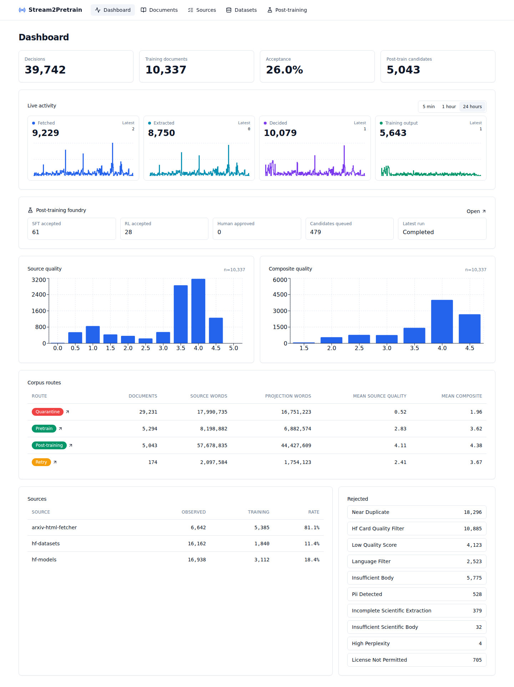
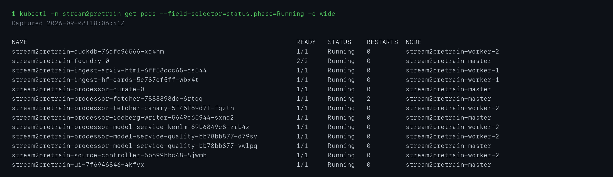
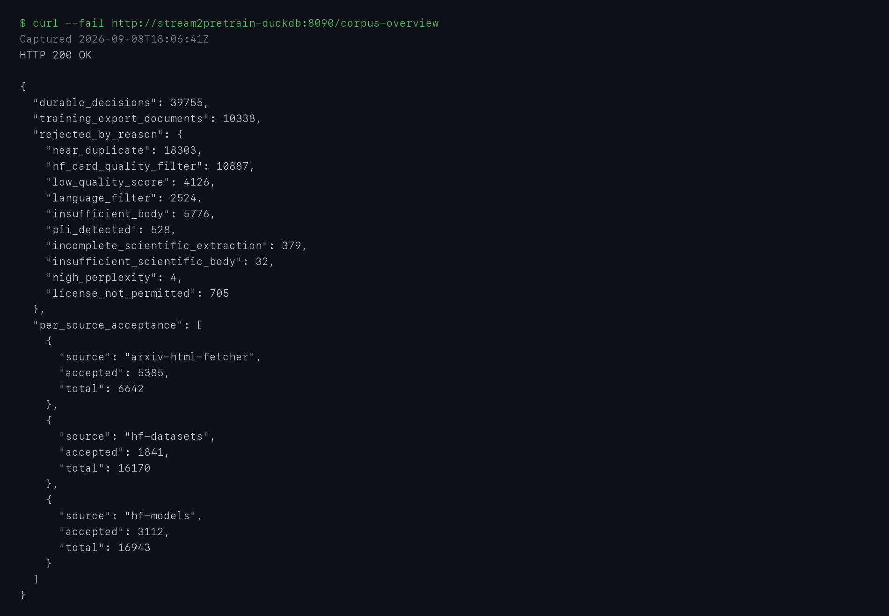

# Stream2Pretrain

Stream2Pretrain is a Kubernetes-native pipeline that turns continuous AI research sources into an auditable pretraining corpus. It admits only explicitly licence-cleared content, extracts useful text, applies source-aware quality rules, checks benchmark contamination, stores every decision in an Iceberg lakehouse, and serves the results through a web cockpit.

This README is the sole report for the DHBW Cloud Computing and Big Data examination. It is written in English because the code, APIs, field names, and cited technical sources use English. Keeping one language also makes the links between the report and implementation easier to follow.

## 1. Use Case and Motivation

Large language model training needs current, high-quality material. AI research changes continuously across papers, laboratory blogs, model releases, reviews, and source code. A periodic manual export becomes stale quickly and gives weak evidence for why a document was accepted or rejected.

Stream2Pretrain solves this as a streaming curation service. Its users are data engineers and researchers who need a reproducible training-data view rather than another web crawler. The service preserves raw input, records every policy decision, and exposes only clean records as training output.

The implemented source adapters cover:

- arXiv OAI-PMH metadata, RSS feeds, and native HTML
- AI laboratory and project RSS feeds
- GitHub events, releases, and release source archives
- Exact-version Hugging Face model, dataset, and Space cards plus Daily Papers discovery
- OpenReview submissions and reviews
- A one-shot historical seed loader for controlled backfill

The DHBW verification profile enables a smaller subset that fits the available cluster. The screenshots show processed records from AI blog feeds, Hugging Face metadata, and a controlled smoke source.

This is a Big Data problem because the input is continuous, heterogeneous, and unbounded. The current course prototype is intentionally small. Its architecture separates the event log, object storage, processing state, table catalog, and query service so the same data path can grow without replacing the processing model.

## 2. Data Characteristics

The relevant Big Data characteristics are:

| Characteristic | Project meaning |
|---|---|
| Volume | Raw pages, extracted text, code files, decisions, and table snapshots accumulate continuously. The prototype does not claim an unmeasured production volume. |
| Velocity | Pollers create a live stream. Release events and feed updates arrive in bursts rather than at a fixed rate. Redpanda buffers these bursts. |
| Variety | The pipeline handles HTML, metadata, reviews, and code. Each format carries different extraction and quality signals. |
| Veracity | Near duplicates, personal data, extraction failures, missing licenses, low-quality pages, and benchmark overlap must remain visible as explicit decisions. |
| Value | Accepted records become a queryable training export. Rejected records remain useful for auditing and policy improvement. |

The live verification produced measurable evidence rather than a throughput estimate. A controlled document reached `docs.curated` in 6.416 seconds. The dashboard and serving screenshots show the durable corpus state at their capture times. Production throughput and capacity remain unmeasured.

## 3. Architecture Decision

Stream2Pretrain uses a Kappa architecture. Live events and backfill records enter the same topics and pass through the same transformations. There is no separate batch implementation with a second policy path. Reprocessing uses retained Redpanda events and versioned Iceberg decisions.

```mermaid
flowchart LR
    sources["AI research sources"] --> ingest["Ingest pollers"]
    ingest --> licence["Pre-fetch licence gate"]
    licence --> decisions["Corpus route ledger"]
    licence --> bronze["MinIO Bronze"]
    licence --> raw["Redpanda raw.fetched"]
    raw --> fetcher["Bytewax fetcher with durable recovery"]
    fetcher --> normalized["Redpanda docs.normalized"]
    normalized --> curate["Bytewax stateful curator"]
    curate --> decisions["Redpanda curation.decisions"]
    curate --> clean["Redpanda docs.curated"]
    decisions --> writer["Iceberg writer"]
    writer --> lakehouse["MinIO and Iceberg V2"]
    writer --> attest["Signed decon attestations"]
    lakehouse --> catalog["Polaris catalog"]
    catalog --> query["DuckDB API"]
    query --> ui["Next.js cockpit"]
```



The project makes four justified deviations from a conventional lecture stack:

1. Redpanda provides the Kafka API with a smaller operational surface for this cluster.
2. Bytewax keeps the stream logic in Python, where the extraction and classifier libraries already live.
3. MinIO replaces HDFS because the inputs and scientific artifacts are naturally object-shaped.
4. Iceberg V2 with Polaris provides table snapshots, schema evolution, and vendor-neutral catalog access.

These choices support the use case directly. They are not included only to increase the number of technologies.

## 4. Components and Data Flow

| Component | Technology | Responsibility and rationale |
|---|---|---|
| Source pollers | Python and async HTTP | Discover new records while respecting source-specific formats and rate limits. |
| Licence admission | Redpanda and Iceberg | Log an immutable pretraining, transform-only, or quarantine route before any document-body request. |
| Bronze writer | MinIO | Preserve immutable compressed source material before transformation. |
| Event bus | Redpanda | Decouple ingestion, curation, storage, and replay through named topics. |
| Fetcher | Bytewax and Resiliparse | Load Bronze bytes, extract text and scientific structure, then emit normalized records. |
| Curator | Stateful Bytewax flow | Apply language, quality, PII, duplication, routing, and decontamination policies with durable recovery and global dedup state. |
| Iceberg writer | PyIceberg | Persist all decisions and the accepted subset as Parquet-backed Iceberg tables. |
| Catalog | Apache Polaris | Resolve table metadata and snapshots through the Iceberg REST protocol. |
| Query service | DuckDB API | Read exact Iceberg metadata versions and expose typed read-only endpoints. |
| Web cockpit | Next.js and TanStack Query | Display durable results and operational activity through real API calls. |
| Observability | Prometheus | Scrape service metrics and evaluate workload availability alerts. |

The end-to-end flow is:

1. A poller discovers a URL or release and its machine-readable content licence.
2. It publishes an immutable pre-fetch decision which the product folds into the corpus route ledger.
3. Missing or excluded licences stop before body fetch. Admitted content is compressed into the Bronze bucket and published to `raw.fetched`.
4. The fetcher repeats the licence check, extracts text, and publishes a `SilverRecord` to `docs.normalized`.
5. The curator produces one auditable decision for every normalized record.
6. Every curation decision is published to `curation.decisions`.
7. Only eligible records are also published to `docs.curated`.
8. The writer persists pre-fetch rejections, curation decisions, and accepted rows; query APIs present one corpus route ledger.
9. Each decision snapshot produces a signed contamination attestation on `decon.attest` and in MinIO.
10. DuckDB reads the catalog metadata and the UI displays the result.

The repository is organized by responsibility:

- [`ingest/`](ingest) contains live source adapters and shared ingestion code.
- [`processor/`](processor) contains Bytewax flows, policies, Iceberg persistence, and APIs.
- [`schemas/`](schemas) contains shared Pydantic event contracts.
- [`ui/`](ui) contains the Next.js cockpit.
- [`charts/stream2pretrain/`](charts/stream2pretrain) contains the application Helm chart.
- [`infra/`](infra) contains OpenStack, k3s, Helmfile, and platform configuration.
- [`scripts/`](scripts) contains deployment, bootstrap, smoke, and benchmark tools.
- [`docs/continuous-deployment.md`](docs/continuous-deployment.md) documents the main-branch image build, VPN, and application deployment workflow.
- [`docs/SOURCE_LICENSE_ADMISSION_MATRIX.md`](docs/SOURCE_LICENSE_ADMISSION_MATRIX.md) records the item-level licence resolver and pre-fetch boundary for every live and preload source.
- [`docs/SOURCE_PROCESSING_POLICY.md`](docs/SOURCE_PROCESSING_POLICY.md) records the discovery-versus-content boundary, extraction path, exact classifier revision, non-applicable signals, and Gold reachability for every source.

## 5. Processing Logic

### Transformations

The fetcher turns raw bytes into normalized document records. It extracts readable text, headings, citations, figures, tables, and equations when the source provides them. The curator then creates segment scores and a final route.

Quality is source-aware:

- Scientific HTML, PDF, and LaTeX use the FinePDFs profile.
- General web text uses the FineWeb-Edu profile.
- Hugging Face cards and repository documentation use a Markdown prose projection and retain FineWeb-Edu as an audit signal without Common-Crawl page-shape gates.
- Code uses a separate Stack v2 and Dolma-grounded quality policy.
- OpenReview review forms use schema completeness; ratings, recommendations, confidence, and decisions remain audit metadata rather than training labels.
- RSS, OAI, Hub-list, Daily Papers, GitHub event, and release envelopes are discovery-only and never become training text.

This prevents a web-education classifier from being treated as a meaningful
code classifier. The DHBW chart fails closed on missing models. FinePDFs,
FineWeb-Edu, KenLM, and E5 run from a pinned immutable model image behind a
stateless in-cluster inference service; Presidio, MinHash, and tokenization stay
with the lightweight stateful curator. Every row records its classifier
revision and backend.

Before these transformations, the shared licence gate records both verbatim
pretraining rights and transform-only post-training rights. Explicit
permissive content can reach pretraining. Only explicitly allowlisted
transform-only licences, including arXiv's non-exclusive distribution grant,
can reach the post-training-only route. Missing, unknown, dataset-wrapper,
no-derivatives, and provider-prohibited rights remain quarantined. The
curator also applies PII detection, licence policy, and MinHash near-duplicate
detection. Language confidence gates natural-language profiles, not source
code. Gopher, C4, and KenLM gates apply only to ordinary web prose, where those
web-derived signals are meaningful.

### Stateful processing

Near-duplicate detection maintains state across documents. Bytewax snapshots
source progress and operator state into the fetcher and curator checkpoint
PVCs. Output is keyed by `doc_id`, so a crash between sink delivery and the
next recovery snapshot can replay a record without creating a second logical
decision. The Iceberg writer also uses the scoring, classifier, and policy
revisions to suppress deterministic replay duplicates.

### Experimental post-training extension

An experimental foundry can turn selected `posttrain_candidate` papers into
grounded SFT trajectories and signed RL-verifiable environments. The same
resumable worker, durable queue, validation gates, MinIO packages, and audit UI
run locally or as a single-writer Kubernetes StatefulSet; the daily path ranks
candidates and continues until the provider reports that its budget is
exhausted. It generates datasets but does not train a model. See
[`docs/POSTTRAIN_FOUNDRY.md`](docs/POSTTRAIN_FOUNDRY.md) for the design and
operations guide.

Decon-Gate builds a 13-token Bloom index for MMLU, GSM8K, HumanEval, MATH, and GPQA. The submitted ZIP contains one synthetic canary for every family. This proves the mechanics without redistributing restricted prompts. The full reserve builder pins public dataset revisions and requires an authorized token for GPQA.

### Windowing and late data

Corpus curation is a per-document stateful transformation, so it does not invent an event-time aggregation window. Prometheus supplies operational windows of five minutes, one hour, and twenty-four hours for the UI.

Late documents are not discarded because their arrival time is newer than their publication time. Each record carries `valid_from` and optional `valid_to`. Iceberg queries reconstruct the corpus as of a selected timestamp. A replay therefore changes processing time without falsifying source time.

The source and writer use at-least-once replay. Idempotent document identifiers and decision keys provide deterministic table results. The project does not claim exactly-once delivery.

## 6. Storage Design

The storage model separates evidence from serving data:

| Layer | Storage | Contents |
|---|---|---|
| Bronze | Gzip objects in MinIO | Immutable source bytes and fetch metadata. |
| Corpus route ledger | Iceberg V2 with Parquet | Every pre-fetch quarantine and downstream curation decision, exposed through one route view with licence provenance. |
| Normalized stream | Redpanda | Extracted text and scientific structure for curation. |
| Decision table | Iceberg V2 with Parquet | Every accepted and rejected policy outcome. |
| Curated table | Iceberg V2 with Parquet | Only trainable records. |
| Attestations | JSON in MinIO and Redpanda | Signed contamination evidence per decision snapshot. |

The Iceberg tables partition by language, risk tier, and month of `valid_from`. These fields support the dominant filters while avoiding a partition per document. The schema stores text, quality scores, route reasons, license provenance, PII flags, decontamination results, validity intervals, and exact policy revisions.

Iceberg is appropriate because files alone do not provide reliable snapshot identity, schema evolution, or catalog discovery. Polaris provides the catalog boundary. DuckDB reads the exact metadata file selected by Polaris rather than guessing the latest object.

The full field list is documented in [`docs/data-model.md`](docs/data-model.md).
The byte-level ownership, August 2026 storage incident, and production scaling
contract are documented in
[`docs/storage-scaling.md`](docs/storage-scaling.md).

## 7. User-facing UI

The cockpit serves the result-viewer role. It is a separate container and a Kubernetes Deployment. It does not use mock data.

The dashboard calls the Next.js `/api/dashboard` route. That route combines durable Iceberg totals from DuckDB with Prometheus activity metrics. It shows corpus-route totals, recent processing activity, and a compact post-training summary. Other pages expose document search, source status, benchmark safety, strictly licence-filtered dataset export, post-training inspection, and mixture views. Per-item licence evidence is available in each document's collapsed advanced audit view, including items quarantined before body fetch.

A typical user flow is:

1. Open the Dashboard and verify that decisions and accepted training documents are increasing.
2. Inspect per-source acceptance and rejection reasons.
3. Open Documents and filter by source, route, format, or quality score.
4. Open Benchmark Safety and inspect reserve coverage and signed attestations.
5. Open Datasets and export a date-bounded JSONL or Parquet view.
6. Open Post-training when evaluating the experimental extension. `Run now` starts the daily ranked path, while `Inspect` exposes tasks, trajectories, verifiers, validation evidence, provenance, and package files for named human review.

The API and document screenshots in section 11 use the same live cluster data shown by the UI.

## 8. Kubernetes Deployment

| Kubernetes object | Components |
|---|---|
| Deployment | Fetcher, Iceberg writer, DuckDB API, decon API, mixture controller, GitHub event poller, and UI. |
| StatefulSet | Curator with a persistent global dedup index and decision cache; single-writer foundry with its durable queue, call cache, and append-only artifact audits. |
| CronJob | Periodic RSS, OAI-PMH, Hugging Face, and GitHub release polls. |
| Job | Optional historical seed loader. |
| ConfigMap | Feed definitions and synthetic benchmark canaries. |
| Secret | MinIO, Polaris, GitHub, Hugging Face, and Ed25519 credentials. |
| PVC | Curator state and platform storage. |
| ServiceMonitor and PrometheusRule | Metrics discovery and availability alerts. |

The Helm chart parameterizes replica counts, resources, images, topics, endpoints, model settings, and ingress. Helmfile deploys edge, platform, catalog, and application tiers in dependency order.

Horizontal scale was demonstrated on the DHBW cluster. The UI Deployment scaled from one to three ready replicas in 14 measured seconds. The pod screenshot shows all three replicas. A temporary request for twenty replicas left seven unavailable, triggered `Stream2PretrainDeploymentUnavailable`, and the alert cleared after restoring one replica.

The core fetcher and curator are coordinated Bytewax executions. They retain
recovery state on PVCs and deliberately do not use ordinary Kafka-lag KEDA,
because broker consumer-group offsets are not the authoritative Bytewax
checkpoint. Independent ingestion workers and stateless classifier services
remain horizontally scalable. Rescaling a core flow is a coordinated
stop-and-start operation using the pre-created recovery partitions, not a set
of independent replicas joining the group.

## 9. Deployment Guide

### Prerequisites

- OpenStack credentials for DHBWCloud
- Terraform, Ansible, kubectl, Helm 3, Helmfile, and uv
- Container images built from the included Dockerfiles
- A reviewed `terraform.tfvars`
- The existing DHBW RFC2136 inventory outside Git
- Kubernetes Secrets for MinIO, Polaris, GitHub, Hugging Face, decon signing,
  and Grafana, plus the foundry provider Secret when the foundry is enabled

Use `uv` for every Python command.

### Validate the repository

```bash
uv sync --all-packages --all-groups
uv run pytest
uv run ruff check schemas ingest processor tests scripts
./scripts/setup_dhbw_demo.sh validate
```

### Provision and deploy

```bash
export OPENRC_PATH=/absolute/path/to/openrc.sh
./scripts/setup_dhbw_demo.sh plan
./scripts/setup_dhbw_demo.sh cluster

export KUBECONFIG=$PWD/infra/kubeconfig-stream2pretrain.yaml
./scripts/setup_dhbw_demo.sh platform
./scripts/setup_dhbw_demo.sh catalog
./scripts/setup_dhbw_demo.sh topics
```

For the existing cluster, run `./scripts/setup_dhbw_demo.sh edge` instead of
reapplying the complete platform tier. It changes only the public edge and
avoids the unsafe full application upgrade.

Create the required Secrets without committing their values. Then install the self-contained benchmark canaries and the application:

```bash
kubectl -n stream2pretrain create configmap stream2pretrain-decon-benchmarks \
  --from-file=corpus.json=local/benchmark_canaries.json

./scripts/setup_dhbw_demo.sh application
./scripts/setup_dhbw_demo.sh verify
```

Required Secret names are:

- `polaris/polaris-bootstrap`
- `polaris/polaris-minio`
- `stream2pretrain/stream2pretrain-minio`
- `stream2pretrain/stream2pretrain-polaris`
- `stream2pretrain/stream2pretrain-github`
- `stream2pretrain/stream2pretrain-hf`
- `stream2pretrain/stream2pretrain-decon-signing`
- `stream2pretrain/stream2pretrain-foundry-providers` with
  `HETZNER_INFERENCE_API_KEY` and `controlToken` when the foundry is enabled

### Run the end-to-end check

```bash
kubectl -n stream2pretrain exec -i deployment/stream2pretrain-duckdb -- \
  python - < scripts/cluster_smoke.py

kubectl -n stream2pretrain port-forward service/stream2pretrain-ui 3000:80
```

Open `http://127.0.0.1:3000/dashboard` after the port forward starts.

## 10. Key Code Sections

- [`ingest/common/bronze_pipeline.py#L42`](ingest/common/bronze_pipeline.py#L42) fetches a source, stores immutable Bronze bytes, and publishes the Bronze event.
- [`processor/fetcher.py#L290`](processor/fetcher.py#L290) converts a Bronze payload into a normalized record.
- [`processor/curate.py#L178`](processor/curate.py#L178) selects the code, scientific, or web quality path and applies the curation policy.
- [`processor/decon_gate.py#L38`](processor/decon_gate.py#L38) defines the benchmark families and the 13-token contamination index.
- [`processor/iceberg_writer.py#L204`](processor/iceberg_writer.py#L204) separates audit decisions, accepted rows, and benchmark candidates before commit.
- [`processor/iceberg_writer.py#L547`](processor/iceberg_writer.py#L547) defines the Iceberg partition specification and format version.
- [`processor/foundry/`](processor/foundry) contains the experimental resumable paper-to-SFT/RL pipeline, validation gates, and deterministic packaging.
- [`processor/duckdb_api.py#L686`](processor/duckdb_api.py#L686) resolves the exact Polaris metadata version and registers the DuckDB view.
- [`ui/app/api/dashboard/route.ts#L68`](ui/app/api/dashboard/route.ts#L68) combines durable DuckDB results for the UI API.
- [`ui/app/dashboard/page.tsx#L24`](ui/app/dashboard/page.tsx#L24) refreshes and renders the live dashboard.
- [`charts/stream2pretrain/templates/processor-curate.yaml#L1`](charts/stream2pretrain/templates/processor-curate.yaml#L1) maps the stateful curator, configuration, Secrets, and checkpoint storage to Kubernetes.
- [`helmfile.yaml#L27`](helmfile.yaml#L27) defines the ordered platform, catalog, and application release graph.
- [`scripts/cluster_smoke.py#L54`](scripts/cluster_smoke.py#L54) injects one controlled document and verifies its identity through the live topics.

## 11. Screenshots and Evidence

### Live UI

The dashboard is backed by the live DuckDB and Prometheus APIs. Counts can increase between screenshots because the pollers continue to run.



### Kubernetes pods and horizontal scale

This capture shows the running application pods and three ready UI replicas from the measured scale test.



### Serving output

The serving API returned the exact controlled document from the Iceberg-backed query path with HTTP 200.



### Historical measured pipeline output

This capture predates the route-name migration from `broad_pretraining` to
`pretrain`; current curation emits only the new route.

The controlled smoke run returned:

```json
{
  "curated_seen": true,
  "decision_route": "broad_pretraining",
  "doc_id": "sha256:0105da1cbc659dbb5730dde54b09fb8ff71cd18e3285ec7ca8e58b9f69c5a5d1",
  "elapsed_seconds": 6.416,
  "reject_reasons": [],
  "risk_tier": 1
}
```

Additional live checks confirmed:

- Polaris exposed both `gold.curation_decisions` and `gold.curated`.
- DuckDB returned the smoke document and corpus overview with HTTP 200.
- Decon coverage contained one synthetic canary for each of the five configured benchmark families.
- The latest checked Ed25519 contamination attestation had a valid signature.
- The UI scale-out from one to three ready replicas took 14 seconds.
- The availability alert fired during a controlled capacity shortfall and cleared after recovery.

## 12. Prototype Limits and Outlook

This is a course prototype, not a production training-data service.

Known limits are:

- Strict classifier replicas are stateless and CPU-autoscaled, but the measured three-node DHBW profile can host at most two replicas while preserving one node for the stateful curator. Larger throughput requires additional worker nodes.
- The submitted benchmark reserve contains synthetic canaries. It proves coverage and signing mechanics but not full real-benchmark recall. The pinned builder requires an authorized GPQA token.
- CI publishes immutable images to GHCR and provides the cluster pull secret when required. Cross-node fetcher scheduling still depends on worker egress and registry availability.
- Core Bytewax fetcher and curator scaling requires a coordinated restart;
  standard Kafka-lag KEDA is intentionally disabled for them. Iceberg remains
  a single writer until its commit coordination is externalized.
- Polaris uses an in-memory catalog backend in the dev profile. MinIO data is persistent, but production catalog recovery needs a relational backend.
- Ingress, DNS, and TLS use Traefik, ExternalDNS with RFC2136, and the shared wildcard certificate. NetworkPolicy, Gatekeeper enforcement, Tempo, and Loki remain disabled in the measured profile.
- Production throughput, safe partition counts, and maximum corpus size are `needs-measurement`.
- Live post-training acceptance yield, provider usage, and foundry cloud resources are `needs-measurement`. The worker requires the Hetzner credential and `Qwen3.8-27B` to be visible through authenticated discovery.
- License detection is a curation heuristic. It is not legal advice or a compliance guarantee.

The next practical work is to add worker capacity, enable a persistent Polaris
backend, build the authorized full benchmark reserve, and measure processor
scale under controlled backlog.

### Team contribution

The Git history contains two contributors and nine commits before the final submission pass.

- Chris led use-case research, source acquisition, schemas, processing logic, classifier routing, decontamination, Iceberg integration, and the UI.
- Julian led OpenStack and k3s deployment, Helmfile and cluster configuration, operational fixes, cluster validation, and deployment policy.
- The final cluster smoke test, evidence capture, limitation review, and README alignment were completed as an integration pass across both work areas.

The commit history preserves these stages instead of presenting the project as one unexplained final upload.

License: [Apache-2.0](LICENSE).
