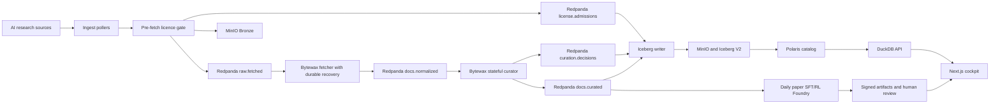

# Stream2Pretrain

Stream2Pretrain is a Kubernetes-native pipeline that turns continuous AI research sources into an auditable training-data corpus. It separates permissive pretraining data from grey-area and unlicensed inputs that may only ground derived post-training artifacts, applies source-aware quality rules, stores every decision in an Iceberg lakehouse, and serves the results through a monitoring cockpit.

This README is the report for the DHBW Cloud Computing and Big Data examination.

## 1. Use Case and Motivation

Large language model training needs current, high-quality material. AI research changes continuously across papers and model or dataset documentation. A periodic manual export becomes stale quickly and gives weak evidence for why a document was accepted or rejected.

Stream2Pretrain solves this as a streaming curation service. Its users are data engineers and researchers who need a reproducible training-data view rather than another web crawler. The service preserves raw input, records every policy decision, and exposes only clean records as training output.

The deployed content adapters cover:

- arXiv full papers discovered through OAI-PMH and four RSS categories
- immutable README-blob revisions from Hugging Face model and dataset cards

Internal discovery envelopes do not appear as sources, documents, acceptances,
or quarantines.

The DHBW profile runs these content paths on CPU workers. Cloud validation uses
an isolated synthetic record that cannot enter the production corpus.

This is a Big Data problem because the input is continuous, heterogeneous, and unbounded. The current course prototype is intentionally small. Its architecture separates the event log, object storage, processing state, table catalog, and query service so the same data path can grow without replacing the processing model.

## 2. Data Characteristics

The relevant Big Data characteristics are:

| Characteristic | Project meaning |
|---|---|
| Volume | Raw pages, extracted text, decisions, and table snapshots accumulate continuously. The prototype does not claim an unmeasured production volume. |
| Velocity | Pollers create a live stream. Feed updates arrive in bursts rather than at a fixed rate. Redpanda buffers these bursts. |
| Variety | The pipeline handles HTML, PDF fallback, metadata, and Markdown documentation. Each format carries different extraction and quality signals. |
| Veracity | Near duplicates, personal data, extraction failures, missing licenses, and low-quality pages must remain visible as explicit decisions. |
| Value | Accepted records become a queryable training export. Rejected records remain useful for auditing and policy improvement. |

The bounded cloud check on 4 September 2026 returned 17,786 unique durable
decisions and 6,754 training-export documents across all policy generations.
These are corpus totals, not daily throughput. A sustained fresh-input
measurement is still required to establish catch-up capacity.

## 3. Architecture Decision

Stream2Pretrain uses a Kappa architecture. Live records enter one streaming path and pass through the same transformations. There is no separate historical batch implementation. Reprocessing uses retained Redpanda events and versioned Iceberg decisions.



The project makes four justified deviations from a conventional lecture stack:

1. Redpanda provides the Kafka API with a smaller operational surface for this cluster.
2. Bytewax keeps the stream logic in Python, where the extraction and classifier libraries already live.
3. MinIO replaces HDFS because the inputs and scientific artifacts are naturally object-shaped.
4. Iceberg V2 with Polaris provides table snapshots, schema evolution, and vendor-neutral catalog access.

These choices support the use case directly. They are not included only to increase the number of technologies.

## 4. Components and Data Flow

| Component | Technology | Responsibility and rationale |
|---|---|---|
| Source pollers | Python and async HTTP | Discover new records while respecting source-specific formats and rate limits. |
| Licence admission | Redpanda and Iceberg | Log an immutable pretraining, transform-only, or quarantine route before any document-body request. |
| Bronze writer | MinIO | Preserve immutable compressed source material before transformation. |
| Event bus | Redpanda | Decouple ingestion, curation, storage, and replay through named topics. |
| Fetcher | Bytewax and Resiliparse | Load Bronze bytes, extract text and scientific structure, then emit normalized records. |
| Curator | Stateful Bytewax flow | Apply language, quality, PII, duplication, and routing policies with durable recovery and global dedup state. |
| Iceberg writer | PyIceberg | Persist all decisions and the accepted subset as Parquet-backed Iceberg tables. |
| Catalog | Apache Polaris | Resolve table metadata and snapshots through the Iceberg REST protocol. |
| Query service | DuckDB API | Read exact Iceberg metadata versions and expose typed read-only endpoints. |
| Web cockpit | Next.js and TanStack Query | Display durable results and operational activity through real API calls. |
| Observability | Prometheus | Scrape service metrics and evaluate workload availability alerts. |

The end-to-end flow is:

1. A poller discovers a content identity. Internal discovery envelopes schedule a full-content worker and produce no corpus decision.
2. The content worker resolves the exact item rights and publishes an immutable pre-fetch decision which the product folds into the corpus route ledger.
3. Permissive and posttrain-only items are compressed into Bronze and published to `raw.fetched`; explicit incompatible rights stop before body fetch.
4. The fetcher repeats the licence check, extracts text, and publishes a `SilverRecord` to `docs.normalized`.
5. The curator produces one auditable decision for every normalized record.
6. Every curation decision is published to `curation.decisions`.
7. Only eligible records are also published to `docs.curated`.
8. The writer persists pre-fetch rejections, curation decisions, and accepted rows; query APIs present one corpus route ledger.
9. DuckDB reads the catalog metadata and the UI displays the result.

The repository is organized by responsibility:

- [`ingest/`](ingest) contains live source adapters and shared ingestion code.
- [`processor/`](processor) contains Bytewax flows, policies, Iceberg persistence, and APIs.
- [`schemas/`](schemas) contains shared Pydantic event contracts.
- [`ui/`](ui) contains the Next.js cockpit.
- [`charts/stream2pretrain/`](charts/stream2pretrain) contains the application Helm chart.
- [`infra/`](infra) contains OpenStack, k3s, Helmfile, and platform configuration.
- [`scripts/`](scripts) contains deployment, bootstrap, smoke, and benchmark tools.
- [`docs/continuous-deployment.md`](docs/continuous-deployment.md) documents the main-branch image build, VPN, and application deployment workflow.
- [`docs/SOURCE_LICENSE_ADMISSION_MATRIX.md`](docs/SOURCE_LICENSE_ADMISSION_MATRIX.md) records the item-level licence resolver and pre-fetch boundary for every live source.
- [`docs/SOURCE_PROCESSING_POLICY.md`](docs/SOURCE_PROCESSING_POLICY.md) records the discovery-versus-content boundary, extraction path, exact classifier revision, non-applicable signals, and Gold reachability for every source.

## 5. Processing Logic

### Transformations

The fetcher turns raw bytes into normalized document records. It extracts readable text, headings, citations, figures, tables, and equations when the source provides them. The curator then creates segment scores and a final route.

We trained four independent ModernBERT-base classifiers on LLM-labeled paper
and card sections, with train/test separation by document. They run on CPU,
score every retained section on a 0-5 scale, and retain confidence and model
provenance for inspection.

| Custom classifier | Purpose | Pipeline use | Held-out section correlation / MAE |
|---|---|---|---|
| arXiv pretraining quality | Usefulness of scientific text | Token-weighted document mean >=3.0 | 0.711 / 0.417 |
| HF pretraining quality | Usefulness of model and dataset documentation | Token-weighted document mean >=3.5 | 0.913 / 0.311 |
| arXiv mathematical reasoning | Mathematical and derivation-rich content | Highlights promising sections for task generation | 0.875 / 0.553 |
| arXiv post-training suitability | Potential for grounded SFT/RL tasks | Mean ranks the daily queue; high sections guide generation | 0.824 / 0.497 |

Correlation is Spearman against the LLM judge, not a downstream training gain.
The held-out split contains 301 papers and 500 cards. Aggregate results and
the training procedure are in [the classifier guide](docs/CLASSIFIERS.md).

Cheap source-specific cleanup and deterministic rejection run first. Both
auxiliary arXiv heads run only after quality passes. Section hints do not
replace the paper supplied to the generator. RSS, OAI and Hub-list envelopes
are discovery only. See [the classifier guide](docs/CLASSIFIERS.md) for exact
input, aggregation and evaluation details.

The DHBW chart fails closed on missing models. Source-quality classifiers and KenLM
run from pinned immutable images behind independently scalable stateless
inference services; Presidio, MinHash, and tokenization stay with the
lightweight stateful curator. Every row records its classifier revision and
backend.

Before these transformations, the shared licence gate records both verbatim
pretraining rights and transform-only post-training rights. Permissive content
can reach pretraining. Grey-area licences, arXiv's non-exclusive distribution
grant, and missing item rights can only reach the derived post-training route.
Explicit incompatible, no-derivatives, contradictory, or provider-prohibited
rights quarantine. The
curator also redacts ordinary contact PII, quarantines high-risk identifiers,
applies licence policy, and performs MinHash near-duplicate detection. Language confidence gates natural-language profiles. Gopher, C4,
and KenLM gates apply only to ordinary web prose, where those
web-derived signals are meaningful.

### Stateful processing

Near-duplicate detection maintains state across documents. Bytewax snapshots
source progress and operator state into the fetcher and curator checkpoint
PVCs. Output is keyed by `doc_id`, so a crash between sink delivery and the
next recovery snapshot can replay a record without creating a second logical
decision. The Iceberg writer also uses the scoring, classifier, and policy
revisions to suppress deterministic replay duplicates.
The processor input batch is explicitly bounded to one record per Kafka
partition so expensive extraction and classification publish and checkpoint
continuously instead of inheriting Bytewax's 1,000-record default.

### Experimental post-training extension

An experimental foundry can turn selected `posttrain_candidate` papers into
grounded SFT trajectories and signed RL-verifiable environments. The same
resumable worker, durable queue, validation gates, MinIO packages, and audit UI
run locally or as a single-writer Kubernetes StatefulSet; the daily path ranks
candidates received in the preceding 24 hours with no fixed paper cap, then
continues until the cohort or provider capacity is exhausted. It generates
datasets but does not train a model. See
[`docs/POSTTRAIN_FOUNDRY.md`](docs/POSTTRAIN_FOUNDRY.md) for the design and
operations guide.

### Windowing and late data

Corpus curation is a per-document stateful transformation, so it does not invent an event-time aggregation window. Prometheus supplies operational windows of five minutes, one hour, and twenty-four hours for the UI.

Late documents are not discarded because their arrival time is newer than their publication time. Each record carries `valid_from` and optional `valid_to`. Iceberg queries reconstruct the corpus as of a selected timestamp. A replay therefore changes processing time without falsifying source time.

The source and writer use at-least-once replay. Idempotent document identifiers and decision keys provide deterministic table results. The project does not claim exactly-once delivery.

## 6. Storage Design

The storage model separates evidence from serving data:

| Layer | Storage | Contents |
|---|---|---|
| Bronze | Gzip objects in MinIO | Immutable source bytes and fetch metadata. |
| Corpus route ledger | Iceberg V2 with Parquet | Every pre-fetch quarantine and downstream curation decision, exposed through one route view with licence provenance. |
| Normalized stream | Redpanda | Extracted text and scientific structure for curation. |
| Decision table | Iceberg V2 with Parquet | Every accepted and rejected policy outcome. |
| Curated table | Iceberg V2 with Parquet | Only trainable records. |

The Iceberg tables partition by language, risk tier, and month of `valid_from`. These fields support the dominant filters while avoiding a partition per document. The schema stores text, quality scores, route reasons, license provenance, PII flags, validity intervals, and exact policy revisions.

Iceberg is appropriate because files alone do not provide reliable snapshot identity, schema evolution, or catalog discovery. Polaris provides the catalog boundary. DuckDB reads the exact metadata file selected by Polaris rather than guessing the latest object.

The full field list is documented in [`docs/data-model.md`](docs/data-model.md).
Source bodies and transient extraction assets have a one-day audit window;
training text, decisions and post-training packages are not age-expired.
Eligible paper evidence is persisted in Gold before candidate publication and
cached in the Foundry queue. [Storage ownership](docs/storage-scaling.md)
defines retention and maintenance safety.

DuckDB maintains a persistent serving index. It bootstraps from Iceberg once,
then applies idempotent transactional deltas and caches corpus aggregates.
Document lists use server-side pagination. Requests do not scan full history.
Static totals use the latest durable decision per document across all policies;
Prometheus activity charts count processing events, which can include replay.

## 7. User-facing UI

The cockpit serves the result-viewer role. It is a separate container and a Kubernetes Deployment. It does not use mock data.

The dashboard calls the Next.js `/api/dashboard` route. That route combines durable Iceberg totals from DuckDB with Prometheus activity metrics. It shows corpus-route totals, recent processing activity, and a compact post-training summary. Other pages expose document search, read-only source status, strictly licence-filtered dataset export, post-training inspection, and mixture views. Per-item licence evidence is available in each document's collapsed advanced audit view, including items quarantined before body fetch. All ordinary cockpit pages are monitoring-only; only named human approval or rejection of generated SFT and RL artifacts is interactive.

A typical user flow is:

1. Open the Dashboard and verify that decisions and accepted training documents are increasing.
2. Inspect per-source acceptance and rejection reasons.
3. Open Documents and filter by source, route, or decision.
4. Open Datasets and export a date-bounded JSONL or Parquet view.
5. Open Post-training to inspect the daily ranked path. `Inspect` exposes tasks,
   trajectories, verifiers, validation evidence, provenance, and package files
   for named human review.

The API and document screenshots in section 11 use the same live cluster data shown by the UI.

## 8. Kubernetes Deployment

| Kubernetes object | Components |
|---|---|
| Deployment | Fetcher, arXiv full-text worker, Hugging Face card poller, Iceberg writer, DuckDB API, mixture controller, and UI. |
| StatefulSet | Curator with a persistent global dedup index and decision cache; single-writer foundry with its durable queue, call cache, and append-only artifact audits. |
| CronJob | Periodic arXiv RSS and OAI-PMH discovery polls. |
| ConfigMap | Feed definitions and runtime configuration. |
| Secret | MinIO, Polaris, Hugging Face, and Ed25519 credentials. |
| PVC | Curator state and platform storage. |
| ServiceMonitor and PrometheusRule | Metrics discovery and availability alerts. |

The Helm chart parameterizes replica counts, resources, images, topics, endpoints, model settings, and ingress. Helmfile deploys edge, platform, catalog, and application tiers in dependency order.

Horizontal scale was demonstrated on the DHBW cluster. The UI Deployment scaled from one to three ready replicas in 14 measured seconds. The pod screenshot shows all three replicas. A temporary request for twenty replicas left seven unavailable, triggered `Stream2PretrainDeploymentUnavailable`, and the alert cleared after restoring one replica.

The core fetcher and curator are coordinated Bytewax executions. They retain
recovery state on PVCs and deliberately do not use ordinary Kafka-lag KEDA,
because broker consumer-group offsets are not the authoritative Bytewax
checkpoint. Independent ingestion workers and stateless classifier services
remain horizontally scalable. Rescaling a core flow is a coordinated
stop-and-start operation using the pre-created recovery partitions, not a set
of independent replicas joining the group.

## 9. Deployment Guide

### Prerequisites

- OpenStack credentials for DHBWCloud
- Terraform, Ansible, kubectl, Helm 3, Helmfile, and uv
- Container images built from the included Dockerfiles
- A reviewed `terraform.tfvars`
- The existing DHBW RFC2136 inventory outside Git
- Kubernetes Secrets for MinIO, Polaris, Hugging Face, and Grafana, plus the
  foundry provider and signing Secrets when the foundry is enabled

Use `uv` for every Python command.

### Validate the repository

```bash
uv sync --all-packages --all-groups
uv run pytest schemas ingest processor tests --ignore=tests/integration
uv run ruff check schemas ingest processor tests scripts
uv run python scripts/security_scan.py
./scripts/setup_dhbw_demo.sh validate
```

### Provision and deploy

```bash
export OPENRC_PATH=/absolute/path/to/openrc.sh
./scripts/setup_dhbw_demo.sh plan
./scripts/setup_dhbw_demo.sh cluster

export KUBECONFIG=$PWD/infra/kubeconfig-stream2pretrain.yaml
./scripts/setup_dhbw_demo.sh platform
./scripts/setup_dhbw_demo.sh catalog
./scripts/setup_dhbw_demo.sh topics
```

For an existing cluster, apply only the changed ownership tier. The
[deployment workflow](docs/continuous-deployment.md) reuses unchanged images
and pinned model layers and deploys only changed application workloads.

Create the required Secrets without committing their values. Then install the application:

```bash
./scripts/setup_dhbw_demo.sh application
./scripts/setup_dhbw_demo.sh verify
```

Required Secret names are:

- `polaris/polaris-bootstrap`
- `polaris/polaris-minio`
- `stream2pretrain/stream2pretrain-minio`
- `stream2pretrain/stream2pretrain-polaris`
- `stream2pretrain/stream2pretrain-hf`
- `stream2pretrain/stream2pretrain-foundry-providers` with
  `HETZNER_INFERENCE_API_KEY` and `controlToken` when the foundry is enabled

The deployment creates the persistent Foundry signing identity once if it was
not pre-provisioned; it is not an external provider credential.

### Run the end-to-end check

```bash
kubectl -n stream2pretrain exec -i deployment/stream2pretrain-duckdb -- \
  python - < scripts/cluster_smoke.py

kubectl -n stream2pretrain port-forward service/stream2pretrain-ui 3000:80
```

Open `http://127.0.0.1:3000/dashboard` after the port forward starts.

For a local equivalent, use [the Podman profile](local/README.md).
It replaces the cloud catalog with a local Iceberg catalog, not the classifiers
or extraction stages. Local runtime and integration tests are opt-in.

## 10. Key Code Sections

- [`ingest/common/bronze_pipeline.py`](ingest/common/bronze_pipeline.py) stores immutable Bronze bytes and publishes the admitted content event.
- [`processor/fetcher.py`](processor/fetcher.py) converts Bronze payloads into source-specific normalized records.
- [`processor/curate.py`](processor/curate.py) applies deterministic checks, learned scoring and routing.
- [`processor/operators/source_classifiers.py`](processor/operators/source_classifiers.py) implements the four section classifiers.
- [`processor/iceberg_writer.py`](processor/iceberg_writer.py) defines schemas and partitions and commits audit decisions and eligible rows.
- [`processor/foundry/`](processor/foundry) contains the experimental resumable paper-to-SFT/RL pipeline, validation gates, and deterministic packaging.
- [`docs/PIPELINE_IMPLEMENTATION_REFERENCE.md`](docs/PIPELINE_IMPLEMENTATION_REFERENCE.md) records every active projection, classifier, regular expression, routing rule, model prompt template, and deterministic SFT/RL check.
- [`processor/serving_index.py`](processor/serving_index.py) maintains transactional serving rows and cached aggregates.
- [`processor/duckdb_api.py`](processor/duckdb_api.py) exposes catalog-backed query and export endpoints.
- [`ui/app/api/dashboard/route.ts`](ui/app/api/dashboard/route.ts) combines durable totals and activity metrics.
- [`ui/app/dashboard/page.tsx`](ui/app/dashboard/page.tsx) renders the monitoring dashboard.
- [`charts/stream2pretrain/templates/processor-curate.yaml`](charts/stream2pretrain/templates/processor-curate.yaml) declares curator resources and recovery storage.
- [`helmfile.yaml`](helmfile.yaml) orders the platform, catalog and application releases.
- [`scripts/cluster_smoke.py`](scripts/cluster_smoke.py) verifies an isolated end-to-end record without contaminating production topics.

## 11. Screenshots and Evidence

### Live UI

The 4 September 2026 capture uses the live DuckDB and Prometheus APIs. Counts can change between captures as new decisions replace earlier outcomes.


### Kubernetes pods and horizontal scale

This capture shows the running application pods and three ready UI replicas from the measured scale test.


### Serving output

The serving API returned the exact controlled document from the Iceberg-backed query path with HTTP 200.


### Pipeline output

The 4 September cloud check observed this real arXiv candidate after active
classification. Its complete structured evidence was persisted in Gold and
cached at Foundry admission:

```json
{
  "doc_id": "sha256:1e5fdf860cba19d72f49655a3f91f3ecb28a04372caa5f7bfc0fbf9220aa7a93",
  "source": "arxiv-html-fetcher",
  "score": 3.482891290309436,
  "cutoff": 3.0,
  "sections": 27,
  "route": "posttrain_candidate",
  "eligible_routes": ["pretrain", "posttrain_candidate"],
  "reject_reasons": []
}
```

Additional live checks confirmed:

- Polaris exposed both `gold.curation_decisions` and `gold.curated`.
- DuckDB returned the smoke document and corpus overview with HTTP 200.
- The UI scale-out from one to three ready replicas took 14 seconds.
- The availability alert fired during a controlled capacity shortfall and cleared after recovery.

## 12. Prototype Limits and Outlook

This is a course prototype, not a production training-data service.

Known limits are:

- The three-node DHBW profile bounds quality inference at two to four stateless replicas. The 4 September check showed four ready replicas and no core Pod restarts. This demonstrates availability, not sustained intake capacity.
- CI publishes immutable images to GHCR and provides the cluster pull secret when required. Cross-node fetcher scheduling still depends on worker egress and registry availability.
- Core Bytewax fetcher and curator scaling requires a coordinated restart;
  standard Kafka-lag KEDA is intentionally disabled for them. Iceberg remains
  a single writer until its commit coordination is externalized.
- Polaris uses an in-memory catalog backend in the dev profile. MinIO data is persistent, but production catalog recovery needs a relational backend.
- Ingress, DNS, and TLS use Traefik, ExternalDNS with RFC2136, and the shared wildcard certificate. NetworkPolicy, Gatekeeper enforcement, Tempo, and Loki remain disabled in the measured profile.
- Production throughput, safe partition counts, and maximum corpus size are `needs-measurement`.
- Post-training has produced accepted SFT and RL artifacts, but generation can still fail. In the latest bounded check, a solver response failed JSON parsing and two papers remained queued. Acceptance yield and sustained provider-limited throughput require a longer measurement.
- License detection is a curation heuristic. It is not legal advice or a compliance guarantee.

The next practical work is to add worker capacity, enable a persistent Polaris
backend, and measure processor scale under controlled backlog.

### Mixture comparison

N3 retains two `MixtureRecipe` CRDs, branch materialization, the mixture
controller and the comparison page. The proxy-LM interface is a scaffold:
continuous GPU training and perplexity-gated promotion are not demonstrated.
A downstream experiment can train the same small Pythia-class model on rolling
mixtures and compare held-out per-domain loss using a time-limited GPU budget.

### Team contribution

- Chris led use-case research, source acquisition, schemas, processing logic, classifier routing, Iceberg integration, and the UI.
- Julian led OpenStack and k3s deployment, Helmfile and cluster configuration, operational fixes, cluster validation, and deployment policy.
- Cluster validation, evidence capture and report alignment integrate both work areas.

The submission includes source, manifests and embedded evidence. Running the
system requires external infrastructure and credentials; grading does not.

License: [Apache-2.0](LICENSE).
