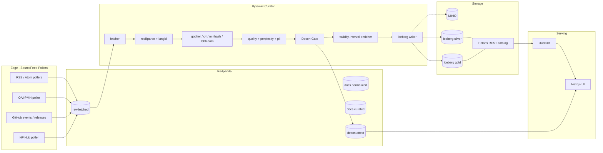

# Stream2Pretrain - Architecture

This document is the narrative version of the architecture sketch in
`RESEARCH.md` section 4. It walks through the data plane in execution order,
documents the cross-cutting concerns, and pins each component to its host on
the k3s cluster.

For the diagrammatic view, see [`architecture.mmd`](./architecture.mmd) (the
Mermaid source rendered by GitHub) or the ASCII block in
[`../RESEARCH.md`](../RESEARCH.md) section 4.

## Architectural style

Stream2Pretrain is a **Kappa** pipeline: there is a single streaming code path
that handles both live ingestion and reprocessing. There is no parallel batch
job. Reprocessing is implemented by replaying Redpanda from an earlier offset,
which is the substrate for the contamination-bisect feature.

The dataflow is:

```
SourceFeed pollers --> Redpanda --> Bytewax curator --> Iceberg lakehouse
                                       |
                                       +--> Decon-Gate sidecar --> attestation topic
```

Every hop is idempotent on `doc_id` (sha256 of the canonical URL), so
restarts and replays do not double-count.

## Component walkthrough

### Edge: source-feed pollers

Each Phase-1 source has a dedicated workload (CronJob or long-running
Deployment depending on cadence):

| SourceFeed | Workload | Cadence | Output topic |
|---|---|---|---|
| `rss-arxiv-cs-*` (4 feeds) | `ingest-rss` Deployment | 2h conditional GET | `raw.fetched` |
| `oai-arxiv-cs` | `ingest-oaipmh` CronJob | 2h with resumption tokens | `raw.fetched` |
| `github-events` | `ingest-github-events` Deployment | `X-Poll-Interval` (~60s) | `raw.fetched` |
| `github-releases` | `ingest-github-releases` Deployment | 2h ETag-conditional | `raw.fetched` |
| `hf-models`, `hf-daily-papers` | `ingest-hf` Deployment | 10-15 min | `raw.fetched` |
| `*-blog` RSS bundle | shares `ingest-rss` workload | 6-24h | `raw.fetched` |
| Sitemaps | `ingest-sitemap` CronJob | per-feed | `raw.fetched` |

Every poller writes the **raw bytes** to MinIO under
`s3://bronze/year=YYYY/month=MM/day=DD/source=<feed>/<doc_id>.html.gz` and
emits a `BronzeRecord` pointer (defined in `schemas/bronze.py`) onto
`raw.fetched`. A doc that fetches twice in the same minute deduplicates by
`doc_id`; the bronze object is overwritten with the latest bytes plus a fresh
`fetched_at`.

### Bus: Redpanda

A single-binary Kafka API broker. Topics:

| Topic | Producer(s) | Consumer(s) | Partitions (dev / prod) |
|---|---|---|---|
| `raw.fetched` | all pollers | curator | 1 / 12 |
| `docs.normalized` | curator (after extract+lang+tags) | curator (next stage) + UI streams | 1 / 12 |
| `docs.curated` | curator | Iceberg writer + Decon-Gate | 1 / 12 |
| `decon.attest` | Decon-Gate | UI + verifier scripts | 1 / 3 |

Partition counts and retention windows live in `schemas/topics.py`. The
prod profile is `needs-measurement` until the Week 5 throughput benchmark.

### Engine: Bytewax curator

A Python streaming dataflow with the Rust core. The pipeline is wired in
`processor/curate.py` and uses operators from `processor/operators/`:

1. `fetcher` - HTTP fetch + content-type sniff. Splits by content type.
2. `resiliparse_extract` - HTML to clean text, extract title.
3. `langid` - fastText lid.176; drops anything below the lang threshold.
4. `gopher_c4_taggers` - heuristic filters via the Dolma Rust taggers.
5. `minhash` - 112-perm signature using Rensa.
6. `lshbloom` - band-partitioned Bloom near-dup index (RocksDB-checkpointed).
7. `quality_classifier` - FineWeb-Edu ONNX INT8 inference (CPU).
8. `kenlm_perplexity` - mmap'd binary KenLM model.
9. `pii_regex` - email / phone / SSN / credit-card / IP scan.
10. `decon_gate` - 13-gram Bloom + E5 embedding sketch (also runs as sidecar).
11. `validity_interval_enricher` - populates `[valid_from, valid_to)` from
    `http_last_modified`, `schema.org datePublished`, Wayback first-seen,
    license effective date, retraction date. Precedence rule documented in
    [`data-model.md`](./data-model.md).
12. `iceberg_writer` - commits to bronze / silver / gold tables.

Operators are pure functions over `(key, value)` tuples; the Bytewax runtime
handles partitioning, state, and recovery.

### Storage: MinIO + Iceberg + Polaris

- **MinIO**: S3 API, single chart, single dev node.
  Buckets: `bronze`, `silver`, `gold`, `decon-attestations`, `checkpoints`.
- **Iceberg V3**: row lineage (`_row_id`), deletion vectors, branch / tag
  semantics. Tables: `silver.normalized`, `gold.curated`,
  `decon.attestations`. Partitioning is detailed in `data-model.md`.
- **Polaris** (lite mode): Iceberg REST catalog, RBAC, single-replica in dev.

### Serving: DuckDB + Next.js UI

DuckDB runs as a single Pod with the `iceberg` extension loaded, serving the
UI's queries via a thin HTTP wrapper (`ui/lib/duckdb-client.ts`). The Next.js
14 App Router app exposes:

- `/dashboard` - live throughput, KEDA replica counts, per-source rates.
- `/sources` - SourceFeed CRD list with status + tail of `raw.fetched`.
- `/decon` - latest signed attestations, drill-down to rejected docs.
- `/as-of` - date picker; renders the deterministic mixture at that instant.
- `/mixtures` - shadow A/B comparison view, perplexity-delta gates.

### Cross-cutting

- **Autoscaling**: KEDA `ScaledObject` per consumer group keyed by Kafka lag.
- **Observability**: kube-prometheus-stack scrapes every `/metrics`, Loki
  picks up structured logs, Tempo records OTel traces. The pollers, fulltext
  fetchers, curator, and Iceberg writer all emit a `trace_id` that is stored
  on the gold record so a UI click can pivot from a row to the full trace.
- **Ingress + TLS**: Traefik IngressRoute with cert-manager.
- **Policy**: OPA Gatekeeper validates SourceFeed admission. Constraint
  templates live in `charts/stream2pretrain/templates/gatekeeper-constraints.yaml`.
- **Network**: default-deny `NetworkPolicy`, per-pod egress allowlist
  derived from `egressAllow` on the SourceFeed.

## Mermaid view



## Pod placement on the dev cluster (1 control + 2 workers)

| Pod | Node preference | Resource budget (dev) |
|---|---|---|
| Redpanda | worker-1 (dedicated) | 2 vCPU, 2 GiB RAM, 20 GiB disk |
| MinIO | worker-2 | 1 vCPU, 1 GiB RAM, 50 GiB disk |
| Bytewax curator (1-6 replicas) | both workers | 1 vCPU, 1 GiB RAM each |
| Polaris | control or worker-2 | 0.5 vCPU, 512 MiB |
| DuckDB | control | 1 vCPU, 1 GiB |
| UI | control | 0.25 vCPU, 256 MiB |
| Pollers | both workers | 0.1 vCPU, 128 MiB each |
| kube-prometheus-stack + Loki | dedicated namespace | shared 1 vCPU, 1 GiB |

Resource numbers are dev-tier estimates and `needs-measurement` for prod.

## Failure modes covered by design

- **Redpanda crash-loop**: pollers buffer in MinIO bronze, drain on recovery.
- **Curator crash**: Bytewax restores from RocksDB checkpoint; Redpanda
  transactional consumer prevents double-commit.
- **MinIO unavailable**: writers retry with exponential backoff; the
  bronze-record pointer carries a tombstone field (`bytes_size = None`).
- **Polaris unavailable**: writers stage parquet in `silver_pending/` and
  promote on recovery.
- **Decon-Gate signing key compromise**: rotate via `operations.md` runbook,
  re-attest the latest snapshot.
