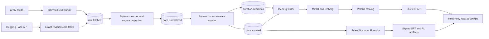

# Architecture

## Kappa data flow

The system is streaming-only. Live input and explicitly approved replay use the
same Redpanda and Bytewax path. Discovery envelopes only schedule content
retrieval and never enter document, route, or acceptance totals.

## Topics

| Topic | Producer | Consumer |
|---|---|---|
| `raw.fetched` | content ingest workers | Bytewax fetcher |
| `docs.normalized` | Bytewax fetcher | Bytewax curator |
| `curation.decisions` | Bytewax curator | Iceberg writer and monitoring |
| `docs.curated` | Bytewax curator | Iceberg writer and Foundry intake |
| smoke variants | isolated deployment smoke | isolated smoke consumers |

## Processing components

- arXiv full-text worker: licence resolution, native HTML, ar5iv fallback,
  bounded CPU PDF fallback, immutable Bronze publication.
- Hugging Face workers: exact revision and repository terms, README-only body
  fetch, immutable Bronze publication.
- Fetcher: source dispatch, structured paper extraction, Markdown card
  projection, language metadata, scientific artifact persistence, Silver emit.
- Curator: source-specific quality scoring, PII, exact and near duplicate state,
  composite and reasoning signals, route decision.
- Iceberg writer: durable decision table and accepted corpus table with
  idempotent identity handling.
- Foundry: ranked 24-hour scientific-paper cohort, task and evidence graph
  generation, two solver trajectories, verifier compilation, deterministic
  validation, signed packaging, and per-artifact human audit.

## Storage

- `s2p-bronze`: short-retention source bodies.
- `s2p-silver`: structured scientific JSON and assets with bounded retention.
- `s2p-gold`: Iceberg data and metadata for route decisions and accepted text.
- `s2p-posttrain`: generated tasks, trajectories, environments, packages, and
  audit evidence.
- retained PVCs: Bytewax recovery, dedup state, and Foundry control state.

## UI

Dashboard, Sources, Documents, Datasets, and Mixture are monitoring/export
views backed by declaratively configured workloads. Document and job detail
opens in a dialog. Only named approval or rejection of a generated SFT/RL
artifact mutates product state.

## Scaling

Independently committing ingest workers and stateless model services can scale
horizontally. The core Bytewax flows currently run as one coordinated execution
per stage because recovery and global near-duplicate state must not be forked by
ordinary replica scaling. CPU, memory, lag, and object growth are measured in
Prometheus; any production throughput claim remains `needs-measurement` until a
target-cluster run records it.
