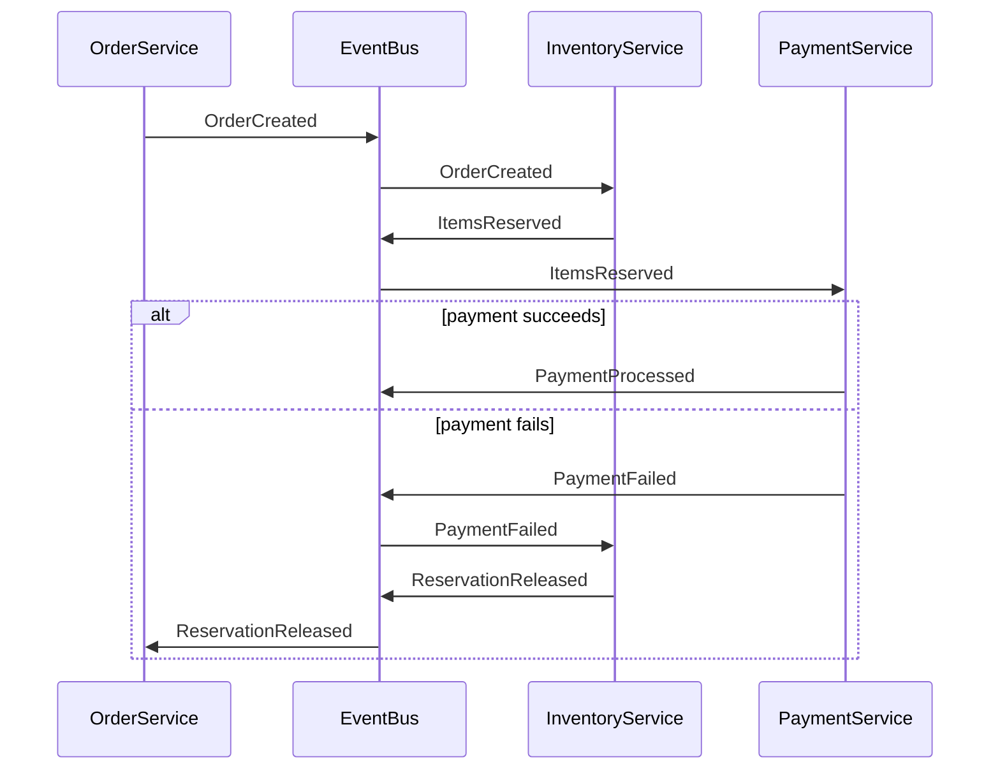
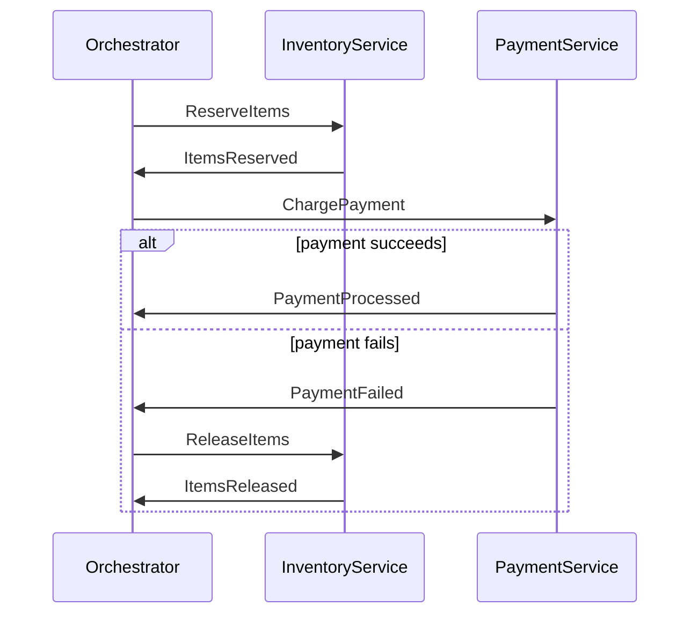

Microservice Architecture

<!-- .slide: data-name="Introduction" data-state="hide-menubar" -->

---
## Microservice Architecture (MSA)

Arranges applications as collections of loosely-coupled services
- Variant of the Service-Oriented Architecture (SOA)
- Fine-grained micro-services employing light-weight protocols

Properties of micro-services
- Unix philosophy: Do one thing and do it well <comment>(single responsibility principle)</comment>
- Use what fits best <comment>(OS, programming language, protocols, ...)</comment>
- Communicates using application-specific protocols <comment>(e.g., MariaDB protocol, proprietary RESTful APIs, Web Socket, ...)</comment>
- Independently deployable and packaged <comment>(including OS, platform, framework, runtime, dependencies, app binary or code)</comment>

---
## Monolithic, SOA, and MSA

---
## High Cohesion
<!-- .slide: data-name="Properties" -->

High Cohesion / [Single-Responsibility-Principle](https://www.amazon.de/Clean-Architecture-Craftsmans-Software-Structure/dp/0134494164)
- Each subsystem has a clearly defined (sub-) task
- Full problem is solved by orchestrating all subsystems
- Single Responsibility Pattern helps avoid weak cohesion
- Clear responsibilities, scalability, and maintainability

---
## Loose Coupling

Approach to interconnecting components in a system
- Components depend on each other to the least extent practicable
- Coupling: degree of knowledge one element has of another

Loose coupling
- Simplify testing, maintenance, and troubleshooting procedures
- System can be easily broken down into definable components

---
## Decentralized Data Management

Each Microservice should [manage its own data](https://microservices.io/patterns/data/database-per-service.html)
- Does not rely on other microservices for data access
- Independent schema, storage technology, and scaling

No shared databases (API-driven data access only)
- Shared databases create tight coupling between services
- Hard to evolve independently and difficult to troubleshoot

Trade-off: no distributed transactions across service boundaries
- A single operation may span multiple services and databases
- Requires accepting eventual consistency instead of strong consistency
- The [SAGA pattern](https://microservices.io/patterns/data/saga.html) is the standard approach to handle this

---
## SAGA Pattern

Sequence of local transactions coordinated across services
- If a step fails, compensating transactions undo the previous steps
- Two coordination styles: Choreography and Orchestration

Choreography (event-driven)
- Services publish events, others react (e.g. [Kafka](https://kafka.apache.org/), [AWS EventBridge](https://aws.amazon.com/eventbridge/))
- Pro: loose coupling, no single point of failure
- Con: flow logic spread across services, hard to trace

Orchestration (centralized, command-driven)
- Orchestrator handles failures (e.g. [Temporal](https://temporal.io/), [AWS Step Functions](https://aws.amazon.com/step-functions/))
- Pro: full flow visible in one place, easier to reason about
- Con: orchestrator is an additional component, potential bottleneck

---
## SAGA: Choreography

<!-- .element: style="width: 80%"-->

---
## SAGA: Orchestration

---
## API-Driven Design / Statelessness

Microservices should be designed around APIs
- Services have a clear API <comment>(defines inter-service interaction)</comment>
- Expose only operations that are relevant for other services
- Don't expose internal implementation details to other services
- APIs should be versioned <comment>(allow for long-lived services)</comment>

Microservices should be stateless
- _"Statelessness is a REST constraint"_ (Fielding, 2000)
- No server-side client-specific state is stored between requests
- Allows for scalability <comment>(load balancing, caching, retry logic, etc.)</comment>
- Requires external session handling <comment>(e.g., tokens, cache-based, ...)</comment>

---
## Smart Endpoints and Dumb Pipes

Services own their logic
- Infrastructure just moves data

Smart Endpoints
- Services receive requests, apply their business logic, and respond
- No external system decides how a service handles its requests
- Operates autonomously <comment>(logic stays close to the domain)</comment>
- Examples: REST API, gRPC service, Kafka consumers

Dumb Pipes
- Communication infrastructure only routes and delivers messages
- Does not transform, filter, or make decisions about content
- Examples: HTTP, gRPC, Kafka topics, RabbitMQ queues

---
## The Anti-Pattern: Smart Pipes

Enterprise Service Bus <comment>(ESB)</comment>
- Central middleware that routes, transforms, and orchestrates messages between services
- Business logic embedded in integration layer, not services
- Common in SOA architectures <comment>(e.g., MuleSoft, IBM MQ, Oracle ESB)</comment>

Why ESBs are problematic in MSA
- Logic is split between services and the bus
- Changes require coordinating service teams and bus configuration
- Bus becomes a bottleneck and single point of failure
- Services no longer fully own their behavior

Message broker shouldn't make business decisions

---
## Communication Patterns

Synchronous communication <comment>(request / response)</comment>
- REST over HTTP/JSON <comment>(ubiquitous, human-readable, easy)</comment>
- gRPC: binary <comment>(Protocol Buffers)</comment>, strongly typed, way more efficient
- Suitable for queries that require an immediate response

Asynchronous communication <comment>(message-passing)</comment>
- Producer sends a message, consumer processes it independently
- Message queues: Kafka, RabbitMQ, ...
- Suitable for events, long-running operations, and decoupling services

When to prefer gRPC over REST
- Internal service-to-service <comment>(high throughput, low latency)</comment>
- When strong typing and generated clients are desired

---
## API Gateway

Single entry point for all external client requests
- Routes requests to the appropriate internal microservice
- Hides internal service topology from clients

Common responsibilities
- Authentication and authorization <comment>(validate tokens before forwarding)</comment>
- Rate limiting, TLS/SSL termination, and request routing
- Request/response transformation and aggregation

Examples: [Kong](https://konghq.com/), [Traefik](https://traefik.io/), AWS API Gateway, nginx
- Deployed as a reverse proxy in front of all services
- Prevents clients from calling internal services directly

---
## Service Discovery

Services need to find each other at runtime
- IP addresses change when services are redeployed or scaled
- Hardcoding addresses is not feasible and error-prone
- Leads to high coupling and operational complexity

Two approaches
- Client-side: query registry, select an instance <comment>(e.g., Netflix Eureka)</comment>
- Server-side: call load balancer, which handles routing <comment>(e.g., AWS ALB, Kubernetes Service)</comment>

Service registry: central directory of available instances
- Services register on startup, deregister on shutdown
- Health checks detect and remove failed instances

---
## Resilience Patterns

Distributed systems fail partially
- Services must handle this gracefully

Circuit Breaker
- Stops calling a failing service after a threshold of errors
- Returns a fallback response instead of waiting for timeout
- Automatically retries after a cooldown period

Further patterns
- Retry with exponential backoff <comment>(transient failures)</comment>
- Timeout: every remote call must have a deadline
- Bulkhead: isolate resources per service <comment>(prevents one slow service from exhausting all threads)</comment>

---
## Auto-Scaling / Monitoring

Microservices should be designed to automatically scale 
- Scale up or down in response to changes in demand
- Ensures application performance and reliability

Robust logging and tracing mechanisms
- MSA applications are scattered across multiple services
- Tracking a request across multiple services is hard
- Requires reading logs from multiple services

Requires monitoring and alerting
- Essential for debugging latency or failure across service boundaries
- Provides insights into the overall health of the system
- Basis for auto-scaling decisions

--- 
## Continuous Deployment and Integration

A microservice should be continuously deployable
- Can <comment>(and should)</comment> be updated frequently 
- Small, incremental changes <comment>(bug fixes, enhancements, etc.)</comment>

Automation of build, test, and deployment processes
- Should include infrastructure automation

Changes are deployed quickly and consistently
- With minimal human intervention
- Helps reducing downtime and minimizes the risk of errors
- Allows releasing new features and bug fixes more frequently
- Can result in increased innovation and faster time to market

---
## MSA: Pros
<!-- .slide: data-name="Pros and Cons" -->

Development
- Independent, small teams per service <comment>("two-pizza rule", ~6–8 people)</comment>
- [Conway's Law](https://en.wikipedia.org/wiki/Conway%27s_law): the way teams talk to each other shapes the software they build <comment>(one team per service → one service per team)</comment>
- Easier to test, maintain, onboard developers, and build artifacts

Deployment
- Deployability <comment>(services can be deployed independently)</comment>
- Fault isolation <comment>(e.g., memory leaks)</comment>

Investment
- No long-term commitment to a single technology stack
- Service-wise migration to new technology stacks possible

---
## MSA: Cons

Complexity
- Complexity of distributed system  <comment>(failures, distributed transactions, testing, ...)</comment>
- Requires coordination between teams

Tool-support
- Tools/IDEs are oriented on building monolithic applications
- Requires explicit support for developing distributed applications

Deployment complexity
- Deploy and manage systems comprised of many different services
- Increased resource consumption <comment>(potentially more overhead)</comment>

---
## The Return of the Monolith

MSA adds significant operational complexity <comment>(not always justified)</comment>
- Amazon Prime Video (2023) [migrated a distributed microservice pipeline back to a monolith](https://dev.to/amplication/amazon-ditches-microservices-for-monolith-decoding-prime-videos-architectural-shift-5bk6)
- [Martin Fowler: "Monolith First"](https://martinfowler.com/bliki/MonolithFirst.html) argues for starting with a monolith and only extracting microservices when necessary

Modular Monolith as an alternative
- Single deployable unit with clear internal module boundaries
- Avoids network overhead, distributed transactions, and deployment complexity
- Can be decomposed later if scale or team size requires it

Choice depends on the specific context and requirements of the application

---
## Literature

- Sam Newman: "Building Microservices: Designing Fine-Grained Systems", ISBN: [1491950358](https://en.wikipedia.org/wiki/Special:BookSources?isbn=1491950358)
- Sam Newman: "Monolith to Microservices: Evolutionary Patterns to Transform Your Monolith", ISBN: [1492047848](https://en.wikipedia.org/wiki/Special:BookSources?isbn=1492047848)
- Susan J. Fowler: "Production-Ready Microservices: Building Standardized Systems Across an Engineering Organization", ISBN: [1491965975](https://en.wikipedia.org/wiki/Special:BookSources?isbn=1491965975)
- Chris Richardson et al.: "Microservices Patterns: With Examples in Java", ISBN: [1617294543](https://en.wikipedia.org/wiki/Special:BookSources?isbn=1617294543)
- Mike Amundsen and Matt Mclarty: "Microservice Architecture", ISBN: [1491956259](https://en.wikipedia.org/wiki/Special:BookSources?isbn=1491956259)
- [Martin Fowler – Microservices](https://martinfowler.com/articles/microservices.html)
- [Sam Newman – *Building Microservices*](https://www.oreilly.com/library/view/building-microservices-2nd/9781492034018/) (O'Reilly Media, 2nd Edition, 2021)
- [Chris Richardson – microservices.io Patterns](https://microservices.io/patterns/index.html)
- [Jez Humble and David Farley – *Continuous Delivery*](https://www.informit.com/store/continuous-delivery-reliable-software-releases-through-9780321601919) (Addison-Wesley, 2010)
- [Robert C. Martin – *Clean Architecture*](https://www.oreilly.com/library/view/clean-architecture-a/9780134494272/) (Prentice Hall, 2017)
- [Mary Shaw and David Garlan – *Software Architecture: Perspectives on an Emerging Discipline*](https://www.amazon.com/Software-Architecture-Perspectives-Emerging-Discipline/dp/0131829572) (Prentice Hall, 1996)
- [Nicola Dragoni et al. – *Microservices: Yesterday, Today, and Tomorrow*](https://arxiv.org/abs/1606.04036) (arXiv:1606.04036, 2017)
- [Roy Fielding – *Architectural Styles and the Design of Network-based Software Architectures*](https://www.ics.uci.edu/~fielding/pubs/dissertation/top.htm) (Doctoral Dissertation, 2000)

