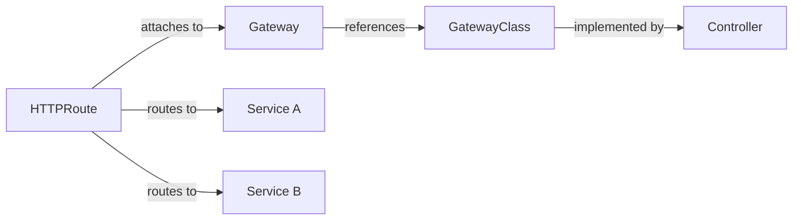

<div class="lecturetitle">Storage and Networking</div>
<!-- .slide: data-name="Introduction" data-state="hide-menubar" -->

---
## Motivation: Storage and Networking

Containers and Pods are ephemeral by design
- On Pod restarts, all data written inside the container is lost
- Pods can be rescheduled to different nodes at any time

Pods get dynamic IP addresses <comment>(change on restart)</comment>
- Service discovery and stable addressing important for applications

Storage and networking abstraction in Kubernetes
- Volumes and Persistent Volumes for data persistence
- Services and DNS for cluster-internal discovery
- Ingress and Gateway API for external <comment>(HTTP)</comment> routing
- External DNS for automatic DNS record management
- API Gateways for cross-cutting concerns across multiple services

<!--- ------------------------------------------------------------------- --->
<!--- ------------------------------------------------------------------- --->
---
# Kubernetes: Storage
<!-- .slide: data-name="Storage" -->
<!--- ------------------------------------------------------------------- --->
<!--- ------------------------------------------------------------------- --->

---
## Pods and Data Persistence

A container's filesystem is ephemeral
- E.g., MariaDB writes to `/var/lib/mysql` inside the container
- Pod crashes, writeable layer is deleted, data is lost
- Same applies to logs, uploaded files, caches, and any other writes

Storage must be agnostic of the underlying node
- Pods can attach [Volumes](https://kubernetes.io/docs/concepts/storage/volumes/) to solve this
- Volume: directory/file mounted <comment>(i.e., made available at a path)</comment>
- Lifecycle and persistence depend on the volume type
- Containers in or across Pods can share the same volume

Volumes require explicit configuration
- Must be provisioned and referenced in the Pod spec

---
## Storage: Volume Types

Different types of volumes for different use cases

| Type                                                                        | Lifecycle   | Description                                                                                                                            |
| --------------------------------------------------------------------------- | ----------- | -------------------------------------------------------------------------------------------------------------------------------------- |
| `emptyDir`                                                                  | Pod         | Empty directory, deleted on Pod removal <comment>(share data between containers)</comment>                                             |
| `hostPath`                                                                  | Node        | Mount path from the node's filesystem <comment>(not portable, avoided in production)</comment>                                         |
| `configMap`                                                                 | External    | Inject read-only files <comment>(e.g., configuration data)</comment>                                                                   |
| `secret`                                                                    | External    | Inject secrets as read-only files <comment>(e.g., sensitive data such as passwords or tokens)</comment>                                |
| `PersistentVolume`                                                          | Independent | Cluster resource representing actual storage, **not** directly used by Pods <comment>(e.g., NFS, iSCSI, cloud storage, etc.)</comment> |
| `persistentVolumeClaim`                                                     | Independent | Request for storage by a Pod, binds to a PersistentVolume                                                                              |
| [others](https://kubernetes.io/docs/concepts/storage/volumes/#volume-types) | —           | `projected`, `downwardAPI`, inline ephemeral CSI volumes, and more                                                                     |

<!-- .element: style="margin-top: 20px;margin-left: 20px; width: 100%;" -->


---
## Empty Dir
<!-- .slide: data-name="Built-In Types" -->

Initially empty dir created when a Pod is assigned to a Node
- Exists as long as that Pod is running on that node
- Containers in the Pod can read and write all files
- On Pod removal, the data in the emptyDir is deleted

```yaml
apiVersion: v1
kind: Pod
metadata:
  name: emptydir-demo-pod
spec:
  containers:
    - name: my-mariadb
      image: mariadb
      volumeMounts:
        - name: data-volume
          mountPath: /docker-entrypoint-initdb.d/
  volumes:
    - name: data-volume
      emptyDir: {}
```

---
## ConfigMap

Used to inject configuration data into Pods
- Example: Create MariaDB tables and/or insert data on startup
- Instead of downloading data using an init container

<a data-code='yaml' data-begin="Begin: Configmap" data-end="CREATE TABLE `popular`" href="code/examples/mariadb-configmap.yaml">Source code</a>

---
## Using ConfigMap in Containers

MariaDB image looks for special folders on startup
- E.g., it runs `*.sql` files in `/docker-entrypoint-initdb.d/`

Example: Use the configmap to init the db with SQL
- Mount configmap at `/docker-entrypoint-initdb.d/` results in
 `/docker-entrypoint-initdb.d/mariadb-init.sql`

<a data-code='yaml' data-begin="Mount the configmap volume" data-end="environment variables" href="code/examples/mariadb-configmap.yaml">Source code</a>

---
## Secrets

[Secrets](https://kubernetes.io/docs/concepts/configuration/secret/) hold sensitive data
- Examples are passwords, OAuth tokens, certificates, ...
- Separate definition and storage of secrets from `Pod` definitions

Example: Database password

```Bash
# Store username and password in two files
echo -n "admin" > ./username.txt
echo -n "mysecretpw" > ./password.txt

# Packages the files into a Secret
kubectl create secret generic db-user-pass \
  --from-file=username.txt \
  --from-file=password.txt

# Display secrets
kubectl get secrets
```

---
## Using `Secret`s

```YAML
apiVersion: v1
kind: Pod
metadata:
  name: mypod
spec:
  containers:
  - name: mypod
    image: redis
    volumeMounts:
    - name: secrets
      mountPath: "/etc/secrets"
      readOnly: true
  volumes:
  - name: secrets
    secret:
      secretName: db-user-pass
```

---
## Persistent Volume (PV)
<!-- .slide: data-name="Persistent Volumes" -->

Until now: ephemeral or read-only volumes
- Many applications require persistent storage
- [PersistentVolume](https://kubernetes.io/docs/concepts/storage/persistent-volumes/) represents a block of storage

Can be provisioned manually by an administrator
- Lifecycle independent of individual Pods
- Bound to some storage resource
- E.g., iSCSI LUN on a SAN, NFS share, path existing on all nodes, manually provisioned AWS S3 cloud volume, etc.

Pods do not directly use PersistentVolumes
- They request storage using a PersistentVolumeClaim
- Decouples how storage is provided from how it is consumed

---
## Persistent Volume Claim (PVC)

A [PersistentVolumeClaim](https://kubernetes.io/docs/concepts/storage/persistent-volumes/#persistentvolumeclaims) is a request for storage by a Pod
- Specifies what is needed, not how it is provided

Required fields
- [Capacity](https://github.com/kubernetes/community/blob/master/contributors/design-proposals/scheduling/resources.md) <comment>(e.g., `8Gi`)</comment>
- [Access modes](https://kubernetes.io/docs/concepts/storage/persistent-volumes/#access-modes) <comment>(ReadWriteOnce, ReadOnlyMany, ReadWriteMany, ReadWriteOncePod)</comment>
- [Volume mode](https://kubernetes.io/docs/concepts/storage/persistent-volumes/#volume-mode) <comment>(`Filesystem` or `Block`)</comment>
- [Storage class](https://kubernetes.io/docs/concepts/storage/persistent-volumes/#class-1) <comment>(optional; selects provisioner and parameters)</comment>

At runtime, Kubernetes binds the PVC to a matching PV
- Binding is exclusive: one PV binds to exactly one PVC
- Pod remains in `Pending` until a matching PV is available

---
## Persistent Volume Claim (PVC)

Abstracts how storage is provided from how it is consumed

```yaml
apiVersion: v1
kind: PersistentVolumeClaim
metadata:
  name: myclaim
spec:
  # ReadWriteOnce, ReadOnlyMany, ReadWriteMany, ReadWriteOncePod
  accessModes:
    - ReadWriteOnce   

  # Filesystem (default) | Block (raw block device)
  volumeMode: Filesystem  
  
  # Minimum capacity required
  resources:
    requests:
      storage: 8Gi    
  
  # Define the type of storage (e.g., performance, cost, etc.)
  storageClassName: slow  
```

---
## Using a PVC in a Pod

A Pod references a PVC by name
- Mount it at a path inside the container
- Kubernetes resolves Pod → PVC → PV → actual storage

```yaml
apiVersion: v1
kind: Pod
metadata:
  name: mypod
spec:
  containers:
    - name: mycontainer
      image: nginx
      volumeMounts:
        - name: mystorage # local name (cf. volumes section)
          mountPath: /var/data # path inside the container
  volumes:
    - name: mystorage
      persistentVolumeClaim: # Type: PVC
        claimName: myclaim #  references the PVC by name
```

---
## PVC Provisioning

Manual provisioning
- An administrator creates a PV <comment>(e.g., ahead of time, manually)</comment>
- Kubernetes binds the PVC to a PV that satisfies the request <comment>(i.e., capacity, access modes, volume mode, and storage class match)</comment>

Better: automatic, dynamic provisioning
- No PV needs to exist beforehand
- [StorageClass](https://kubernetes.io/docs/concepts/storage/storage-classes/) names a PV provisioner and its parameters
- When a PVC references a StorageClass, the provisioner creates a matching PV automatically

Provisioner: [Container Storage Interface](https://kubernetes-csi.github.io/docs/drivers.html) <comment>(CSI)</comment> compliant drivers 
- Plugin interface between Kubernetes and storage backends

---
## CSI Drivers

Standard API between Kubernetes and storage vendors
- Before CSI, storage drivers were compiled into Kubernetes <comment>(in-tree)</comment>
- Allows vendors to ship drivers independently of Kubernetes releases
- Any provider can be deployed in a cluster

Two components run in the cluster
- CSI Controller: one per cluster, manages volume lifecycle
- CSI Node Plugin: one per node, manages volume mounts on nodes

Examples
- Local, single-node, development: [hostPath](https://kubernetes.io/docs/concepts/storage/volumes/#hostpath), [local](https://kubernetes.io/docs/concepts/storage/volumes/#local)
- Cloud: [AWS EBS](https://github.com/kubernetes-sigs/aws-ebs-csi-driver), [Azure Disk](https://github.com/kubernetes-sigs/azuredisk-csi-driver), [GCP PD](https://github.com/kubernetes-sigs/gcp-compute-persistent-disk-csi-driver)
- On-premise: [Rook Ceph](https://github.com/rook/rook), [NFS](https://github.com/kubernetes-csi/csi-driver-nfs), [OpenStack Cinder](https://github.com/kubernetes/cloud-provider-openstack/blob/master/docs/cinder-csi-plugin/using-cinder-csi-plugin.md)

---
## PVC Provisioning: Storage Class

Storage classes for different performance or cost tiers
- Cloud providers typically pre-install different StorageClasses
- E.g., fast but expensive SSDs vs. slower but cheaper HDDs

Defines [volume binding mode](https://kubernetes.io/docs/concepts/storage/storage-classes/#volume-binding-mode)
- Immediate <comment>(provisioned as soon as the PVC is created)</comment>
- WaitForFirstConsumer <comment>(delayed until a Pod using it is scheduled)</comment>

Defines [Reclaim policy](https://kubernetes.io/docs/concepts/storage/persistent-volumes/#reclaim-policy)
- What happens to the underlying storage when the PVC is deleted

| Policy  | Description                                                 |
| ------- | ----------------------------------------------------------- |
| Retain  | Keep the volume after PVC deletion, manual cleanup required |
| Delete  | Delete the underlying volume when the PVC is deleted        |
| Recycle | Delete data but keep volume for future use (deprecated)     |
<!-- .element: style="margin-left: 20px; width: 100%;" -->

---
## AWS Storage Class Example

Two AWS EBS volume types commonly used in Kubernetes

| Field      | gp3                          | sc1                         |
| ---------- | ---------------------------- | --------------------------- |
| Full name  | General Purpose SSD v3       | Cold HDD                    |
| Use case   | Default workloads, databases | Infrequent access, archives |
| Throughput | up to 1,000 MB/s             | up to 250 MB/s              |
| Cost       | Medium                       | Low                         |
<!-- .element: style="margin-left: 20px; width: 100%;" -->

Example 

```yaml
apiVersion: storage.k8s.io/v1
kind: StorageClass
metadata:
  name: fast
provisioner: ebs.csi.aws.com   # EBS = Elastic Block Store
parameters:
  type: gp3 # EBS volume type (gp3, sc1, io2, …)
reclaimPolicy: Delete  # Delete EBS volume when PVC is deleted
# Delay volume creation until a Pod is scheduled
volumeBindingMode: WaitForFirstConsumer  
```

---
## Default Storage Class

PVCs specify a [StorageClass](https://kubernetes.io/docs/concepts/storage/storage-classes/) to get dynamic provisioning
- Requires environment-specific configuration and knowledge

Instead, a default storage class can be defined for the cluster
- PVCs that omit `storageClassName` default to this default

Example: default storage class example for OpenStack
```yaml
apiVersion: storage.k8s.io/v1
kind: StorageClass
metadata:
  name: default
  annotations:
    # Marks this as the default storage class
    storageclass.kubernetes.io/is-default-class: "true"  
provisioner: cinder.csi.openstack.org
parameters:
  type: slow # provider-specific hint
```

<!--- ------------------------------------------------------------------- --->
<!--- ------------------------------------------------------------------- --->
---
# Kubernetes Networking
<!-- .slide: data-name="Networking" -->
<!--- ------------------------------------------------------------------- --->
<!--- ------------------------------------------------------------------- --->

---
## Two Distinct Networks

Node network 
- Network connecting all nodes <comment>(e.g., `192.168.1.0/24`)</comment> 
- Managed outside Kubernetes <comment>(cloud provider or your data center)</comment>

Pod network (cluster network)
- Virtual network spanning all nodes (e.g., `10.244.0.0/16`)
- Nodes get slices of the IP space and assign IPs to Pods from that


---
## Pod Network

Kubernetes creates a network namespace for each Pod
- Basically an isolated network stack for each Pod
- Network implementation is handled by pluggable drivers

Container Network Interface (CNI) drivers
- Implement Pod network; invoked on pod creation/deletion
- Assign IPs, virtual interfaces, routing & cross-node communication

| CNI                                               | Mechanism                                                                 | Note                                                                                                                                                          |
| ------------------------------------------------- | ------------------------------------------------------------------------- | ------------------------------------------------------------------------------------------------------------------------------------------------------------- |
| [Flannel](https://github.com/flannel-io/flannel)  | [VXLAN](https://en.wikipedia.org/wiki/Virtual_Extensible_LAN)             | Wraps Pod packets inside UDP; data travels encapsulated over the node network. Easy to set up, but adds overhead. No built-in traffic filtering between Pods. |
| [Calico](https://github.com/projectcalico/calico) | [BGP](https://en.wikipedia.org/wiki/Border_Gateway_Protocol) (no overlay) | Uses BGP (the Internet's routing protocol) to set up routes and next hops. No wrapping, full speed; supports network policies.                                |
| [Cilium](https://cilium.io/use-cases/cni/)        | [eBPF](https://ebpf.io/)                                                  | Delegates packet-processing to the Linux kernel. No context switches &rarr; high throughput. Network policies and application layer filtering possible.       |
<!-- .element: style="margin-left: 20px; width: 100%;" -->

---
## Communication Types

Different types of communications in Kubernetes
- Container-to-container communications
- Pod-to-Pod communications
- Pod-to-Service communications
- External-to-Service communications


---
## Container-to-Container Communications

Containers in the same Pod can communicate with each other
- Similar to processes running on the same host
- Can reach each other via `localhost`

They share the same network interface (i.e., IP address)
- Only one container in a Pod can listen on a specific port

Example: web server + log shipper containers
- App writes logs to emptyDir, another container forwards them


---
## Pod-to-Pod Communications

By default, all pods can communicate with other pods
- No matter on which node they are running
- Pod network uses a shared subnet for all pods in the cluster

Pods are similar to applications running in VMs or physical hosts
- Every pod has its own IP address and can reach any pods via their IP
- By default, no network policies or firewalls between pods


---
## Inspecting a Pod's Network Data

Inspect pod data
- E.g., `kubectl describe pod nginx`
- Displays node and pod IP addresses

Output

```yaml
Name:         nginx
Node:         minikube/192.168.64.11
Labels:       app=nginx
IP:           172.17.0.7
Containers:
  nginx:
    Image:          nginx:latest
    Port:           80/TCP
[...]
```
<!-- .element: style="font-size: 1em;" -->

---
## Service
<!-- .slide: data-name="Services" -->

Pod IPs are ephemeral and not stable
- Services provide stable network identities to a changing set of Pods
- A service has a stable IP address during its lifetime

A service (by default) forwards traffic to a pod
- Eligible pods are selected via labels
- Traffic is forwarded to one of the selected pods
- Different forwarding strategies exist <comment>(e.g., round-robin, random, etc.)</comment>


---
## Service Example

Example: Service named `my-service` 
- Listens on port 80/TCP
- Selects <comment>(ready, healthy)</comment> pods with label `app=MyApp`
- Forwards traffic to TCP port 9376 on the selected pod

Example

```YAML
kind: Service
apiVersion: v1
metadata:
  name: my-service
spec:
  selector:
    app: MyApp
  ports:
  - protocol: TCP
    port: 80
    targetPort: 9376
```

---
## Service: Traffic Forwarding Strategies

Kubernetes needs to choose which Pod to forward traffic
- Controlled by `sessionAffinity` and `trafficDistribution`

Default: random / round-robin (no session affinity)
- Each new connection is forwarded to a randomly chosen healthy Pod
- Implemented by `kube-proxy` using firewall rules <comment>(iptables or IPVS)</comment>
- Stateless implementation <comment>(no memory of previous requests routing)</comment>

Sometimes, session affinity is needed
- Connections from the same client IP are forwarded to the same Pod
- Useful when the application stores per-user state in memory
- Configured via `sessionAffinity: ClientIP` <comment>(see next slide)</comment>s

---
## Service: Session Affinity

Example for session affinity based on client IP
- Stores mapping of client IPs to backend Pods for 3h

```yaml
apiVersion: v1
kind: Service
metadata:
  name: my-service
spec:
  selector:
    app: MyApp
  ports:
    - protocol: TCP
      port: 80
      targetPort: 9376
  # Use client IP for session affinity
  sessionAffinity: ClientIP
  sessionAffinityConfig:
    clientIP:
      # Reset affinity after 3h (3*60*60 seconds) of inactivity
      timeoutSeconds: 10800   
```

---
## Service: Topology-Aware Routing

Prefers Pods in the same availability zone as the calling pod
- Reduces cross-zone traffic costs and latency
- Nodes' `topology.kubernetes.io/zone` label determines zone
- Prefers routing to a Pod where Pod and Node label are identical

```yaml
apiVersion: v1
kind: Service
metadata:
  name: my-service
spec:
  selector:
    app: MyApp
  ports:
    - protocol: TCP
      port: 80
      targetPort: 9376
  # PreferSameZone or PreferSameNode
  # Falls back to any zone if no local Pod is available
  trafficDistribution: PreferSameZone
```

---
## Non-Default Service Types

By default, Services have a cluster-internal IP
- Same as specifying `type: ClusterIP`
- Other options are available using different types of services

Available service types
- `ClusterIP` <comment>(default, cluster-internal communication)</comment>
- `NodePort`, `ExternalName` <comment>(skipped in the main lecture flow)</comment>
- `LoadBalancer`
- None (headless service)

Can be used for different use cases
- E.g., exposing services outside the cluster, or mapping to external services

---
## Service Type: LoadBalancer

Provisions an external load balancer 
- Standard way to expose a Service on the internet
- Each load balancer service has a cost <comment>(expensive for many services)</comment>

```yaml
apiVersion: v1
kind: Service
metadata:
  name: my-service
spec:
  type: LoadBalancer
[...omitted...]
```

Requires software component running in the cluster
- Provides link to the cloud provider's load balancer API
- [AWS Load Balancer Controller](https://kubernetes-sigs.github.io/aws-load-balancer-controller/), [GKE Cloud Load Balancing](https://cloud.google.com/kubernetes-engine/docs/concepts/service-load-balancer), [OpenStack Cloud Controller Manager](https://github.com/kubernetes/cloud-provider-openstack), [MetalLB (bare-metal clusters)](https://metallb.universe.tf/)

vvv
## Service Type: NodePort

Opens a port on every node in the cluster
- Forwards traffic arriving on that port to the Service
- Used one bare-metal or dev clusters without cloud load balancers
- In production settings, prefer `LoadBalancer` instead

```yaml
apiVersion: v1
kind: Service
metadata:
  name: my-service
spec:
  type: NodePort
  selector:
    app: MyApp
  ports:
    - protocol: TCP
      port: 80          # cluster-internal port
      targetPort: 9376  # port on the Pod
      # Optional; if omited a free port (30000–32767) is selected
      # If set, it is rejected if out-of-range or already in use
      nodePort: 30080   # port opened on every node
```
<!-- .element: style="font-size: 0.6em;" -->

vvv
## Service Type: ExternalName

Maps a Service name to an external DNS name 
- No proxying, no selector, no Pod involved
- Used to give a cluster-internal name to an external dependency

```yaml
apiVersion: v1
kind: Service
metadata:
  name: my-database
  namespace: prod
spec:
  type: ExternalName
  externalName: db.example.com   # resolves to this outside the cluster
```

Pods inside the cluster can now reach 
- `my-database.prod.svc.cluster.local`
- Kubernetes returns a CNAME to `db.example.com`
- Use to give a cluster-internal name to an external dependency

---
## Headless Services

Until now: Services with a stable IP address (internal or external)
- Sometimes a stable IP is not required but a stable service name
- Headless services do not have an IP of their own 

They provide no load balancing or proxying
- Specify `.spec.clusterIP: None`
- Can be used to enable other discovery mechanisms <comment>(next slides)</comment>

Example

```yaml
kind: Service
apiVersion: v1
metadata:
  name: my-service
spec:
  # Headless service (i.e., no ip is assigned)
  clusterIP: None
```

---
## CoreDNS and Service Discovery
<!-- .slide: data-name="Service Discovery" -->

IP addresses are not known prior to app deployment
- Even if stable, they are are not sensible for app configuration
- Kubernetes provides a built-in [CoreDNS](https://coredns.io/) server for service discovery
- All Pods are configured to use it as their DNS resolver

Every Service in the cluster is assigned a DNS name
- Service names are a fully qualified domain name (FQDN)
- E.g., `my-svc.my-namespace.svc.cluster.local`

Resolve services by name instead of IP address
- Resolve database service IP by looking it up in DNS
- Returns IPv4 <comment>(A)</comment> and IPv6 <comment>(AAAA)</comment> records
- Allows easy service discovery without hardcoding IP addresses

---
## CoreDNS and Service Discovery

For convenience, a search path is configured
- Adds namespace (e.g., `default`) and cluster domain (e.g., `cluster.local`)
- Inside the same namespace `mysvc` is sufficient
- From another namespace, use `mysvc.othernamespace`

Simple application configuration using DNS

```JavaScript
const mariadb = require('mariadb')

const pool = mariadb.createPool({
     host: 'my-app-mariadb-service',
     database: 'sportsdb',
     user:'root', 
     password: 'mysecretpw',
     connectionLimit: 1
})
```

vvv
## CoreDNS and Service Discovery

Service port numbers also get DNS entrises
- Allows port resolution by name instead of number using SRV records
- SRV records: `_port-name._protocol.my-svc.my-namespace.svc.cluster.local`
- `_mariadb-port._tcp.my-app-mariadb-service` resolves to `3306/TCP`

```yaml
apiVersion: v1
kind: Service
metadata:
  name: my-service
spec:
  selector:
    app: MyApp
  ports:
    - name: db-port      # used in SRV record: _db-port._tcp.my-service...
      protocol: TCP
      port: 3306          # cluster-internal port
      targetPort: 3306  # port on the Pod
```
<!-- .element: style="font-size: 0.6em;" -->


vvv
## DNS for Services and Pods: Example

Inside the cluster, perform the following lookups

Cluster IP service

```shell
$ host my-app-mariadb-service
my-app-mariadb-service.default.svc.cluster.local has address 10.106.165.130

$ host -t SRV _mariadb-prot._tcp.my-app-mariadb-service
_mariadb-prot._tcp.my-app-mariadb-service.default.svc.cluster.local has SRV record 0 100 3306 my-app-mariadb-service.default.svc.cluster.local.
```
<!-- .element: style="font-size: 0.55em;" -->

Headless service

```shell
$ host -t SRV _memcached-prot._tcp.my-memcached-service
_memcached-prot._tcp.my-memcached-service.default.svc.cluster.local has SRV record 0 50 11211 10-244-0-50.my-memcached-service.default.svc.cluster.local.
_memcached-prot._tcp.my-memcached-service.default.svc.cluster.local has SRV record 0 50 11211 10-244-0-53.my-memcached-service.default.svc.cluster.local.

$ host my-memcached-service
my-memcached-service.default.svc.cluster.local has address 10.244.0.50
my-memcached-service.default.svc.cluster.local has address 10.244.0.53
```
<!-- .element: style="font-size: 0.55em;" -->

---
## Headless Services and DNS

Headless Services
- Do not have a service IP address
- Instead, the service name resolves to all IP addresses of all pods

Node.js example

```JavaScript
const dns = require('dns').promises;

async function getMemcachedServersFromDns() {
  // Query all IP addresses from DNS for the service name
  let queryResult = await 
    dns.lookup('my-memcached-service', { all: true })

  // Add memcache port 11211 to each IP
  return queryResult.map(el => el.address + ":11211")
}

// Get updated server list
let servers = await getMemcachedServersFromDns()
console.log("Updated memcached server list to ", servers)
```

<!--- ------------------------------------------------------------------- --->
<!--- ------------------------------------------------------------------- --->
<!--- ------------------------------------------------------------------- --->
---
# Ingress (and a bit of Gateway API)
<!-- .slide: data-name="Ingress" -->
<!--- ------------------------------------------------------------------- --->
<!--- ------------------------------------------------------------------- --->

---
## Ingress

`LoadBalancer` services consumes load balancer and an  IP
- Good for a single service, expensive for many

Most customer-facing applications use HTTP/HTTPS
- Can be routed based on hostnames and paths
- Avoids assigning every service its own IP address

For HTTP(S) traffic, Kubernetes provides the [Ingress](https://kubernetes.io/docs/concepts/services-networking/ingress/) resource
- Uses a single external IP and load balancer for multiple services
- Can perform additional functions <comment>(TLS termination, URL rewriting, ...)</comment>

Ingress resources define rules for HTTP routing
- Software component (ingress controller) implements these rules
- Different implementations available

--- 
## Ingress Controller and Types

Ingress controllers
- Open source: [Nginx Ingress](https://kubernetes.github.io/ingress-nginx/deploy/) (deprecated), [Traefik](https://doc.traefik.io/traefik/providers/kubernetes-ingress/), [HAProxy](https://www.haproxy.com/documentation/kubernetes/latest/), ...
- Cloud-specific: [Azure](https://github.com/Azure/application-gateway-kubernetes-ingress), [AWS](https://github.com/kubernetes-sigs/aws-alb-ingress-controller), ...
- [Minikube](https://kubernetes.io/docs/tasks/access-application-cluster/ingress-minikube/): `minikube addons enable ingress`

Different configurations possible
- Path-based <comment>(e.g., service 1 on `/foo`, service 2 on `/bar`)</comment>
- Name-based Virtual Hosting, IP-based, ...

---
## Ingress Example

```yaml
apiVersion: networking.k8s.io/v1
kind: Ingress
metadata:
  name: simple-fanout-example
spec:
  rules:
  - http:
      paths:
      - path: /foo
        pathType: Prefix
        backend:
          service:
            name: service1
            port:
              number: 4200
```

Applications see the original path
- `http://ex.com/foo` forwarded to `service1` with as path `/foo`
- Some proprietary solutions also support URL rewriting

--- 
## Ingress: SSL/TLS Termination

Ingress references a Secret with private key and certificate

```yaml
apiVersion: networking.k8s.io/v1
kind: Ingress
metadata:
  name: tls-example-ingress
spec:
  tls:
    - hosts:
        - foo.bar.com
      secretName: my-certificate
  [...]
```

```yaml
apiVersion: v1
kind: Secret
metadata:
   name: my-certificate
   namespace: default
data:
   tls.crt: base64 encoded cert
   tls.key: base64 encoded key
type: kubernetes.io/tls
```

---
## Ingress: SSL/TLS Termination

Manually managing certificates is error-prone and does not scale
- Certificates expire, need to be renewed and updated in Kubernetes

Certificate management can be automated
- [cert-manager](https://cert-manager.io/) is an open-source option
- Integrates with Kubernetes resources and controllers

Watches Service and Ingress resources for TLS annotations
- Automatically provisions and renews certificates
  
Supports a variety of certificate issuers
- ACME <comment>(i.e., mostly Let's Encrypt)</comment>
- HashiCorp Vault, Venafi, self-signed, and more
- Details: navigate down

vvv
## Ingress: SSL/TLS Termination

Example: cert-manager + Let's Encrypt
- Requires a ClusterIssuer configured to use Let's Encrypt ACME

```yaml
# Tells cert-manager to use Let's Encrypt ACME
apiVersion: cert-manager.io/v1
kind: ClusterIssuer
metadata:
  name: letsencrypt-prod
spec:
  acme:
    server: https://acme-v02.api.letsencrypt.org/directory
    email: admin@example.com # notified on expiry
    privateKeySecretRef:
      name: letsencrypt-prod-key # stores the ACME account key
    solvers:
      - http01:
          ingress:
            # cert-manager creates a temp Ingress 
            # to answer the ACME challenge
            class: nginx              
```

vvv
## Ingress: SSL/TLS Termination

Cert-manager detects the annotation
- Requests a certificate from Let's Encrypt, stores it in `example-com-tls`, and renews it automatically before expiry

```yaml
apiVersion: networking.k8s.io/v1
kind: Ingress
metadata:
  name: example-ingress
  annotations:
    # Annotated ingress to request a certificate automatically
    cert-manager.io/cluster-issuer: letsencrypt-prod
spec:
  tls:
    - hosts:
        - example.com
      # cert-manager writes the certificate here
      secretName: example-com-tls    
  rules:
    [...omitted...]
```

---
## Ingress: Annotations

Annotations extend Ingress behaviour
- Some are defined by Kubernetes <comment>(portability across controllers)</comment>
- Supported by any controller that implements the Ingress spec
- Non-standard ones by controller implementations

Annotation: Use a default controller for this Ingress
- `ingressclass.kubernetes.io/is-default-class: "true"`
- Signals that this Ingress should be handled by the default controller
- Controllers claim ingresses with no `ingressClassName` set
- Only one default controller supported <comment>(otherwise, first one wins)</comment>

Annotation: `kubernetes.io/ingress.class: "nginx"`
- Deprecated in favor of Ingress' `spec.ingressClassName`

---
## Ingress: Non-Standard Annotations

Examples of non-standard annotations for different controllers

| Annotation                                    | Example value      | Controller    | Effect                                                         |
| --------------------------------------------- | ------------------ | ------------- | -------------------------------------------------------------- |
| `nginx.ingress.kubernetes.io/rewrite-target`  | `/`                | ingress-nginx | Rewrite the upstream request path                              |
| `nginx.ingress.kubernetes.io/proxy-body-size` | `"0"`              | ingress-nginx | Remove upload size limit                                       |
| `nginx.ingress.kubernetes.io/ssl-redirect`    | `"true"`           | ingress-nginx | Force HTTP → HTTPS redirect                                    |
| `cert-manager.io/cluster-issuer`              | `letsencrypt-prod` | cert-manager  | Automatically provision a TLS certificate                      |
| `konghq.com/protocols`                        | `"https"`          | Kong          | Restrict route to HTTPS only, redirect HTTP → HTTPS            |
| `konghq.com/https-redirect-status-code`       | `"301"`            | Kong          | Set redirect status code (default 426 — browsers don't follow) |
| `konghq.com/strip-path`                       | `"true"`           | Kong          | Strip the matched path prefix before forwarding                |
| `konghq.com/plugins`                          | `rate-limiter`     | Kong          | Attach a Kong plugin to this route                             |
<!-- .element: style="font-size: 0.5em;" -->

Non-standard annotations are not portable
- Switching controllers requires updating all annotations
- Should be used with caution

---
## Ingress: Limitations

Ingress covers basic HTTP routing but has several limitations
- No support for protocols other than HTTP(S)
- No traffic splitting, header-based routing, or weighted backends
- Advanced features require non-portable, controller-specific annotations

The [Gateway API](https://gateway-api.sigs.k8s.io/) is the designated successor to Ingress
- Stable since Kubernetes 1.28
- Separate resources for infrastructure and application teams
- Supports HTTP, HTTPS, TCP, and gRPC natively
- Expressive routing <comment>(header matching, traffic splitting, redirects)</comment>
- Not very widely adopted yet, but worth keeping an eye on <comment>(navigate down for a brief introduction to the API and its properties)</comment>

vvv
## Ingress Mixes Admin/App Concerns

```yaml
apiVersion: networking.k8s.io/v1
kind: Ingress
metadata:
  annotations:
    # admin concern: TLS policy
    nginx.ingress.kubernetes.io/ssl-redirect: "true"   
    # admin concern: URL rewrite
    nginx.ingress.kubernetes.io/rewrite-target: /      
    # admin concern: certificate
    cert-manager.io/cluster-issuer: letsencrypt-prod   
spec:
  # admin concern: TLS configuration
  tls:
    - hosts: [myapp.example.com]
      secretName: myapp-tls                            
  rules:
    # app team concern: virtual hostname
    - host: myapp.example.com   
      http:
        paths:
          # app team concern: routing rule
          - path: /api          
            pathType: Prefix
            backend:
              # app team concern: target service
              service:
                name: api-svc   
                port: { number: 8080 }
```
<!-- .element: style="font-size: 0.53em;" -->

vvv
## Separating Concerns with Gateway API

Gateway API separates responsibilities into distinct resources

| Role                    | Concern                                              |
| ----------------------- | ---------------------------------------------------- |
| Vendor / Cloud provider | Provide and maintain the controller software         |
| Cluster admin           | Choose and configure which gateway technology to use |
| Cluster admin           | Allocate ports, TLS certificates, and IP addresses   |
| App team                | Define routing rules for their service               |
<!-- .element: style="margin-left: 20px; width: 100%;" -->

Resources owned by different roles

| Resource                       | Owner          | Purpose                                                                     |
| ------------------------------ | -------------- | --------------------------------------------------------------------------- |
| (Controller) <br/> no resource | Vendor         | Software (Deployment) that implements a `GatewayClass`                      |
| `GatewayClass`                 | Vendor / admin | Names a controller and its default config <br> (installed once per cluster) |
| `Gateway`                      | Cluster admin  | Binds to ports and TLS certs; instantiates a `GatewayClass`                 |
| `HTTPRoute`                    | App team       | Routing rules (path, header, weight) attached to a `Gateway`                |
<!-- .element: style="margin-left: 20px; width: 100%;" -->

vvv
## Gateway API: Resources and Relationships



vvv
## Gateway API: GatewayClass

Assumes the Nginx Gateway controller is installed in the cluster
- Vendor provides a Deployment for the controller and documentation on how to configure it
- The controller watches for `GatewayClass` resources with its (hardcoded) identifier 
- E.g., `controllerName: k8s.nginx.org/nginx-gateway-controller`

Example

```yaml
apiVersion: gateway.networking.k8s.io/v1
kind: GatewayClass
metadata:
  name: nginx
spec:
  controllerName: k8s.nginx.org/nginx-gateway-controller  
```

vvv
## Gateway API: Gateway

References a `GatewayClass`
- Listeners define which ports and protocols the gateway listens on
- TLS configuration references Kubernetes Secrets with certificates

```yaml
apiVersion: gateway.networking.k8s.io/v1
kind: Gateway
metadata:
  name: main-gateway
spec:
  gatewayClassName: nginx
  listeners:
  - name: http
    port: 80
    protocol: HTTP
  - name: https
    port: 443
    protocol: HTTPS
    tls:
      certificateRefs:
      - name: my-certificate # references a TLS Secret
```
<!-- .element: style="font-size: 0.7em;" -->

vvv
## Gateway API: HTTPRoute

HTTPRoute defines routing rules attached to a Gateway
- `parentRefs` specifies which Gateway and listener to attach to
- `rules` define how to route to services based on path, headers, etc

```yaml
apiVersion: gateway.networking.k8s.io/v1
kind: HTTPRoute
metadata:
  name: app-route
spec:
  parentRefs:
  - name: main-gateway
    sectionName: https # attaches only to the HTTPS listener
  rules:
  - matches:
    - path: { type: PathPrefix, value: / }
    backendRefs:
    - name: api-service
      port: 8080
```

---
## External DNS

Ingress and LoadBalancer services get an external IP
- Clients want to access services via a DNS name
- DNS records still have to be created manually

Can be automated [External DNS](https://github.com/kubernetes-sigs/external-dns)
- Watches Services and Ingress resources for hostnames
- Creates, updates, and deletes DNS records accordingly

Supports many DNS providers
- Some providers are implemented in-tree such as cloud-based ([AWS Route53](https://github.com/kubernetes-sigs/external-dns/blob/master/docs/tutorials/aws.md), [Cloudflare](https://github.com/kubernetes-sigs/external-dns/blob/master/docs/tutorials/cloudflare.md), [Azure DNS](https://github.com/kubernetes-sigs/external-dns/blob/master/docs/tutorials/azure.md), [Google Cloud DNS](https://github.com/kubernetes-sigs/external-dns/blob/master/docs/tutorials/gke.md)) or generic [RFC2136 (DNS UPDATE)](https://github.com/kubernetes-sigs/external-dns/blob/master/docs/tutorials/rfc2136.md) ones
- Others can be implemented using webhooks <comment>(see [this list](https://github.com/kubernetes-sigs/external-dns/tree/master#new-providers) for details)</comment>

---
## Exercise: Create an Ingress

<a data-exercise="external-access">Create Ingress</a>

---
# Summary: Storage
<!-- .slide: data-name="Summary" -->

Container filesystems are ephemeral
- All data is lost when a Pod restarts
- Volumes attach storage to Pods
  - `emptyDir`: shared scratch space within a Pod, deleted with the Pod
  - `configMap` / `secret`: read-only config and sensitive data
  - `persistentVolumeClaim`: durable storage, survives Pod restarts

PV / PVC decouples storage provisioning from consumption
- `PersistentVolume` (PV):actual storage <comment>(NFS share, cloud disk, …)</comment>
- `PersistentVolumeClaim` (PVC): Pod's request for storage <comment>(capacity, access mode, storage class)</comment>

Dynamic, automatic provisioning via `StorageClass`
- CSI drivers connect Kubernetes to cloud <comment>(AWS EBS, Azure Disk, GCP PD)</comment> and on-premise backends <comment>(Ceph, NFS)</comment>

---
# Summary: Networking

Networking
- Pods get their own IP <comment>(cluster-wide virtual network)</comment>
- CNIs provides networking for Pods <comment>(e.g., Flannel, Calico, Cilium)</comment>

`Service`: stable name and IP for a changing set of Pods
- ClusterIP, LoadBalancer, NodePort, ExternalName, headless

Advanced topics
- `CoreDNS`: service discovery by name instead of IP
- `Ingress`: routes HTTP(S) to services via a single load balancer
- `Gateway API`: expressive, role-separated successor to Ingress
- `Cert-manager`: automates TLS certificate provisioning/renewal
- `External DNS`: automates DNS record creation <comment>(Services, Ingress)</comment>


