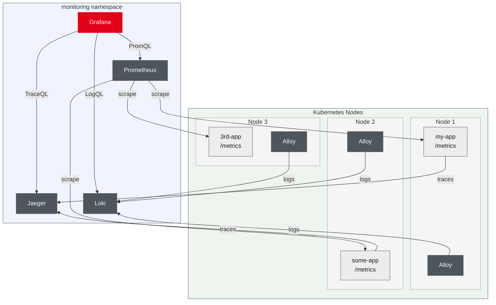
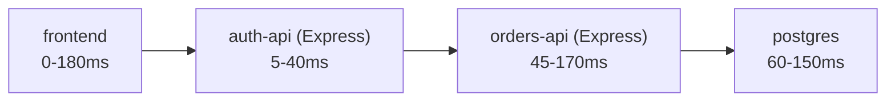

<div class="lecturetitle">Observability & Autoscaling</div>
<!-- .slide: data-name="Introduction" data-state="hide-menubar" -->

---
## Chapter Overview

Observability: know what is happening inside the cluster
- Collecting and querying metrics <comment>(e.g., Prometheus)</comment>
- Kubernetes object state as metrics <comment>(e.g., kube-state-metrics)</comment>
- Dashboards and alerting <comment>(e.g., Grafana)</comment>
- Log collection and querying <comment>(e.g., Loki)</comment>
- Distributed tracing <comment>(e.g., Jaeger, Zipkin, Tempo)</comment>

Autoscaling: respond to load automatically
- Right-size resource requests <comment>(Vertical Pod Autoscaler, VPA)</comment>
- Scale replicas on CPU/memory <comment>(Horizontal Pod Autoscaler, HPA)</comment>
- Event-driven autoscaling <comment>(KEDA)</comment>
- Add and remove nodes based on demand <comment>(Cluster Autoscaler)</comment>

---
<!--- ------------------------------------------------------------------- --->
<!--- ------------------------------------------------------------------- --->
# Observability
<!--- ------------------------------------------------------------------- --->
<!--- ------------------------------------------------------------------- --->

---
## Observability vs. Monitoring

Monitoring: watch predefined metrics, alert on threshold violations
- Useful when you already know what can go wrong
- Fails for unknown failure modes <comment>(you only see what you measured)</comment>

Observability: understand the internal state of a system
- Based on the system's outputs: metrics, logs, and traces
- Enables debugging problems you did not anticipate at design time

| Pillar  | What it captures                         | Tool examples             |
| ------- | ---------------------------------------- | ------------------------- |
| Metrics | Numeric measurements over time           | Prometheus, OpenTelemetry |
| Logs    | Structured or unstructured event records | Loki, Elasticsearch       |
| Traces  | Request flow across service boundaries   | Jaeger, Zipkin, Tempo     |

---
## Metrics Frameworks
<!-- .slide: data-name="Metrics Frameworks" -->

Three common types of metrics frameworks

| Framing             | Origin                                                                                         | Signals                              | Question answered                 | Best for                                      |
| ------------------- | ---------------------------------------------------------------------------------------------- | ------------------------------------ | --------------------------------- | --------------------------------------------- |
| USE                 | [Brendan Gregg](https://www.brendangregg.com/usemethod.html)                                   | Utilization, Saturation, Errors      | Is this resource a bottleneck?    | Resources <comment>(CPU, Disk, NIC)</comment> |
| RED                 | [Tom Wilkie](https://www.youtube.com/watch?v=zk77VS98Em8) <comment>(Weave / Grafana)</comment> | Rate, Errors, Duration               | Is this service healthy?          | Request-driven services                       |
| Four Golden Signals | [Google SRE](https://sre.google/sre-book/monitoring-distributed-systems/)                      | Latency, Traffic, Errors, Saturation | Is the user experience degrading? | Holistic overview                             |
<!-- .element: style="margin-left: 20px; width: 100%; font-size: 0.6em;" -->

Standard set of metrics ("Four Golden Signals")
- Introduced by Google's  [Site Reliability Engineering book](https://www.oreilly.com/library/view/site-reliability-engineering/9781491929117/ch01.html) 
- Summarise the health of a request-driven service
- Make different services comparable, reduces metric overload

Production dashboards usually combine RED and USE
- RED per service edge, USE per node

---
## USE Metrics

Make the health of a resource measurable
- Applied per resource <comment>(e.g., a node)</comment>, not per service

| Signal          | Question answered                    |
| --------------- | ------------------------------------ |
| **U**tilization | What % of time is the resource busy? |
| **S**aturation  | How much work is queued or waiting?  |
| **E**rrors      | How many error events did it report? |
<!-- .element: style="margin-left: 20px;" -->

Examples

| Resource | Signal      | Metric                     | What it tells you                              |
| -------- | ----------- | -------------------------- | ---------------------------------------------- |
| CPU      | Utilization | `node_load1 / cores`       | Average number of busy CPUs over 1 minute      |
| CPU      | Saturation  | Run queue length           | Threads waiting for a CPU to free up           |
| CPU      | Errors      | Throttling events          | Times the kernel forced a process to pause     |
| Disk     | Utilization | `% time busy`              | Fraction of time the disk had any I/O activity |
| Disk     | Saturation  | I/O queue depth            | Pending I/O requests not yet served            |
| Disk     | Errors      | Read/write failures        | Hardware or filesystem-level errors            |
| Network  | Utilization | Bytes/sec vs link capacity | How close to the NIC's maximum throughput      |
| Network  | Saturation  | Packet drops               | Packets the NIC discarded because it was full  |
<!-- .element: style="margin-left: 20px; width: 95%; font-size: 0.55em;" -->

---
## USE Metrics (Continued)

Same pattern applies to other resources

| Resource           | Signal      | Metric                      | What it tells you                              |
| ------------------ | ----------- | --------------------------- | ---------------------------------------------- |
| Memory             | Utilization | `used / total`              | How much RAM is currently in use               |
| Memory             | Saturation  | Swap activity / page faults | Pressure when free RAM runs low                |
| Memory             | Errors      | OOM kills                   | Kernel killed a process for exceeding memory   |
| DB connection pool | Utilization | `active / max connections`  | How much of the pool is busy                   |
| DB connection pool | Saturation  | Wait time to acquire        | How long requests queue for a free connection  |
| DB connection pool | Errors      | Acquisition timeouts        | Requests that gave up waiting for a connection |
| Thread pool        | Utilization | `active / max threads`      | How much of the pool is busy                   |
| Thread pool        | Saturation  | Task queue length           | How many tasks are waiting to run              |
| Thread pool        | Errors      | Rejected tasks              | Pool refused work because the queue was full   |
<!-- .element: style="margin-left: 20px; width: 95%; font-size: 0.55em;" -->

Useful for finding resource-induced bottlenecks
- E.g., a high CPU run queue indicates a CPU bottleneck
- E.g., a high memory swap activity indicates a memory bottleneck

---
## RED Metrics

Make the health of a request-driven service measurable

| Signal       | Question answered                          |
| ------------ | ------------------------------------------ |
| **R**ate     | How much traffic does the service receive? |
| **E**rrors   | What fraction of requests fail?            |
| **D**uration | How long does a request take?              |
<!-- .element: style="margin-left: 20px; " -->

Percentiles are preferred over averages
- Average hides the slow tail <comment>(e.g., one user in ten can wait 5s while the mean stays at 200ms)</comment>

Percentile concept <comment>(if every request were stored individually)</comment>
- Percentiles are typically approximated from histogram buckets
- Uses latency buckets <comment>(`≤5ms`, `≤25ms`, `≤100ms`, `≤500ms`, `≤2.5s`, `Inf`)</comment>
- Measured per route, not just per service

---
## Four Golden Signals: RED + USE

Google's [Four Golden Signals](https://sre.google/sre-book/monitoring-distributed-systems/) predate RED and USE
- The framework most production setups effectively converge on
- RED and USE together reconstruct the four-signal coverage

Mapping the four signals to RED and USE

| Four Golden Signal | Where it comes from                                                                        |
| ------------------ | ------------------------------------------------------------------------------------------ |
| Latency            | RED — Duration                                                                             |
| Traffic            | RED — Rate                                                                                 |
| Errors             | RED — Errors <comment>(5xx)</comment> AND USE — Errors <comment>(disk, NIC, ...)</comment> |
| Saturation         | USE — Saturation <comment>(queue length, packet drops, ...)</comment>                      |
<!-- .element: style="margin-left: 20px; width: 100%; font-size: 0.7em;" -->

Practical takeaway
- Track RED at service edges <comment>(covers Latency, Traffic, request Errors)</comment>
- Track USE on every node and shared resource <comment>(covers Saturation and infrastructure Errors)</comment>

---
## Typical Observability Stack


<!-- .element: style="width: 80%;" -->

---
<!--- ------------------------------------------------------------------- --->
## Metrics: Prometheus
<!-- .slide: data-name="Prometheus" -->
<!--- ------------------------------------------------------------------- --->

[Prometheus](https://prometheus.io/) is the de-facto standard
- Pull-based model: Scrapes metrics from endpoints regularly
- Often deployed together with Grafana <comment>(visualization and alerting)</comment>

Metrics stored in an embedded time-series database
- Identified by a metric name and a set of labels <comment>(key-value pairs)</comment>
- Query language [PromQL](https://prometheus.io/docs/prometheus/latest/querying/basics/)
- Supports filtering, aggregation, and rate calculations

Typical use cases
- System health monitoring <comment>(CPU, memory, disk usage)</comment>
- Application performance monitoring <comment>(request latency, error rates)</comment>
- Alerting <comment>(e.g., high error rate, low available replicas)</comment>

---
## Prometheus Metrics Scraping

Prometheus pulls metrics from applications
- Regularly scrapes configured endpoints (e.g., every 30s)
- Store metrics in its time-series database for querying and alerting

Requires applications to expose a metrics endpoint
- Typically, `/metrics` HTTP endpoint returning current metric values
- Applications must be instrumented to collect and expose these metrics

Client libraries available for many languages and frameworks
- E.g., Node.js or Express.js apps on top of Node.js

| Language | Library                                                                                            | Notes                                                                                                       |
| -------- | -------------------------------------------------------------------------------------------------- | ----------------------------------------------------------------------------------------------------------- |
| Node.js  | [prom-client](https://github.com/siimon/prom-client)                                               | Collects Node.js runtime metrics, can expose custom metrics (our example uses explicit this variant)        |
| Express  | [express-prometheus-middleware](https://github.com/jochen-schweizer/express-prometheus-middleware) | Automatically records requests and duration per route; less control over metric names and bucket boundaries |

---
## Prometheus Metric Types

Different metric types for different use cases

| Type      | Behaviour                                   | Typical use                            |
| --------- | ------------------------------------------- | -------------------------------------- |
| Counter   | Monotonically increasing, never decreases   | Request count, error count, bytes sent |
| Gauge     | Any value, can go up or down                | Memory usage, queue depth              |
| Histogram | Counts observations in configurable buckets | Request latency, response size         |
| Summary   | Like histogram but computes quantiles       | p50 / p99 latency                      |

<!-- .element: style="margin-left: 20px; width: 100%; font-size: .72em;" -->

Examples for metrics

| Type      | Metric name and labels                                       | Value                                                                     |
| --------- | ------------------------------------------------------------ | ------------------------------------------------------------------------- |
| Gauge     | Used heap size in bytes of Node.js (to monitor memory usage) | `134217728`                                                               |
| Counter   | Requests `/api/telemetry`, status `200`                      | `4827`                                                                    |
| Histogram | Request duration for `GET /api/telemetry` with status `200`  | `180` (`le=0.05`, i.e., `<=50ms`), `240` (`le=0.1`, i.e., `<=100ms`), ... |
<!-- .element: style="margin-left: 20px; width: 100%; font-size: .72em;" -->

---
## Prometheus Metrics Format

Prometheus metrics are exposed in a human-readable text format
- Defined in the [Prometheus exposition format](https://prometheus.io/docs/instrumenting/exposition_formats/)
- An alternative, [protobuf](https://protobuf.dev/) format may be used using HTTP negotiation

Example output from the `/metrics` endpoint

```prometheus
# HELP gridflex_http_requests_total Total HTTP requests by method, route, and status code
# TYPE gridflex_http_requests_total counter
gridflex_http_requests_total{method="GET", route="/api/telemetry", status="200"} 4827

# HELP gridflex_nodejs_heap_size_used_bytes Process heap size used from Node.js
# TYPE gridflex_nodejs_heap_size_used_bytes gauge
gridflex_nodejs_heap_size_used_bytes 134217728

# HELP gridflex_http_request_duration_seconds HTTP request duration in seconds
# TYPE gridflex_http_request_duration_seconds histogram
gridflex_http_request_duration_seconds_bucket{le="0.1",  method="GET", route="/api/telemetry", status="200"} 240
gridflex_http_request_duration_seconds_bucket{le="0.5",  method="GET", route="/api/telemetry", status="200"} 450
gridflex_http_request_duration_seconds_bucket{le="1",    method="GET", route="/api/telemetry", status="200"} 480
gridflex_http_request_duration_seconds_bucket{le="+Inf", method="GET", route="/api/telemetry", status="200"} 500
```
<!-- .element: style="font-size: 0.65em;" -->

---
## Prometheus Metrics Format: Anatomy

Each metric line has three parts

```
gridflex_http_requests_total{
    method="GET", route="/api/telemetry", status="200"
} 4827
```

Explanation of the parts

| Part        | Example                                                |
| ----------- | ------------------------------------------------------ |
| Metric name | `gridflex_http_requests_total`                         |
| Labels      | `{method="GET", route="/api/telemetry", status="200"}` |
| Value       | `4827`                                                 |
<!-- .element: style="margin-left: 20px; width: 100%; font-size: 0.7em;" -->

Labels are key-value pairs that identify a specific time series
- Same metric name with different labels &rarr; different time series
- E.g., errors on `/api/telemetry` and `/api/devices` are tracked separately

---
## Prometheus Label Cardinality

A unique label combination creates a separate time series
- Prometheus stores index structures per time series in memory
- High-cardinality labels cause label explosion <comment>(&rarr; out of memory)</comment>

Rule of thumb: label values must be enumerable in advance
- Bad if the value grows with your data <comment>(IDs, timestamps, free text)</comment>
- For these cases, use log files, not labels

| Label      | Example value      | Cardinality | Problem                |
| ---------- | ------------------ | ----------- | ---------------------- |
| `status`   | `"200"`            | ~5          | safe                   |
| `method`   | `"GET"`            | ~5          | safe                   |
| `route`    | `"/api/telemetry"` | ~10         | safe                   |
| `user_id`  | `"u-48291"`        | millions    | one series per user    |
| `url`      | `"/api/items/:id"` | unbounded   | one series per item ID |
| `trace_id` | `"3f2a1b..."`      | unbounded   | one series per request |
<!-- .element: style="margin-left: 20px; width: 100%; font-size: 0.7em;" -->

---
## PromQL: Querying Metrics

[PromQL](https://prometheus.io/docs/prometheus/latest/querying/basics/) is the query language built into Prometheus

|                |                                                                                  |                                    |
| -------------- | -------------------------------------------------------------------------------- | ---------------------------------- |
| Instant vector | Current value of matching time series                                            | `gridflex_http_requests_total`     |
| Range vector   | Values over a time window <comment>(used with functions like `rate()`)</comment> | `gridflex_http_requests_total[5m]` |
| Aggregation    | Combines multiple series into one                                                | `sum(...)`, `avg(...)`, `max(...)` |
<!-- .element: style="margin-left: 20px; width: 100%; font-size: 0.65em;" -->

Labels narrow down which series are selected
- `=`: exact match, `!=`: not equal, `=~`: regex match, `!~`: regex not match

Similarities to SQL but no joins or subqueries

|                                      |                                     |
| ------------------------------------ | ----------------------------------- |
| `WHERE status = '200'`               | `{status="200"}`                    |
| `WHERE status LIKE '5__'`            | `{status=~"5.."}`                   |
| `SUM(count)`                         | `sum(gridflex_http_requests_total)` |
| `GROUP BY route`                     | `sum(...) by (route)`               |
| `WHERE time > now() - interval '5m'` | `[5m]` range vector                 |
<!-- .element: style="margin-left: 20px; width: 100%; font-size: 0.65em;" -->

---
## PromQL: Examples

Filter by labels <comment>(status 5xx: server errors)</comment>

```promql
# single route
gridflex_http_requests_total{route="/api/telemetry", status=~"5.."}
```

Filter by labels <comment>(all routes aggregated)</comment>

```promql
# all routes aggregated
sum(gridflex_http_requests_total{status=~"5.."})
```

Rate over a time window (use with counter metrics)
- Returns requests per second over 5 minutes

```promql
rate(gridflex_http_requests_total[5m])
```

Alert rule: fire when error rate exceeds 5%

```yaml
- alert: HighErrorRate
  expr: rate(gridflex_http_requests_total{status=~"5.."}[5m])
       / rate(gridflex_http_requests_total[5m]) > 0.05
  for: 2m
```

---
## Prometheus Metrics Scraping

Originally, Prometheus scraped metrics based on pod annotations
- These are ignored by default in operator-based deployments

[Prometheus-operator](https://github.com/prometheus-operator/prometheus-operator) based installations use CRDs for configuration
- Prometheus Operator watches for these CRDs
- Automatically reconfigures Prometheus

| CRD              | Targets             | Use when                                    |
| ---------------- | ------------------- | ------------------------------------------- |
| `PodMonitor`     | Pods directly       | No Service needed; per-pod metrics          |
| `ServiceMonitor` | Kubernetes Services | App has a Service; scrapes each backing Pod |

Service monitors are more common in production
- No need to select individual Pods, just select the Service
- Scrape Pods via the Service <comment>(uses services to resolve Pod IPs)</comment>
- Only scrapes ready Pods <comment>(no need to worry about Pod lifecycle)</comment>

---
## PodMonitor

Selects Pods directly by label
- Matches Pods with label `app: my-app`
- Pod must have a named port (e.g. `name: metrics`)
- Scrapes `/metrics` on container port named `metrics` every 30 seconds

```yaml
apiVersion: monitoring.coreos.com/v1
kind: PodMonitor
metadata:
  name: my-app-monitor
spec:
  selector:
    matchLabels:
      app: my-app       # matches Pods with this label
  podMetricsEndpoints:
    - port: metrics     # named containerPort on the Pod
      path: /metrics
      interval: 30s
```

PodMonitor is discouraged in production (only for special use cases)

---
## Prometheus ServiceMonitor Example

ServiceMonitor select services their label
- Just like Deployments select Pods by label

Example for a Helm template defining a `ServiceMonitor`

<a data-code='yaml' href="code/gridflex/helm-chart/templates/servicemonitor.yaml">servicemonitor.yaml</a>

---
## Observing Kubernetes Objects
<!-- .slide: data-name="Kubernetes Metrics" -->

Cluster-metrics are also important for operations and debugging
- Kubernetes objects should also be observable
- E.g., replica count, node disk pressure, Pod health, etc.

Popular tool [kube-state-metrics](https://github.com/kubernetes/kube-state-metrics)
- Exposes the state of Kubernetes objects as Prometheus metrics
- Deployed as a Pod in the cluster, reads from the Kubernetes API
- E.g., how many replicas are available? Is a Pod in a crash loop?

Useful metrics

| Metric                                    | What it shows                                                |
| ----------------------------------------- | ------------------------------------------------------------ |
| kube_deployment_status_replicas_available | Available replicas per Deployment                            |
| kube_pod_status_phase                     | Pod phase <comment>(Pending, Running, Failed, ...)</comment> |
| kube_node_status_condition                | Node health conditions                                       |

---
## Observing Kubernetes Objects: Queries

Useful PromQL queries for cluster operations

```promql
# Available replicas of the gridflex-api Deployment
kube_deployment_status_replicas_available{deployment="gridflex-api"}

# Deployments with fewer available replicas than desired
kube_deployment_status_replicas_available 
    < kube_deployment_spec_replicas

# Pods in crash loop
kube_pod_container_status_waiting_reason{
    reason="CrashLoopBackOff"} == 1

# Nodes under disk pressure
kube_node_status_condition
  {condition="DiskPressure", status="true"} == 1

# Average CPU utilisation per node (requires node-exporter)
avg by (instance) (1 - rate(node_cpu_seconds_total{mode="idle"}[5m]))

# Memory utilisation per node (requires node-exporter)
1 - (node_memory_MemAvailable_bytes / node_memory_MemTotal_bytes)
```

---
## Installing the Observability Stack

Can be installed via a Helm using  [kube-prometheus-stack](https://github.com/prometheus-community/helm-charts/tree/main/charts/kube-prometheus-stack)
- Installs a suite of monitoring tools for Kubernetes

Typical components included in the stack
- Prometheus
- Grafana
- [Alertmanager](https://github.com/prometheus/alertmanager) <comment>(alerts via email, Slack, etc.)</comment>
- [node-exporter](https://github.com/prometheus/node_exporter) <comment>(e.g., CPU, memory, disk, ...)</comment>
- [blackbox exporter](https://github.com/prometheus/blackbox_exporter) <comment>(e.g., active HTTP endpoint probing)</comment>
- [kube-state-metrics](https://github.com/kubernetes/kube-state-metrics) <comment>(Kubernetes object state)</comment>
- [Loki](https://github.com/grafana/loki) log aggregation <comment>(optional, enable it plus [Grafana Alloy](https://grafana.com/docs/alloy/latest/))</comment>

---
## Log Collection: Loki
<!-- .slide: data-name="Log Collection" -->

[Loki](https://grafana.com/oss/loki/) provides a log aggregation system for cloud-native environments
- Stores logs in a compressed format
- Indexes labels only <comment>(e.g., pod or deployment name)</comment>
- Does not make log content searchable <comment>(like, e.g., [Elasticsearch](https://github.com/elastic/elasticsearch))</comment> 

Requires a log collector to push logs to Loki
- A frequent choice is [Grafana Alloy](https://grafana.com/docs/alloy/latest/) running as a DaemonSet
- Collects stdout/stderr from every pod and pushes them to Loki
- Adds labels based on Kubernetes metadata <comment>(e.g., namespace, pod, container)</comment>

Does not provide a user interface for log querying
- Integrates with Grafana for log exploration and dashboards

---
## LogQL: Querying Logs

[LogQL](https://grafana.com/docs/loki/latest/query/) is Loki's query language
- Modeled after PromQL

Examples

```logql
# Select all logs by selecting using labels
{app="gridflex-api"}

# Filter by log content (pipe syntax)
{app="gridflex-api"} |= "ERROR"

# Parse JSON logs and filter on a structured field
{app="gridflex-api"} | json | level="error"

# Count error rate over time (metric query from logs)
rate({app="gridflex-api"} |= "ERROR" [5m])
```

---
## Exercise: Observability

<a data-execise="observability">Exercise: Observability</a>

---
<!--- ------------------------------------------------------------------- --->
# Distributed Tracing
<!-- .slide: data-name="Distributed Tracing" -->
<!--- ------------------------------------------------------------------- --->

Metrics tell you what is slow; tracing tells you why
- Trace: one end-to-end request across all involved services
- Span: one step within that trace <comment>(e.g., an HTTP call, controller handler, or database query)</comment>

Example: online shop backend



- `frontend` sends `GET /api/orders/42`
- `auth-api` verifies authentication and forwards the request
- `orders-api` loads order and queries PostgreSQL
- One trace ID links all spans across the full request path

---
## Tracing and App Instrumentation

Goal: follow a request as it flows through multiple services
- Each service adds a span containing timing and metadata
- Spans are linked by a trace ID propagated from service to service

Typical span data
- Start time, end time, and duration, service and operation name
- Metadata, e.g., HTTP method, URL, response status, error flags, or database query
- E.g., `auth-api`, `GET /api/orders/:id`, `status=200`

Tracing requires application instrumentation
- Services must generate and forward trace data
- [OpenTelemetry](https://opentelemetry.io/) is a standard SDK across languages and frameworks
- Tracing backends <comment>(e.g., Jaeger)</comment> store and visualize traces

---
## Tracing and App Instrumentation

Instrumentation with OpenTelemetry
- First instrumented service creates a new trace ID
- E.g., the frontend code in the browser generates a trace ID
- Trace context is propagated via W3C's `traceparent` HTTP header

OpenTelemetry provides auto-instrumentation
- Spans and header propagation are added automatically
- E.g., for HTTP servers, HTTP clients, Express, and database drivers
- For database queries, the span includes the query as metadata <comment>(useful for debugging slow queries)</comment>

Avavilable for many languages and frameworks
- E.g., Node.js, Java, Python, Go, .NET, Ruby, and more

---
## App Instrumentation For Tracing

Example: initialize OpenTelemetry in a Node.js service
- Use auto-instrumentation for Express, HTTP, and database spans

```javascript
const { NodeSDK } = require('@opentelemetry/sdk-node');
const { getNodeAutoInstrumentations } 
  = require('@opentelemetry/auto-instrumentations-node');
const { OTLPTraceExporter } 
  = require('@opentelemetry/exporter-trace-otlp-http');

const sdk = new NodeSDK({
  // OLTP: OpenTelemetry Protocol, standard trace format
  traceExporter: new OTLPTraceExporter(
    { url: 'http://jaeger:4318/v1/traces' }),
  instrumentations: [getNodeAutoInstrumentations()]
});

// Must be called before any other require() 
// Otherwise instrumentation won't work for those modules
sdk.start();
```

---
## App Instrumentation For Tracing

Orders API: extract trace context and handle the HTTP response

```javascript
const express = require('express');
const { Pool } = require('pg');
const { trace, context, propagation, SpanStatusCode } 
        = require('@opentelemetry/api');

const app = express();
const tracer = trace.getTracer('orders-api');
const pool = new Pool({ connectionString: 'postgres://db/shop' });

app.get('/api/orders/:id', async (req, res) => {
  // Extract trace context from the incoming 
  // traceparent header (set by auth-api)
  const incomingContext 
    = propagation.extract(context.active(), req.headers);
  
  await context.with(incomingContext, async () => {
    try {
      res.json(await loadOrder(req.params.id));
    } catch (err) {
      res.status(500).json({ error: 'database error' });
    }
  });
});
```
<!-- .element: style="font-size: 0.6em;" -->

---
## App Instrumentation For Tracing

`loadOrder`: create a span, query PostgreSQL, and record errors
- Context is propagated by context.with() in the route handler

```javascript
async function loadOrder(id) {
  const span = tracer.startSpan('load order from database');

  try {
    // pg auto-instrumentation creates a query child span
    // recording SQL statement and duration
    const result = await pool.query( 'SELECT * FROM orders '+
      'WHERE id = $1', [id]) );
    return result.rows[0];
  } catch (err) {
    span.recordException(err); // attach stack trace to the span
    span.setStatus(
        { code: SpanStatusCode.ERROR, message: err.message });
    throw err; // re-throw so the route can send 500
  } finally {
    span.end(); // always end the span
  }
}
```


---
<!--- ------------------------------------------------------------------- --->
<!--- ------------------------------------------------------------------- --->
# Autoscaling Applications
<!-- .slide: data-name="Autoscaling" -->
<!--- ------------------------------------------------------------------- --->
<!--- ------------------------------------------------------------------- --->

---
## Autoscaling Overview

Currently, replicas and resource requests are set manually
- Based on guesswork, load testing, or rules of thumb

Autoscaling is essential for reliability and cost efficiency
- Key part of cloud-native operations and cost management
- Avoids over-provisioning <comment>(waste of resources)</comment> and under-provisioning <comment>(unreliability, unavailability, poor performance)</comment>
- Improves customer experience <comment>(good performance at all times)</comment>

Kubernetes supports autoscaling at three levels

| Level         | What scales                       | Mechanism                                          |
| ------------- | --------------------------------- | -------------------------------------------------- |
| Pod resources | CPU/memory requests per container | Vertical Pod Autoscaler <comment>(VPA)</comment>   |
| Pod replicas  | Number of Pods in a Deployment    | Horizontal Pod Autoscaler <comment>(HPA)</comment> |
| Cluster nodes | Number of Nodes in the cluster    | Cluster Autoscaler                                 |
<!-- .element: style="margin-left: 20px; width: 100%; margin-bottom: 10px;" -->

---
## Vertical Pod Autoscaler (VPA)

[VPA](https://github.com/kubernetes/autoscaler/tree/master/vertical-pod-autoscaler) right-sizes CPU and memory requests automatically
- Observes actual usage over time and adjusts resource requests
- Down-scales Pods that over-request resources <comment>(reduces waste)</comment>
- Up-scales Pods that are resource-starved <comment>(improves reliability)</comment>

Enables better node scheduling
- Pods get the resources they actually need, not what was guessed
- Cluster Autoscaler can make better decisions about node utilization

Limitations
- VPA and HPA cannot both control CPU/memory for the same Pod
- Changing resource requests currently requires a Pod restart


---
## Vertical Pod Autoscaler (VPA)

Example: define VPA for a Deployment

```yaml
apiVersion: autoscaling.k8s.io/v1
kind: VerticalPodAutoscaler
metadata:
  name: my-app-vpa
spec:
  targetRef:
    apiVersion: apps/v1
    kind: Deployment
    name: my-app
  updatePolicy:
    updateMode: Auto
  resourcePolicy:
    containerPolicies:
      - containerName: "*"
        minAllowed:
          cpu: 100m
          memory: 128Mi
        maxAllowed:
          cpu: "2"
          memory: 2Gi
```

---
## Horizontal Pod Autoscaler (HPA)

[HPA](https://kubernetes.io/docs/tasks/run-application/horizontal-pod-autoscale/) scales the number of Pods in a Deployment
- Allows the cluster to handle variable load without manual intervention
- Requires [metrics-server](https://github.com/kubernetes-sigs/metrics-server) <comment>(collect resource metrics from the cluster)</comment>

Pre-defined corridor between a min and max number of replicas
- Uses [a controlled rate of scaling up and down](https://kubernetes.io/docs/concepts/workloads/autoscaling/horizontal-pod-autoscale/#default-behavior) to avoid oscillations
- Can be [customized](https://kubernetes.io/docs/concepts/workloads/autoscaling/horizontal-pod-autoscale/#configurable-scaling-behavior) to be more aggressive or conservative

Scaling decisions are based on observed metrics
- By default, CPU and memory utilization per Pod
- Specify a target value <comment>(e.g., 50% CPU or 80% RAM)</comment>

Example: Average CPU utilization at 50% across all Pods

```bash
kubectl autoscale deployment 
  my-app --cpu-percent=50 --min=1 --max=10
```

---
## Horizontal Pod Autoscaler: Example

Can also be defined as a Kubernetes object

```yaml
apiVersion: autoscaling/v2
kind: HorizontalPodAutoscaler
metadata:
  name: my-app
spec:
  scaleTargetRef:
    apiVersion: apps/v1
    kind: Deployment
    name: my-app
  minReplicas: 1
  maxReplicas: 10
  metrics:
    - type: Resource
      resource:
        name: cpu
        target:
          type: Utilization
          averageUtilization: 50
```

---
## Horizontal Pod Autoscaler: Algorithm

Desired replica count is calculated every 15 seconds
- $\text{desiredReplicas} = \left\lceil \text{currentReplicas} \times \frac{\text{currentMetricValue}}{\text{desiredMetricValue}} \right\rceil$
- 2 pods at 80% CPU, target 50% → $\left\lceil 2 \times \frac{80}{50} \right\rceil = \lceil 3.2 \rceil =$ 4 pods

Default behaviour
- Scale up immediately to avoid poor performance
- Scale down after 5 minutes stabilization window of sustained low load <comment>(to avoid oscillations)</comment>

Can be configured using the `behavior` field in the HPA spec
- Controls stabilization window, rate of change
- Can be defined independently for scale-up and scale-down 
- See [HPA - Configurable scaling behavior](https://kubernetes.io/docs/tasks/run-application/horizontal-pod-autoscale/#configurable-scaling-behavior) for details

---
## Custom Metrics Autoscaling

Often, CPU / memory are no good scaling metrics for applications
- HPA scales pods when CPU/memory crosses a threshold 
- CPU is a lagging indicator <comment>(rises after work has already piled up)</comment>
- Works for steady grows but not for sudden spikes <comment>(e.g., Black Friday sale, DDoS attack)</comment>

Better to scale on application-specific metrics
- E.g., request duration, pending orders, or queue depth

HPA supports custom metrics via the Kubernetes metrics API
- Requires a custom metrics adapter <comment>(e.g., Prometheus Adapter)</comment>
- Translates PromQL queries into the Kubernetes metrics API
- Quite complex to set up and maintain

---
## Custom Metrics Autoscaling Using Keda

Simpler, frequently used alternative: [KEDA](https://keda.sh/) 
- KEDA: Kubernetes Event-driven Autoscaling
- Simpler configuration and broader source support
- Supports scale-to-zero for event-driven workloads

Supports [70+ scalers](https://keda.sh/docs/latest/scalers/) out-of-the-box

| Category                    | Examples                                                |
| --------------------------- | ------------------------------------------------------- |
| Standard Kubernetes metrics | CPU, memory, custom metrics via Prometheus Adapter      |
| Queues and streams          | Kafka, RabbitMQ, NATS JetStream, Pulsar, AWS SQS        |
| Databases and data          | PostgreSQL, MySQL, MongoDB, Redis/Valkey, Cassandra     |
| Metrics and observability   | Prometheus, Datadog, Dynatrace, New Relic, Loki         |
| Cloud and platform APIs     | AWS CloudWatch, Azure Monitor, GCP Pub/Sub, Cloud Tasks |
| Time or external input      | Cron schedules, HTTP add-on, external scalers           |

---
## Event-driven Autoscaling: KEDA
<!-- .slide: data-name="Event-driven Autoscaling" -->

Fundamental concept in KEDA: [`ScaledObject`](https://keda.sh/docs/latest/reference/scaledobject-spec/)
- Defines how to scale a Kubernetes object based on one or more triggers
Multiple triggers on a single `ScaledObject` possible
- E.g., scale on both CPU and queue depth
- Manages HPAs internally <comment>(no separate HPA resource needed)</comment>

Supports scale-to-zero (cost, resource efficiency)
- HPA alone cannot go below 1 replica
- Use cases include event-driven, not resource-driven workloads
- Such as batch jobs, scheduled tasks, etc.
- E.g., scale a deployment to zero when there are no pending orders in MariaDB, and scale up when new orders arrive

---
## KEDA: CPU and Memory-Based Scaling

Traditional CPU and memory-based scaling is also supported
- Can target both CPU and memory in the same `ScaledObject`

```yaml
apiVersion: keda.sh/v1alpha1
kind: ScaledObject
metadata:
  name: my-deployment-autoscaler
spec:
  scaleTargetRef:
    name: my-deployment
  minReplicaCount: 1
  maxReplicaCount: 10
  triggers:
    - type: cpu
      metadata:
        type: Utilization
        value: "50"  # target 50% CPU utilization per Pod
    - type: memory
      metadata:
        type: Utilization
        value: "80"  # target 80% memory utilization per Pod
```
<!-- .element: style="font-size: 0.65em;" -->

---
## KEDA and Prometheus

KEDA can scale based on any Prometheus metric
- E.g, scale based on average request rate per second across all Pods
- Use a 5-minute rate to smooth out short-term spikes

```yaml
apiVersion: keda.sh/v1alpha1
kind: ScaledObject
metadata:
  name: my-deployment-autoscaler
spec:
  scaleTargetRef:
    name: my-deployment
  minReplicaCount: 0 # not sensible for an API
  maxReplicaCount: 50
  triggers:
    - type: prometheus
      metadata:
        serverAddress: http://prometheus-server:9090
        threshold: "100"          # add a replica per 100 req/s
        query: |
          sum(rate(http_requests_total{deployment="my-app"}[5m]))
```
<!-- .element: style="font-size: 0.6em;" -->

---
## Cluster Autoscaler
<!-- .slide: data-name="Cluster Autoscaling" -->

Replica scaling only works within the available node capacity
- If all nodes are fully utilized, HPA cannot add more Pods
- Pods remain `Pending` due to insufficient resources
- Requires additional resources <comment>(i.e., nodes)</comment> to be added to the cluster

[Cluster Autoscaler](https://github.com/kubernetes/autoscaler/tree/master/cluster-autoscaler) scales the number of Nodes
- Adds nodes when Pods are pending due to insufficient resources
- Removes nodes when underutilized <comment>(nodes are [drained](https://kubernetes.io/docs/tasks/administer-cluster/safely-drain-node/) first)</comment>

Key constraints
- Requires deep cloud provider integration <comment>(manage VMs via API)</comment>
- Scales within node groups <comment>(i.e., cannot change VM flavor)</comment>
- Stabilization window of several minutes <comment>(adding nodes takes time)</comment>

---
## Cluster Autoscaler

Typically used in managed Kubernetes services 
- E.g., EKS, GKE, AKS
- Pre-configured with the cloud provider's autoscaling mechanism
- E.g., AWS Auto Scaling Groups, GCP Instance Groups, Azure Scale Sets

Use Cases
- Handle variable load without over-provisioning
- E.g., scale up during business hours, scale down at night
- Handle unexpected load spikes without manual intervention

Can also be used in self-managed clusters on IaaS platforms
- E.g., OpenStack, VMware, etc.

---
## Cluster Autoscaler on OpenStack

Autoscaler runs as a Deployment inside the cluster
- Needs to be installed separately 
- E.g., using this [cluster-autoscaler](https://artifacthub.io/packages/helm/cluster-autoscaler/cluster-autoscaler) helm chart
- Requires a cloud provider integration to manage nodes

[OpenStack CCM](https://github.com/kubernetes/cloud-provider-openstack) integrates Kubernetes with OpenStack
- CCM: Cloud Controller Manager, a Kubernetes component that abstracts cloud provider interactions
- CCM handles node registration and cleanup <comment>(but not scaling itself)</comment>
- Requires OpenStack credentials, permissions to manage compute resources, and pre-defined node groups (e.g., via [Magnum](https://docs.openstack.org/magnum/latest/) or [Heat](https://docs.openstack.org/heat/latest/

---
## Cluster Autoscaler on OpenStack

Example: Helm Value for `cluster-autoscaler` 
- Uses OpenStack Magnum as the cloud provider
- Magnum manages Kubernetes and node groups on OpenStack

Requires a `cloud.conf` file 
- Contains OpenStack credentials stored in a Secret
- Get ID & secret from OpenStack <comment>(Identity → Application Credentials)</comment>

Example

```ini
[Global]
auth-url=https://stack.dhbw.cloud:5000/v3
application-credential-id=<id>
application-credential-secret=<secret>
region=RegionOne
```

---
## Cluster Autoscaler on OpenStack

```yaml
cloudProvider: magnum

magnumClusterName: my-k8s-cluster
autoscalingGroups:
  - name: worker-group-a   # Magnum node group name
    minSize: 1
    maxSize: 5

extraArgs:
  scale-down-delay-after-add: 5m
  scale-down-unneeded-time:   5m

# Must be mounted from a Secret
cloudConfigPath: /etc/kubernetes/cloud.conf

extraVolumes:
  - name: cloud-config
    secret:
      secretName: cloud-config   # name of your Secret

extraVolumeMounts:
  - name: cloud-config
    mountPath: /etc/kubernetes/cloud.conf
    subPath: cloud.conf
    readOnly: true
```
<!-- .element: style="font-size: 0.6em;" -->

---
## Exercise: Autoscaling

<a data-execise="autoscaling">Exercise: Autoscaling</a>

---
<!--- ------------------------------------------------------------------- --->
<!--- ------------------------------------------------------------------- --->
# Summary
<!-- .slide: data-name="Summary" -->
<!--- ------------------------------------------------------------------- --->
<!--- ------------------------------------------------------------------- --->

Observability: insight into what is happening inside the cluster
- Metrics <comment>(Prometheus / PromQL)</comment>
- Logs <comment>(Loki / LogQL)</comment>
- Traces <comment>(Jaeger / OpenTelemetry)</comment>
- Grafana unifies all three pillars in a single UI

Autoscaling responds to load automatically at three levels

| Level         | Mechanism          | Key limitation                        |
| ------------- | ------------------ | ------------------------------------- |
| Pod resources | VPA                | Cannot combine with HPA on CPU/memory |
| Pod replicas  | HPA / KEDA         | Bounded by available node capacity    |
| Cluster nodes | Cluster Autoscaler | Requires cloud provider integration   |
