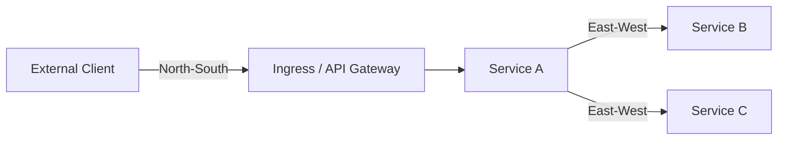
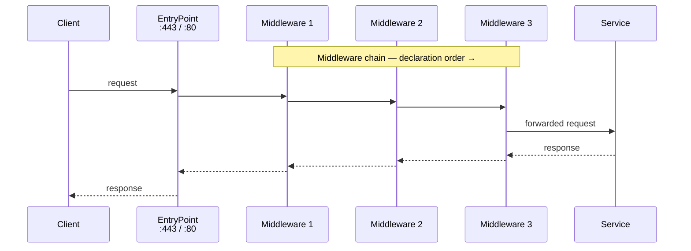
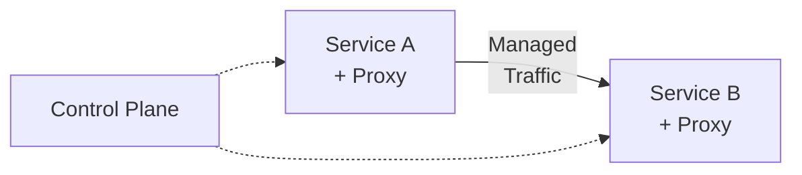
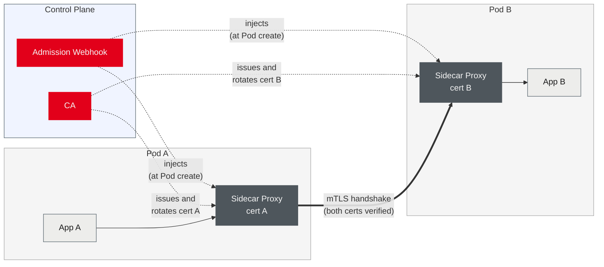

<div class="lecturetitle">Security, Traffic Management and Deployment Strategies</div>
<!-- .slide: data-state="hide-menubar" -->

---
## Motivation

Security: protect services, data, and cluster resources
- Access control <comment>(RBAC, Network Policies)</comment>
- Secret management <comment>(Sealed Secrets, HashiCorp Vault)</comment>
- Supply chain security <comment>(image scanning, signing, SBOM)</comment>

Traffic management: control traffic flows into and in the cluster
- North-south: external clients to services <comment>(Ingress, API Gateways)</comment>
- East-west: service-to-service traffic inside the cluster <comment>(Service Mesh)</comment>
- Deployment strategies: how new versions are rolled out


<!-- .element: style="margin-left: 20px;" -->


<!--- ------------------------------------------------------------------- --->
<!--- ------------------------------------------------------------------- --->
---
# Security
<!--- ------------------------------------------------------------------- --->
<!--- ------------------------------------------------------------------- --->

---
## Security: Defence in Depth

Security in Kubernetes is layered
- No single control is sufficient
- Each layer limits the blast radius of a breach

| Layer            | What it protects                                  | Mechanism                                    |
| ---------------- | ------------------------------------------------- | -------------------------------------------- |
| Cluster access   | Who can call the Kubernetes API                   | RBAC, OIDC, ServiceAccounts                  |
| Network          | Which pods can communicate with which             | Network Policies                             |
| Service identity | That service A really is service A                | Service Mesh mTLS <comment>(later)</comment> |
| Secrets          | Credentials and keys not exposed in Git           | Sealed Secrets, Vault                        |
| Supply chain     | Only trusted, unmodified images run in production | Image scanning, signing, SBOM                |

A common mistake is to secure only one layer
- Assume an attacker who reaches a Pod via a vulnerable image
- Can still be limited by Network Policies and RBAC

<!--- ------------------------------------------------------------------- --->
---
# Access Control
<!-- .slide: data-name="Access Control" -->
<!--- ------------------------------------------------------------------- --->

---
## Kubernetes RBAC

 Role-Based Access Control <comment>(RBAC)</comment>
 - Controls what users and workloads can do in the cluster
- All API calls go through the RBAC authorizer
- Applies to both human users and in-cluster workloads

Core objects

| Object         | Scope     | Purpose                                              |
| -------------- | --------- | ---------------------------------------------------- |
| ServiceAccount | Namespace | Identity assigned to a Pod                           |
| Role           | Namespace | List of allowed API operations on specific resources |
| ClusterRole    | Cluster   | Same, but applies cluster-wide                       |
| RoleBinding    | Namespace | Assigns a Role to a user or ServiceAccount           |

Principle of least privilege
- A workload should have only the permissions it actually needs
- The default ServiceAccount only allows reading a Pod's own token

---
## Kubernetes RBAC: Example

First: create a ServiceAccount for the workload

```yaml
apiVersion: v1
kind: ServiceAccount
metadata:
  name: pod-reader
  namespace: my-app
```
<!-- .element: style="font-size: 0.6em;" -->

Second: create a Role with read-only permissions on Pods
- Applies to the same namespace only

```yaml
apiVersion: rbac.authorization.k8s.io/v1
kind: Role
metadata:
  name: pod-reader-role
  # Applies this role to this namespace only
  namespace: my-app
rules:
    # API group "" means the core API group (e.g., pods, services)
  - apiGroups: [""]
    # Only allow operations on pods
    resources: ["pods"]
    # read-only; no create, delete, or update
    verbs: ["get", "list", "watch"]
```
<!-- .element: style="font-size: 0.6em;" -->

---
## Kubernetes RBAC: Example

Third: bind the Role to the ServiceAccount using a RoleBinding
- Grants the permissions defined in the Role to the ServiceAccount

```yaml
apiVersion: rbac.authorization.k8s.io/v1
kind: RoleBinding
metadata:
  name: pod-reader-binding
  namespace: my-app
subjects:
  - kind: ServiceAccount
    name: pod-reader
roleRef:
  kind: Role
  name: pod-reader-role
  apiGroup: rbac.authorization.k8s.io
```

Non-namespaced permissions
- Use `ClusterRole` and `ClusterRoleBinding` instead

---
## Initial Cluster Access: kubeconfig

A [`kubeconfig`](https://kubernetes.io/docs/concepts/configuration/organize-cluster-access-kubeconfig/) is created on cluster creation
- Authenticates via an x509 client certificate in the file

Kubernetes does not store human user accounts
- Identity lives inside the certificate signed by the [cluster-internal CA](https://kubernetes.io/docs/setup/best-practices/certificates/) <comment>(Kubernetes API server trusts anything that CA signed)</comment>

Identity encoded in certificate fields
- CN <comment>(Common Name)</comment>: username in Kubernetes
- O <comment>(Organization)</comment>: group membership in Kubernetes

The group [`system:masters`](https://kubernetes.io/docs/reference/access-authn-authz/rbac/#user-facing-roles) is hardcoded in the API server
- Bypasses the [RBAC authorizer](https://kubernetes.io/docs/reference/access-authn-authz/rbac/) entirely <comment>(full cluster admin)</comment>
- No `RoleBinding` grants these permissions explicitly

---
## Initial Cluster Access: kubeconfig

Inspect the certificate from a k3s kubeconfig

```bash
$ grep client-certificate-data "$KUBECONFIG" | 
  awk '{print $2}' | base64 -d | openssl x509 --text
```

Output

```yaml
Certificate:
    Data:
        Version: 3 (0x2)
        Serial Number: 6591276219106128072 (0x5b78eacc984cf0c8)
        Signature Algorithm: ecdsa-with-SHA256
        Issuer: CN=k3s-client-ca@1778257421
        Subject: O=system:masters, CN=system:admin
        Subject Public Key Info:
            Public Key Algorithm: id-ecPublicKey
                Public-Key: (256 bit)
                pub: [...omitted...]
                ASN1 OID: prime256v1
                NIST CURVE: P-256
[...omitted...]
```

---
## Certificate-based Authentication

Possible to use client certificates to grant cluster access
- Not recommended for day-to-day use <comment>(only for initial access)</comment>

Anyone with the file is cluster admin until the CA is rotated
- Revocation is painful <comment>(rotate the CA, maintain a CRL)</comment>
- No SSO or group membership from central directory
- No audit of who logged in

Supported authentication mechanisms

| Mechanism            | Identity encoded in    | Cluster state          | Revocation                |
| -------------------- | ---------------------- | ---------------------- | ------------------------- |
| Client certificate   | Cert `CN` / `O` fields | None — only the CA     | CA rotation or CRL        |
| OIDC token           | JWT claims             | None — only issuer URL | Token expiry, IdP revokes |
| ServiceAccount token | JWT signed by cluster  | ServiceAccount object  | Delete the SA             |

---
## Authn/Authz using OIDC
<!-- .slide: data-name="OIDC" -->

Services need to know who is calling
- Implementing authentication is error-prone and expensive
- Hard to implement,easy to get wrong: password storage <comment>(hashing, salting)</comment>, session management, token expiry, revocation, MFA, social login, enterprise SSO, etc.

OpenID Connect (OIDC) is the industry standard solution
- Built on OAuth 2.0 <comment>(identity layer, not just authorization)</comment>
- Delegates authentication to a trusted Identity Provider (IdP)

Examples
- Login with Github, Keycloak, LinkedIn, ...
- SaaS solutions: Auth0, Okta, AWS Cognito, ...
- Open Source: Keycloak, Dex, Ory Hydra, ...

---
## Authn/Authz using OIDC

OIDC
- Supports different [flows](https://auth0.com/docs/get-started/authentication-and-authorization-flow) for different client types
- Device clients <comment>(e.g., IoT devices)</comment> use the [client credentials flow](https://auth0.com/docs/get-started/authentication-and-authorization-flow/client-credentials-flow)
- Operators users use [authorization code flow with PKCE](https://auth0.com/docs/get-started/authentication-and-authorization-flow/authorization-code-flow-with-pkce)

IdPs issue so-called [JWT](https://www.jwt.io/introduction#what-is-json-web-token) (JWT)
- Can be used for both authentication and authorization
- Self-contained, cryptographically signed tokens with claims about the user and their permissions

Your service only verifies a signed token
- Single sign-on (SSO) across many services for free
- Widely adopted, supported by most clouds, frameworks, and vendors


---
## OIDC Authentication

OIDC is preferred over the bootstrap kubeconfig
- Central revocation at the identity provider <comment>(no CA rotation)</comment>
- Single sign-on across clusters <comment>(no per-cluster account management)</comment>
- Group membership comes from the directory <comment>(not from cluster YAML)</comment>

Authentication is delegated to an IdP via OIDC
- API server validates the JWT token
- Extracts username and group membership from token claims

Allows re-using existing identity providers and SSO solutions
- Common providers: [Keycloak](https://www.keycloak.org/), [Okta](https://www.okta.com/), [Dex](https://dexidp.io/), [GitHub](https://docs.github.com/en/apps/oauth-apps/building-oauth-apps/authorizing-oauth-apps), [Azure AD](https://learn.microsoft.com/en-us/entra/identity-platform/v2-protocols-oidc), [Google](https://developers.google.com/identity/openid-connect/openid-connect)
- Can also use existing LDAP or Active Directory with a bridge like Dex

---
## OIDC Authentication with k3s

Requires setting up a client in Keycloak
- Add a `kubernetes` public client to the `gridflex` realm
- Public client <comment>(no secret)</comment>, authorization code flow with PKCE
- Redirect URI `http://localhost:8000`  <comment>(local kubelogin callback)</comment>

Point the k3s API server at the Keycloak realm
- Pass `--kube-apiserver-arg` flags via `/etc/rancher/k3s/config.yaml` on every server node

```yaml
# /etc/rancher/k3s/config.yaml
kube-apiserver-arg:
  - "oidc-issuer-url=https://keycloak.<your-zone>/realms/gridflex"
  - "oidc-client-id=kubernetes"
  - "oidc-username-claim=email"  # JWT claim used as Kubernetes username
  - "oidc-username-prefix=oidc:" # avoid collision with built-in usernames
  - "oidc-groups-claim=groups"   # JWT claim used for RBAC group matching
  - "oidc-groups-prefix=oidc:"
```
<!-- .element: style="font-size: 0.6em;" -->

---
## OIDC Authentication with k3s

Restart k3s to pick up the new flags
- `sudo systemctl restart k3s`

Users authenticate via `kubectl` with the [kubelogin](https://github.com/int128/kubelogin) plugin
- Opens a browser, obtains and stores token in `~/.kube/config`
- Token is sent with every API call
- RBAC bindings use `oidc:<email>` and groups as `oidc:<group>`

Add an OIDC user to the local kubeconfig

```bash
kubectl config set-credentials oidc-user \
  --exec-api-version=client.authentication.k8s.io/v1beta1 \
  --exec-command=kubectl \
  --exec-arg=oidc-login \
  --exec-arg=get-token \
  --exec-arg=--oidc-issuer-url=https://keycloak.<your-zone>/realms/gridflex \
  --exec-arg=--oidc-client-id=kubernetes \
  --exec-arg=--oidc-extra-scope=email \
  --exec-arg=--oidc-extra-scope=groups
```
<!-- .element: style="font-size: 0.58em;" -->

---
## OIDC Authentication with k3s

Authenticate with the OIDC user

```bash
# Create a new context that uses the OIDC user
kubectl config set-context oidc \
  --cluster=default --user=oidc-user

# Switch to the new context to authenticate with OIDC
kubectl config use-context oidc

# First call triggers the browser-based SSO flow
# The token is then cached
kubectl get pods
```

This manual setup is typically simplified by a tool
- E.g., [kubelogin](https://github.com/int128/kubelogin) has a `setup` command to automate kubeconfig changes
- Major cloud providers have some tools to automate this <comment>(e.g., `aws eks update-kubeconfig`)</comment>

---
## Multi-tenancy: Namespace per Team

Pattern: one namespace per team
- RBAC group from OIDC controls access

```console
cluster
├── namespace: team-backend     # only backend-engineers group
├── namespace: team-frontend    # only frontend-engineers group
└── namespace: kube-system      # cluster admins only
```

Define a reusable ClusterRole for developers

```yaml
apiVersion: rbac.authorization.k8s.io/v1
kind: ClusterRole
metadata:
  name: namespace-developer
rules:
  - apiGroups: ["apps"]
    resources: ["deployments", "replicasets", "statefulsets"]
    verbs: ["get", "list", "watch", "create", "update", "patch", "delete"]
  - apiGroups: [""]
    resources: ["pods", "services", "configmaps", "secrets", "events"]
    verbs: ["get", "list", "watch", "create", "update", "patch", "delete"]
```
<!-- .element: style="font-size: 0.6em;" -->

---
## Multi-tenancy: OIDC Group RoleBinding

Grant ClusterRole to an OIDC group
- Scoped to one namespace only

```yaml
apiVersion: rbac.authorization.k8s.io/v1
kind: RoleBinding
metadata:
  name: backend-team-access
  # access is limited to this namespace
  namespace: team-backend       
subjects:
  - kind: Group
    # matches the OIDC groups claim value for backend engineers
    name: "oidc:backend-engineers"   
    apiGroup: rbac.authorization.k8s.io
roleRef:
  kind: ClusterRole
  # same ClusterRole reused for every team
  name: namespace-developer     
  apiGroup: rbac.authorization.k8s.io
```


<!--- ------------------------------------------------------------------- --->
---
# Network Policies
<!-- .slide: data-name="Network Policies" -->
<!--- ------------------------------------------------------------------- --->

---
## Network Policies

All Pods in a cluster can communicate with all other Pods
- No isolation between namespaces or services out of the box

Network Policies define allowed traffic using label selectors
- Whitelist model: traffic not explicitly allowed is denied
- Two policy directions <comment>(ingress and egress)</comment>
- Requires support from the cluster network plugin <comment>(e.g., Calico, Cilium)</comment>

Common patterns
- Namespace isolation <comment>(allow only intra-namespace traffic)</comment>
- Database access <comment>(only the app Pod may reach the database Pod)</comment>
- Egress restriction <comment>(Pods may only contact known external endpoints)</comment>

---
## Network Policies: Example

Allow only the `gridflex-api` Pods to reach the MongoDB Pods
- Select MongoDB by label, permits ingress only from `gridflex-api`
- All other Pods attempting to reach MongoDB are dropped

<a data-code="yaml" href="code/examples/network-policy/networkpolicy-mongodb.yaml" target="_blank">networkpolicy-mongodb.yaml</a>
<!-- .element: style="font-size: 0.8em;" -->


---
<!--- ------------------------------------------------------------------- --->
# Secret Management
<!-- .slide: data-name="Secrets" -->
<!--- ------------------------------------------------------------------- --->

---
## Secret Management: The Problem

Applications need sensitive values
- Passwords, API keys, certificates, tokens, ...

Kubernetes Secrets store them, but offer little protection
- Stored Base64-encoded in etcd <comment>(no encryption at rest by default)</comment>
- Readable by anyone with RBAC access to the namespace

Applications and configuration are often stored in Git
- Sensitive values should not be committed in plaintext

Two fundamentally different approaches
- Encrypt secrets so they can safely live in Git <comment>(Sealed Secrets, SOPS)</comment>
- Keep secrets in a central store and fetch them at runtime <comment>(Vault)</comment>

---
## Secret Management: Sealed Secrets

[Sealed Secrets](https://github.com/bitnami-labs/sealed-secrets) <comment>(Bitnami)</comment>
- In-cluster controller generates and holds an asymmetric key pair
- Public key is used to encrypt secrets <comment>(e.g., outside the cluster)</comment>
- Private key is used to decrypt secrets <comment>(only in the cluster)</comment>

Input is a standard Kubernetes `Secret`
- Should not be committed to Git <comment>(contains plaintext values)</comment>

<a data-code="yaml" href="code/gridflex/ansible/files/forgejo-admin.yaml" target="_blank">forgejo-admin.yaml</a>

---
## Secret Management: Sealed Secrets

Encrypted secrets are called `SealedSecrets`
- `kubeseal` encrypts a `Secret` with the public key into a `SealedSecret`

Obtaining the public key
- Public key is fetchted from the controller <comment>(encryption is client-side)</comment>
- Key can be exported for cluster-less use <comment>(and passed with `--cert`)</comment>

Example: create a `SealedSecret` for the Secret
- Reads key from the cluster

<a data-code="bash" href="code/examples/secret-management/seal-forgejo-admin.sh" target="_blank">seal-forgejo-admin.sh</a>

---
## Secret Management: Sealed Secrets

Output can be safely committed to Git

<a data-code="yaml" href="code/examples/secret-management/sealedsecret-forgejo-admin.yaml" target="_blank">sealedsecret-forgejo-admin.yaml</a>

Controller watches for `SealedSecret` resources
- Decrypts them using the corresponding private key
- Creates the corresponding `Secret` in the same namespace

---
## Secret Management: SOPS

[SOPS](https://github.com/getsops/sops) <comment>(Secrets OPerationS, Mozilla, now CNCF)</comment>
- Encrypt secret values inside a YAML/JSON file
- Encrypts only values, not keys or structure <comment>(clean Git diffs)</comment>

Keys are managed by an external backend
- E.g., [age](https://github.com/FiloSottile/age), [PGP](https://gnupg.org/), [AWS](https://aws.amazon.com/kms/)/[GCP](https://cloud.google.com/security/products/security-key-management)/[Azure](https://azure.microsoft.com/en-us/products/key-vault) Key Management Service
- Decrypted at deploy time <comment>(using some in-cluster integration)</comment>

A frequent choice is [age](https://github.com/FiloSottile/age) for its simplicity and modern design
- Modern file encryption tool <comment>(replacement for PGP/GnuPG)</comment>
- Small key pair <comment>(`age-keygen`)</comment>, no key servers or web of trust 
- Public key encrypts, private key decrypts
- Keep the private key out of Git <comment>(stored as a cluster Secret for decryption)</comment>

---
## Secret Management: SOPS with age

Example: encrypt the same Forgejo admin Secret with an age key
- Encrypted file keeps readable keys <comment>(`username:`, `password:`)</comment>
- Values are encrypted with `ENC[...]` values</comment>

<a data-code="bash" href="code/examples/secret-management/sops-forgejo-admin.sh" target="_blank">sops-forgejo-admin.sh</a>
<!-- .element: style="font-size: 0.85em;" -->

---
## Secret Management: SOPS with age

Encrypted file can be safely committed to Git
- Value-only encryption allows readable diffs when values change

<a data-code="yaml" href="code/examples/secret-management/sops-forgejo-admin.enc.yaml" target="_blank">sops-forgejo-admin.enc.yaml</a>
<!-- .element: style="font-size: 0.95em;" -->

---
## Secret Management: HashiCorp Vault

[HashiCorp Vault](https://www.vaultproject.io/): central server hands out secrets at runtime
- Secrets are never in Git; the app asks Vault for them when it starts
- Dynamic secrets: Vault creates a fresh credential per request and deletes it after a while <comment>(short-lived, auto-expiring)</comment>
- Can also store fixed secrets, issue TLS certificates, and encrypt data on request
- Every access is logged, and a leaked secret can be revoked centrally <comment>(turned off without redeploying)</comment>

Integrates with Kubernetes
- Secrets are provides as environment variables or mounted as files in the Pod <comment>(no Kubernetes Secret needed)</comment>
- Vault uses a Container Storage Interface (CSI) or a sidecar injector to get secrets into the Pod

---
## Secret Management: HashiCorp Vault

Example: store a password in the Vault
- Vault agent mounts the secret into the Pod using [annotations](https://developer.hashicorp.com/vault/docs/deploy/kubernetes/injector/annotations) 
- No Kubernetes Secret needed

<a data-code="bash" href="code/examples/secret-management/vault-forgejo-admin.sh" target="_blank">vault-forgejo-admin.sh</a>
<!-- .element: style="font-size: 0.9em;" -->

---
## Secret Management: Comparison

Different trade-offs between encrypt-in-Git and runtime secrets

| Solution       | Secrets live     | Pros                                        | Cons                                       | Typical use                         |
| -------------- | ---------------- | ------------------------------------------- | ------------------------------------------ | ----------------------------------- |
| Sealed Secrets | Encrypted in Git | Simple, GitOps-native, no runtime service   | Cluster-bound key, no rotation or audit    | Small/medium GitOps clusters        |
| SOPS           | Encrypted in Git | Readable diffs, external KMS, multi-cluster | Needs key management and decryption in CD  | GitOps with an external KMS         |
| Vault          | Central server   | Dynamic secrets, leasing, audit, revocation | Operational complexity, runtime dependency | Large orgs, short-lived credentials |
<!-- .element: style="margin-left: 20px; width: 100%; font-size: .8em;" -->

Choice depends on the use case and organizational needs
- Encrypt-in-Git is the common default
- Use Vault when secrets must be dynamic or audited


---
<!--- ------------------------------------------------------------------- --->
# Supply Chain Security
<!-- .slide: data-name="Supply Chain" -->
<!--- ------------------------------------------------------------------- --->

---
## Supply Chain Security

Images can contain vulnerabilities or be tampered with
- [Known CVEs](https://www.cve.org/) provide attack vector
- Tampered images are form of supply chain attack

Key practices

| Practice          | What it addresses                              | Tool examples           |
| ----------------- | ---------------------------------------------- | ----------------------- |
| Image scanning    | Known CVEs in OS and language dependencies     | Trivy, Grype, Snyk      |
| SBOM              | Full inventory of all components in an image   | Syft, Docker Scout      |
| Image signing     | Verify if image is a trusted build             | Sigstore / Cosign       |
| Admission control | Block non-compliant images from being deployed | Kyverno, OPA/Gatekeeper |
<!-- .element: style="margin-left: 20px; width: 100%; font-size: 0.75em;" -->

Integrate scanning into CI pipelines
- Fail the build on critical CVEs <comment>(before pushed to the registry)</comment>

---
## Image Scanning: What Trivy Inspects

[Trivy](https://trivy.dev/) unpacks image layers and matches against CVE databases
- OS from the base image <comment>(e.g., `libssl3` pulled in by `FROM debian`)</comment>
- Language dependencies inside the image <comment>(e.g., a vulnerable `lodash` in `package-lock.json`)</comment>
- Misconfigurations in IaC <comment>(e.g., a Dockerfile running as `root` instead of a non-root user)</comment>

Each finding has a severity and, if available, a fixed version
- Severity from `LOW` to `CRITICAL` <comment>(how urgent)</comment>
- Fixed-in version <comment>(which upgrade closes the hole)</comment>

---
## Image Scanning: Example

Scan a built image, locally or from a registry
- E.g., run `trivy image registry.dennis-pfisterer-at-dhbw-de.users.dhbw.site/gridflex-api`
- Add `--ignore-unfixed` so un-actionable CVEs do not block the build

Example output (summarized to fit on the slide)

| Package         | Severity | Installed → Fixed | CVE                                                               | Issue                     |
| --------------- | -------- | ----------------- | ----------------------------------------------------------------- | ------------------------- |
| picomatch       | HIGH     | 4.0.3 → 4.0.4     | [CVE-2026-33671](https://www.cve.org/CVERecord?id=CVE-2026-33671) | ReDoS via crafted pattern |
| brace-expansion | MEDIUM   | 5.0.4 → 5.0.5     | [CVE-2026-33750](https://www.cve.org/CVERecord?id=CVE-2026-33750) | Denial of service         |
| ip-address      | MEDIUM   | 10.1.0 → 10.1.1   | [CVE-2026-42338](https://www.cve.org/CVERecord?id=CVE-2026-42338) | IPv4/IPv6 parsing flaw    |
| qs              | MEDIUM   | 6.14.2 → 6.15.2   | [CVE-2026-8723](https://www.cve.org/CVERecord?id=CVE-2026-8723)   | `stringify` crash         |
<!-- .element: style="margin-left: 20px; width: 100%; font-size: 0.73em;" -->


<!--- ------------------------------------------------------------------- --->
<!--- ------------------------------------------------------------------- --->
---
# Traffic Management
<!-- .slide: data-name="Traffic Management" -->
<!--- ------------------------------------------------------------------- --->
<!--- ------------------------------------------------------------------- --->

---
## North-South and East-West Traffic

North-South traffic: between external clients and services
- Handled by Ingress or the Gateway API
- API Gateways add policy on top of routing 
- Provide rate limiting, authentication, authorization, transformation, ...

East-West traffic: between services inside the cluster
- Affects Pod-to-pod communication on the cluster network
- No encryption by default <comment>services trust each other implicitly</comment>
- No per-request observability <comment>(without modifying application code)</comment>
- Service Meshes address East-West traffic concerns 
- Provides encrypted service-to-service communication, identity, observability, traffic shaping without code changes

---
<!--- ------------------------------------------------------------------- --->
# API Gateways
<!-- .slide: data-name="API Gateway" -->
<!--- ------------------------------------------------------------------- --->

Ingress and the Gateway API handle routing only but not...
- Authentication and authorization <comment>(API keys, JWT, OAuth2)</comment>
- Rate limiting <comment>(per client, endpoint, subscription plan)</comment>
- Request transformation <comment>(path rewriting, header injection, body modification)</comment>
- Observability <comment>(access logs, per-route metrics, distributed tracing)</comment>

Every service implements these concerns independently
- Duplicated logic across teams and languages
- Inconsistent enforcement <comment>(one service may skip rate limiting entirely)</comment>

API Gateway centralizes these concerns at the cluster edge
- Cross-cutting policy is managed in one place

---
## API Gateways: Implementation Options

| Option                                          | Type                     | Notes                                                                          |
| ----------------------------------------------- | ------------------------ | ------------------------------------------------------------------------------ |
| AWS API Gateway                                 | Commercial               | Fully managed, integrates with Lambda and IAM                                  |
| Azure API Management                            | Commercial               | Managed gateway with developer portal and policy engine                        |
| [Kong](https://konghq.com/)                     | Open Source / Commercial | Plugin-based, Kubernetes-native; OIDC and advanced features require Enterprise |
| [Envoy Gateway](https://gateway.envoyproxy.io/) | Open Source              | Implements Gateway API using Envoy as the data plane                           |
| [Apache APISIX](https://apisix.apache.org/)     | Open Source              | Plugin-based, native OIDC/Keycloak, rate limiting, traffic splitting           |
| [Traefik](https://traefik.io/)                  | Open Source / Commercial | Kubernetes-native, lightweight, supports Gateway API                           |

<!-- .element: style="margin-left: 20px; width: 100%; font-size: 0.65em;" -->

Traefik is used as an example
- Rate limiting, OIDC, and traffic splitting, etc. possible
- All required features are open source <comment>(no Enterprise tier needed)</comment>
- Works with most existing setups, operators, and helm charts

---
## Deploying Traefik in Kubernetes

k3s ships Traefik pre-installed as the default Ingress controller
- Traefik is a drop-in replacement for existing Ingress controllers <br> <comment>(e.g., nginx-ingress which has been deprecated)</comment>
- No separate installation required for k3s clusters
- Other clusters: `helm install traefik traefik/traefik`

Traefik uses the Kubernetes API as its sole configuration store
- Traefik supports standard `Ingress` and its own CRDs in parallel
- CRDs add type-safe access to advanced features

| CRD              | Purpose                                                                                        |
| ---------------- | ---------------------------------------------------------------------------------------------- |
| `IngressRoute`   | Route definition with host/path matching and middleware references                             |
| `Middleware`     | Reusable request/response processing step <comment>(e.g., auth, rate limit, headers)</comment> |
| `TraefikService` | Service abstraction supporting weighted routing for canary/blue-green                          |

---
## Deploying Traefik in Kubernetes

Standard `Ingress` resources continue to work unchanged
- Traefik-specific features are added via CRDs alongside existing `Ingress` resources <comment>(no migration required)</comment>

Traefik picks up existing `Ingress` resources automatically
- Requires `spec.ingressClassName: traefik` on the `Ingress`
- Alternatively, Traefik must be the cluster default ingress controller <br> <comment>(no ingressClassName required)</comment>

Check whether Traefik is the cluster default
- Run `kubectl get ingressclass`
- Look for `ingressclass.kubernetes.io/is-default-class: "true"` annotation

---
## Traefik: Request Pipeline

Every request passes through a fixed four-stage pipeline


<!-- .element: style="margin-left: 20px;" -->

Explanation of each stage
| Stage            | Description                                                                                          |
| ---------------- | ---------------------------------------------------------------------------------------------------- |
| EntryPoint       | Listens on a port <comment>(`:443` for HTTPS, `:80` for HTTP)</comment>                              |
| Router           | Matches request host/path; selects the middleware chain and backend                                  |
| Middleware chain | List of processing steps <comment>(executed in declaration order, reversed on the way out)</comment> |
| Service          | The upstream Kubernetes Service <comment>(load-balances across matching Pods)</comment>              |
<!-- .element: style="margin-left: 20px; width: 100%; font-size: 0.65em;" -->

---
## Traefik: Middleware Architecture

Middlewares are the primary extension point 
- Defined as CRDs, referenced by name

Examples of [common built-in middlewares](https://doc.traefik.io/traefik/reference/routing-configuration/http/middlewares/overview/)

| Built-in Middleware | Function                                         |
| ------------------- | ------------------------------------------------ |
| `RedirectScheme`    | Force HTTPS redirect                             |
| `Headers`           | Add, remove, or rewrite request/response headers |
| `Compress`          | gzip / brotli (Google) response compression      |
| `RateLimit`         | Token-bucket rate limiting per source IP         |
| `BasicAuth`         | HTTP Basic Authentication                        |
| `ForwardAuth`       | Delegate authentication to an external service   |
<!-- .element: style="margin-left: 20px; width: 100%; font-size: 0.75em;" -->

Also supports 3rd-party and custom ones via a [plugin system](https://plugins.traefik.io)
- Go programs <comment>(loaded at startup, referenced like built-in ones)</comment>
- [Community plugins](https://plugins.traefik.io/plugins) are available

---
## Traefik: Middleware Example

Example: redirect HTTP to HTTPS
- redirectScheme: built-in middleware type; no custom code required
- scheme: target scheme for the redirect
- https-redirect: how this middleware is referenced

Creates a middleware (without any routing logic yet)

<a data-code="yaml" href="code/gridflex/api-gw/middleware-https-redirect.yaml" target="_blank">Middleware manifest</a>

---
## Traefik: Attachment and Scope

Middlewares need to be attached to a route to take effect
- Can be attached at different scopes

Global scope
- Applies to all routes handled by Traefik
- Useful for cluster-wide policies like HTTPS enforcement

Per-route scope
- Attached to specific routes in `IngressRoute` definitions
- Uses the `middlewares` field to reference middleware by name

Per standard `Ingress` scope
- Attached via annotation on the `Ingress` resource
- Applies to all routes defined in that `Ingress`

---
## Traefik: Global Middleware

Can be applied while deploying Traefik or later
- In k3s, Traefik is managed by the k3s Helm chart
- Use a `HelmChartConfig` CRD to inject values into the chart

Example: redirect HTTP → HTTPS
- Applies to every route 
  
```yaml
apiVersion: helm.cattle.io/v1
kind: HelmChartConfig
metadata:
  name: traefik
  namespace: kube-system
spec:
  valuesContent: |-
    ports:
      web:
        middlewares:
          - default-https-redirect@kubernetescrd
```

---
## Traefik: Per-Route Middleware

Uses a CRD-based route definition
- Instead of a standard `Ingress`
- Cannot coexist with an `Ingress` defining the same host/path

```yaml
apiVersion: traefik.io/v1alpha1
kind: IngressRoute
metadata:
  name: my-service
  namespace: default
spec:
  # Static entrypoint defined in Traefik's static configuration
  # web: http on :80, web-secure: https on :443
  entryPoints: ["web"]
  routes:
    - match: Host(`api.example.com`)
      kind: Rule
      middlewares:
        - name: https-redirect
      services:
        - name: my-service
          port: 80
```
<!-- .element: style="font-size: 0.6em;" -->

---
## Traefik: Standard Ingress Middleware

Uses annotations-based route definition
- Uses `traefik.ingress.kubernetes.io/router.middlewares`
- Naming convention for referencing a middleware: `<namespace>-<name>@kubernetescrd`
- E.g., `gridflex-https-redirect@kubernetescrd`


```yaml
apiVersion: networking.k8s.io/v1
kind: Ingress
metadata:
  name: my-service
  namespace: default
  annotations:
    traefik.ingress.kubernetes.io/router.middlewares: default-https-redirect@kubernetescrd
spec:
  rules:
[... ommitted for brevity ...]
```
<!-- .element: style="font-size: 0.7em;" -->

---
## Traefik: Rate Limiting

Rate limiting protects services from excessive traffic and abuse
- Traefik's rate limit middleware implements a [token-bucket algorithm](https://en.wikipedia.org/wiki/Token_bucket)
  - `average`: sustained request rate across `period`
  - `burst`: maximum spike before excess requests are rejected
- Rate is tracked per source IP by default

Example 

<a data-code="yaml" href="code/gridflex/api-gw/middleware-rate-limit.yaml" target="_blank">Full manifest</a>

---
## Traefik: OIDC Authentication

Two approaches to add OIDC authentication in Traefik
- Forward or use 3rd party plugin

Forward to external service
- Delegate authentication to separate service <comment>(decouples logic)</comment>
- Requires maintaining an additional service <comment>(re-use existing solutions)</comment>
- E.g., [oauth2-proxy](https://oauth2-proxy.github.io/oauth2-proxy/) using ForwardAuth middleware <comment>(widely used)</comment>

3rt party plugin
- Runs inside Traefik; no separate service required
- No extra network hop but requires well-maintained plugin
- E.g., [traefik-oidc-auth](https://github.com/sevensolutions/traefik-oidc-auth)
- We'll use this approach since it requires fewer moving parts

---
## Exercise: API Gateway with Traefik

<a data-exercise="api-gateway" data-part="2">API Gateway with Traefik: HTTPS, rate limiting, OIDC</a>


---
<!--- ------------------------------------------------------------------- --->
<!--- ------------------------------------------------------------------- --->
<!--- ------------------------------------------------------------------- --->
# Service Mesh
<!-- .slide: data-name="Service Mesh" -->
<!--- ------------------------------------------------------------------- --->
<!--- ------------------------------------------------------------------- --->
<!--- ------------------------------------------------------------------- --->

Default in-cluster communication is insecure and unobservable
- No encryption, no identity, no per-request metrics or traces
- Requires application code changes to add these features <comment>(typically via application-level instrumentation)</comment>

Service Meshes move these concerns into infrastructure
- No application code changes required
- Reduces application complexity, provides uniform observability, and secures service-to-service communication

A service mesh consists of two planes
- Data plane: lightweight proxy injected as a sidecar into every Pod
- Control plane: manages and distributes configuration to all proxies

---
## Service Mesh: Data Plane

Data plane comprised of two components
- [Mutating admission webhook](https://kubernetes.io/docs/reference/access-authn-authz/admission-controllers/#mutatingadmissionwebhook) and sidecar proxy


<!-- .element: style="margin-left: 20px;" -->

Mutating webhook
- Invoked by the API server on every Pod creation
- Injects sidecar proxies into Pods at creation time

Sidecar proxy is injected into every Pod
- Transparent proxy intercepts all traffic to and from the Pod
- Uses firewalling  <comment>(iptables / eBPF)</comment> to intercept Pod traffic transparently


---
## Service Mesh: Control Plane

Control plane manages and distributes configuration to proxies
- Issues certificates, secures traffic, manages routing and policies, and monitors traffic
- Pushes routing rules and policies to data plane without redeploying
- Provides API for operators to configure the mesh

Common (open source) service mesh options

| Option                                                                     | Pros                                            | Cons                                                           |
| -------------------------------------------------------------------------- | ----------------------------------------------- | -------------------------------------------------------------- |
| [Istio](https://istio.io/)                                                 | Full feature set; large ecosystem               | Highest operational complexity                                 |
| [Kuma](https://kuma.io/)                                                   | Multi-cluster support; easier than Istio        | Smaller community and ecosystem                                |
| [Cilium Service Mesh](https://cilium.io/use-cases/service-mesh/)           | Sidecar-less model; strong eBPF networking      | L7 features can be less extensive than Istio                   |
| [Consul Service Mesh](https://developer.hashicorp.com/consul/docs/connect) | Strong service discovery; good hybrid use cases | Heavier platform footprint, enterprise add-ons not open-source |
| [Linkerd](https://github.com/linkerd/linkerd2)                             | Simple setup; low overhead                      | Smaller feature set                                            |

<!-- .element: style="font-size: 0.65em; margin-left: 20px; width: 100%" -->

---
## Service Mesh: Golden Metrics

Mesh produces RED metrics without any instrumentation
- No Prometheus libraries, OpenTelemetry SDKs, manual histograms, or application code changes
- Produces three of the four golden metrics for every service
- Automatically by the sidecar proxy

Uniform metrics across all services
- Generic instrumentation-free metrics
- Automatic histogram buckets
- Standardized metrics collection across all services
- Provides metrics for non-instrumented, legacy, or third-party services

---
## Service Mesh: Live Traffic Inspection

Injected sidecar proxies can inspect live traffic
- Allows interactive debugging of live requests with full context
- The mesh sees every request <comment>(no application logging required)</comment>

Example: Linkerd's `tap` command
- Run `linkerd viz tap` to see live <comment>(meshed)</comment> requests
- HTTP-aware `tcpdump`, with workload context, no root needed
- Verify expected traffic patterns, catching unexpected behavior, etc.

```bash
linkerd viz tap deploy/orders -n backend
# req id=0:1 proxy=in  src=10.42.0.8:54812 dst=10.42.0.9:8080
#   :method=POST :path=/api/orders :authority=orders.backend
# rsp id=0:1 proxy=in  :status=200 latency=3411µs
```

---
## Service Mesh: mTLS

mutual TLS <comment>(mTLS)</comment>: encryption and mutual authentication
- The internal CA issues certificates for each sidecar
- Admission webhook injects sidecar into every <comment>(new)</comment> Pod
- Sidecar re-configures networking to intercept all traffic
- Both sides of a connection verify each other's certificate


<!-- .element: style="margin-left: 20px; width: 90%;" -->

---
## Service Mesh: mTLS

Control plane acts as an internal certificate authority
- No certificate management required from application developers
- Mesh injects the sidecar and issues certificates <comment>(renewal can be automated with cert-manager)</comment>

Every Pod has a cryptographic identity
- Failed certificate verification drops connections immediately
- Traffic policies allow or deny specific (groups of) identities
- Identities are passed <comment>(e.g., via http headers)</comment>

What mTLS does and does not protect against
- Protects against eavesdropping, man-in-the-middle, and IP-spoofing
- Does not protect against already compromised Pods <comment>(cert mounted)</comment>

---
## Service Mesh: Traffic Shaping

Can control how requests are distributed between versions
- Routing rules are separate from the workload definition
- Proxies are layer 7-aware and can route based on HTTP properties <comment>(headers, paths, etc.)</comment>
- Allows gradual rollouts, testing in production, and resilience testing without code changes

Use cases
- Canary release <comment>(small fraction of traffic to a new version)</comment>
- A/B testing <comment>(route specific users to a different version)</comment>
- Fault injection <comment>(introduce errors or delays to test resilience)</comment>

---
## Traffic Shaping: Gateway vs. Mesh

Two layers can split traffic
- Choice depends on where the decision belongs


| Aspect                  | API Gateway (e.g., Traefik)                  | Service Mesh (e.g., Linkerd)                            |
| ----------------------- | -------------------------------------------- | ------------------------------------------------------- |
| Where the split happens | North-south <comment>(at the edge)</comment> | East-west <comment>(between any two services)</comment> |
| Object                  | `TraefikService` with weights                | `TrafficSplit` / `HTTPRoute`                            |
| Scope                   | Only traffic entering through the gateway    | Every meshed service-to-service call                    |
| Dependency              | Gateway already in place                     | Full mesh deployed                                      |

Both implement the same canary concept at different layers
- Edge canary: when only external clients call the service
- Mesh canary: when internal callers should also see the new version

---
## Service Mesh: Resilience

Move resilience into mesh configuration
- Timeouts, retries so that users don't see errors or long waits
- Circuit breakers <comment>(some meshes; no traffic to unhealthy instances)</comment>

Linkerd: no  circuit breaking support (but has timeouts and retries)
- Provides two objects for resilience configuration

`HTTPRoute`: per-route timeouts and retries
- Based on the Gateway API <comment>(portable across meshes and gateways)</comment>
- Attaches to a Service <comment>(match by path, method, headers)</comment>

`ServiceProfile`: retry budgets and per-route metrics
- Caps globally <comment>(e.g., max. 10% extra requests, prevent retry storms)</comment>
- Show per-route success rate and latency in the Linkerd dashboard

---
## Service Mesh: Resilience: HTTPRoute

Per-route timeout via HTTPRoute using the Gateway API
- HTTPRoute is the preferred way
- ServiceProfile remains for retry budgets and metrics

<a data-code="yaml" href="code/gridflex/mesh/httproute-orders-timeout.yaml" target="_blank">(full manifest)</a>
<!-- .element: style="font-size: 0.75em;" -->

---
## Service Mesh: Resilience: ServiceProfile

Retry budget and per-route metrics via ServiceProfile 

<a data-code="yaml" href="code/gridflex/mesh/serviceprofile-orders-retrybudget.yaml" target="_blank">(full manifest)</a>

---
## Exercise: Service Mesh

<a data-exercise="service-mesh" data-part="2">Service Mesh Example (Linkerd)</a>

---
<!--- ------------------------------------------------------------------- --->
<!--- ------------------------------------------------------------------- --->
# Deployment Strategies
<!-- .slide: data-name="Deployment Strategies" -->
<!--- ------------------------------------------------------------------- --->
<!--- ------------------------------------------------------------------- --->

---
## Deployment Strategies

How are new versions of an application rolled out
- Without breaking production traffic
- Tradeoffs: availability, rollback speed, cost, and complexity

Different strategies exist with different tradeoffs
- Recreate, Rolling Update, Blue-Green, Canary

Different implementation options for each strategy
- Kubernetes native
- Service Mesh <comment>(e.g., Linkerd TrafficSplit, Istio VirtualService)</comment>
- API Gateway <comment>(e.g., Traefik TraefikService with weights)</comment>
- External tools <comment>(e.g., Argo Rollouts, Flagger)</comment>

---
## Recreate Strategy

Basic strategy: stop old version, then start new version
- E.g., `helm uninstall` + `helm install`
- Not recommended for production <comment>(downtime, loss of history)</comment>
- Dependent resources <comment>(Services, Ingress, Secrets, ConfigMaps, ...)</comment> also deleted and recreated

Recreate strategy
- Set `spec.strategy.type: Recreate` on the Deployment
- Triggered by updating a deployments image tag or other fields

Deployment stays alive by scaling the old ReplicaSet to 0
- Waits until all old Pods terminate, then starts new Pods
- Use `helm upgrade` (or `kubectl apply`) to update in place

---
## Recreate Strategy: Example

Deploy the update (e.g., 1.0.0 → 2.0.0)
- Edit deployment YAML, apply with `kubectl apply -f deployment.yaml`
- Or use `helm upgrade --install my-release ./my-chart --set image.tag=2.0.0`

```yaml
apiVersion: apps/v1
kind: Deployment
metadata:
  name: my-app
spec:
  strategy:
    # stop all old Pods before starting new ones
    type: Recreate
  template:
    spec:
      containers:
        - name: my-app
          image: my-app:2.0.0
```

---
## Rolling Update (Kubernetes Default)

No downtime, but both versions serve traffic simultaneously
- New Pods are created before old ones are terminated
- Requires backwards-compatible changes <comment>(e.g., API contracts, database schema)</comment>

ReplicaSets are updated incrementally at a controlled pace
- `maxUnavailable` <comment>(max number of unavailable Pods while updating)</comment>
- `maxSurge` <comment>(max number of Pods existing above the desired number)</comment>

Used in practice for web services and APIs
- Any stateless HTTP service where requests are independent <comment>(e.g., REST APIs, frontends, microservices)</comment>
- Good for versioned APIs or backwards-compatible across releases
- Not appropriate when database migrations must be applied

---
## Rolling Update: Example

Change nginx version from `1.7.9` to `1.9.1`
- Run `kubectl set image deployment/nginx-deployment nginx=nginx:1.9.1`

See rollout status
  - Run `kubectl describe deployment nginx-deployment`
  - Run `kubectl get replicaset` to see active ReplicaSets

Change replica count
- Run `kubectl scale deployment.v1.apps/nginx-deployment --replicas=2`

Rollback data and historical information
- 10 old ReplicaSets are kept
- Change by setting `.spec.revisionHistoryLimit`

---
## Demo: Updating a Deployment

<!--
  tmux -CC new -s myrec
  Disable the status bar in tmux: ctrl + b + : + set -g status off
  Split window horizontally: ctrl + b + "
  Run: tmux select-layout even-vertical

  Detach the session tmux ctrl + b + d
  asciinema rec --overwrite -i 2 -c "tmux attach -t myrec" k8s-deployment.cast
  Detach the session tmux ctrl + b + d

  To goto Top pane ctrl + b + up-key
  To goto Down pane ctrl + b + down-key
  
  Delete the session: tmux kill-session -t myrec
-->
<asciinema  data-conf='{ "cols": 130, "rows": 26, "theme":"monokai", "autoPlay": true, "idleTimeLimit": 2 }' 
            src="img/k8s-deployment.cast" />

vvv
## Demo: Commands

- Observe deployments: `watch -t kubectl get deployment`
- Create the deployment: `kubectl apply -f https://k8s.io/examples/controllers/nginx-deployment.yaml`
- See corresponding ReplicaSet: `kubectl get replicaset`
- Get all pods: `kubectl get pods`
- Change nginx from `1.7.9` to `1.9.1`: `kubectl set image deployment/nginx-deployment nginx=nginx:1.9.1`
- See rollout status: 
  - Run `kubectl get replicaset -o wide` to see active ReplicaSets
  - Run `kubectl rollout status deployment.v1.apps/nginx-deployment`
- Scaling a deployment: `kubectl scale deployment.v1.apps/nginx-deployment --replicas=2`
- Get all pods: `kubectl get pods`

<!-- .element: style="font-size: 90%;" -->

---
## Rolling Update: Rollback

Change cause not recorded by default
- Use `kubectl annotate deployment/nginx-deployment kubernetes.io/change-cause="Updated nginx version to 1.9.1"` to set

```bash
kubectl rollout history deployment/nginx-deployment
# REVISION  CHANGE-CAUSE
# 1         <none>
# 2         Updated nginx version to 1.9.1
```

Roll back to a previous revision
- Kubernetes reactivates old ReplicaSet <comment>(no build step needed)</comment>

```bash
# Roll back to the previous revision
kubectl rollout undo deployment/nginx-deployment

# Roll back to a specific revision
kubectl rollout undo deployment/nginx-deployment --to-revision=1
```

---
## Blue-Green Deployment

Two identical environments run in parallel
- Blue: current production version <comment>(serving all traffic)</comment>
- Green: new version <comment>(deployed and validated before receiving traffic)</comment>
- Requires roughly double the resources while both are active

Traffic is switched by updating a Service selector or Ingress rule
- Instant cutover <comment>(no gradual rollout)</comment>
- Instant rollback <comment>(point the selector back to blue)</comment>

```bash
# Switch traffic from blue to green
kubectl patch service my-app \
  -p '{"spec":{"selector":{"version":"green"}}}'
```

Not a built-in Kubernetes strategy 
- Implemented via Services or a delivery tool <comment>(e.g., Argo Rollouts, Flagger, Spinnaker; not covered here)</comment>

---
## Canary Release

Route small fraction of traffic to the new version first
- Gradually increase the percentage as confidence grows
- Observe error rates, latency, and business metrics before full rollout

Benefits
- Real-world validation with limited negative impact on users
- Catch issues only visible under production load with real users
- Easy rollback <comment>(shift all traffic back to the stable version)</comment>

Implementation in Kubernetes
- Multiple Deployments sharing one Service <comment>(coarse-grained, traffic distribution based on replica count)</comment>
- Advanced routing for fine-grained traffic splitting <comment>(using service meshes like [Linkerd](https://linkerd.io/) or API Gateways like [Traefik](https://traefik.io/))</comment>

---
## Canary with Traefik

Use Traefik's `IngressRoute` and `TraefikService` together
- Two Deployments + two Services <comment>(one stable, one canary)</comment>

`TraefikService`: declares weighted split across both Services 
- References the stable and canary Services as backends
- Applications deploy standard, unchanged Kubernetes Services
- Shift traffic by editing the `weight` values <comment>(no redeployment needed)</comment>
- Blue/Green can be implemented with `0` / `100` weights

`IngressRoute`: forwards ingress traffic to `TraefikService`
- Requires migrating from `Ingress` to `IngressRoute`
- Vendor "lock-in" on the platform, not the application layer
- Apps remain portable, but routing configuration is Traefik-specific

---
## Canary with Traefik

Define a weighted `TraefikService` that splits traffic between stable and canary versions

<a data-code="yaml" href="code/gridflex/api-gw/traefikservice-canary.yaml" target="_blank">(full manifest)</a>

---
## Canary with Traefik

Target the canary `TraefikService` from an `IngressRoute` instead of a plain Kubernetes service

<a data-code="yaml" href="code/gridflex/api-gw/ingressroute-canary.yaml" target="_blank">(full manifest)</a>
<!-- .element: style="font-size: 0.88em;" -->

---
## Summary: Deployment Strategies

| Strategy       | Downtime | Rollback | Resource cost      | Kubernetes support                    |
| -------------- | -------- | -------- | ------------------ | ------------------------------------- |
| Recreate       | Yes      | Instant  | Normal             | Native (`strategy.type`)              |
| Rolling Update | No       | Gradual  | Normal             | Native (default)                      |
| Blue-Green     | No       | Instant  | 2× while both live | Via Service selector or special tools |
| Canary         | No       | Instant  | Slightly elevated  | Via Ingress / Service Mesh            |


Choice depends on application requirements and constraints
- Stateless services: blue-green and canary
- Stateful or schema changes: Recreate or rolling updates
- Regulated environments: blue-green for auditability

---
## Exercise: Deployment Strategies

<a data-exercise="deployment-strategies" data-part="2">Deployment Strategies with Traefik</a>
