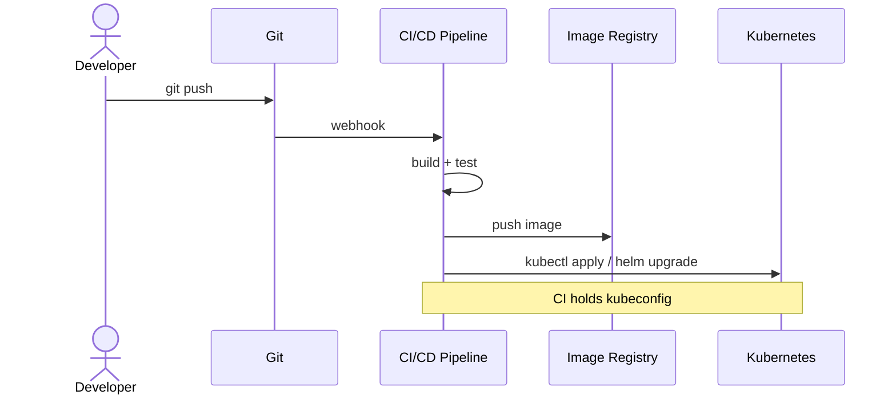
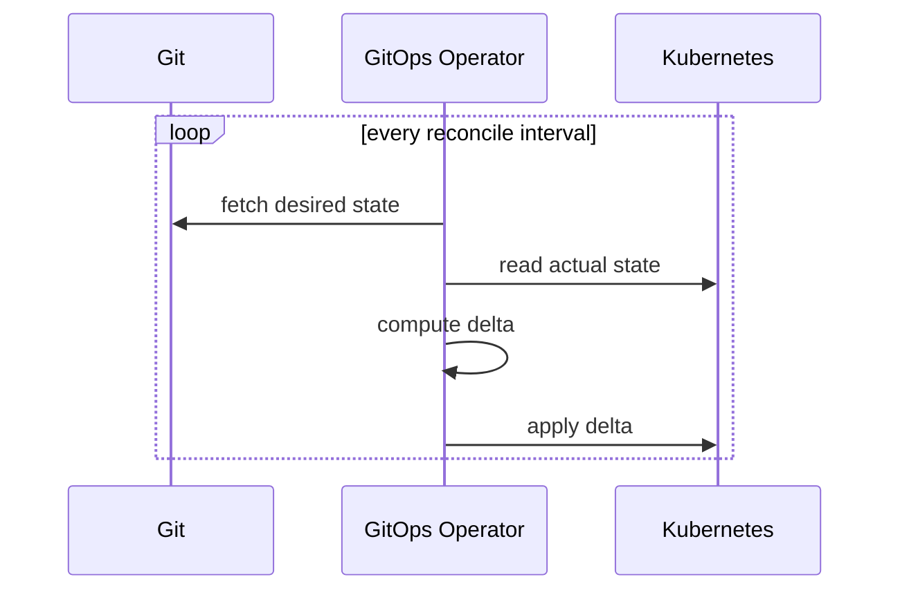
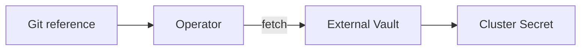
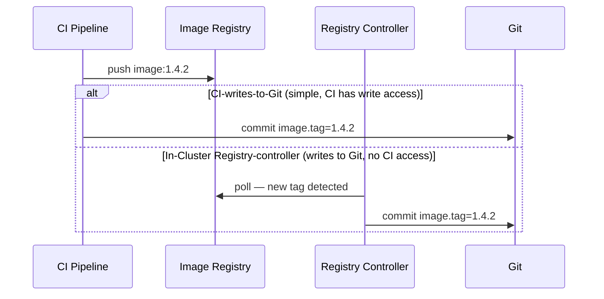
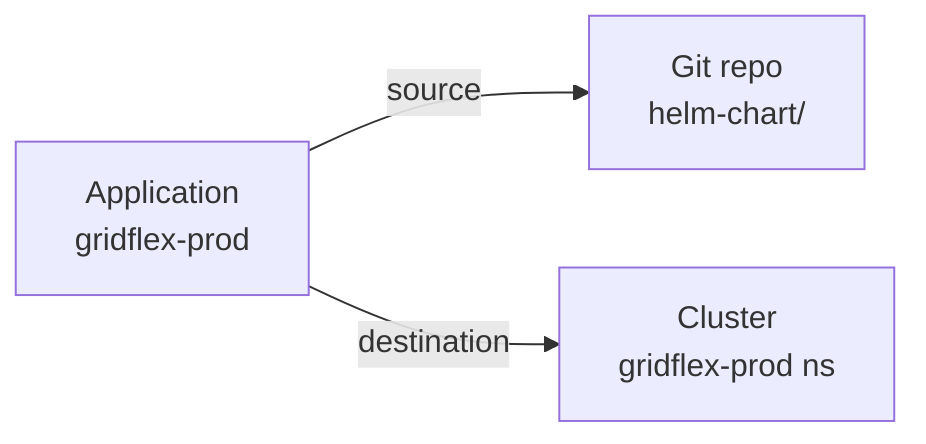
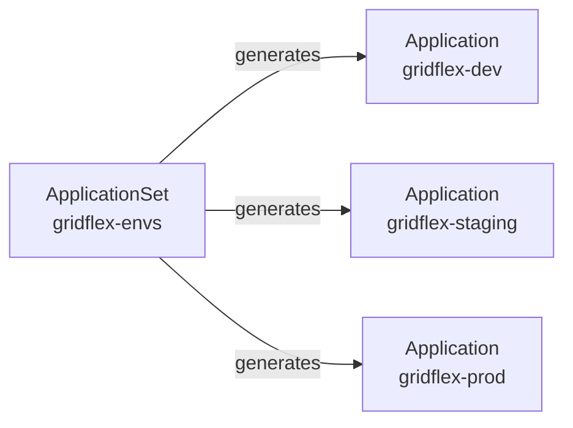
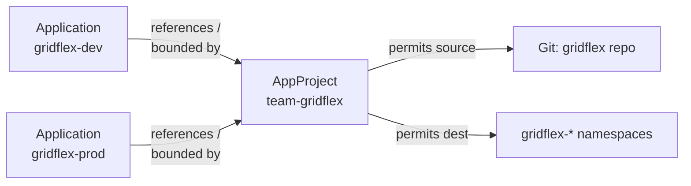
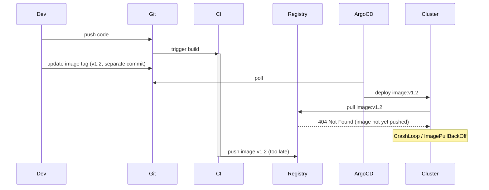
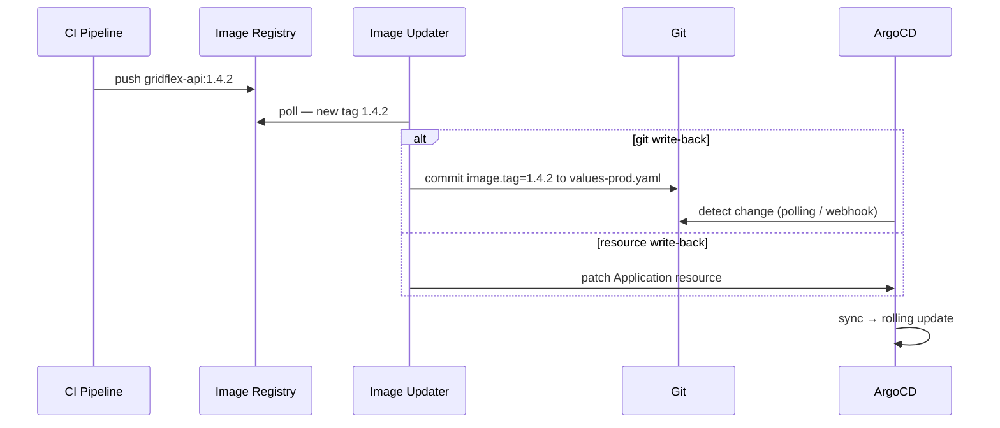
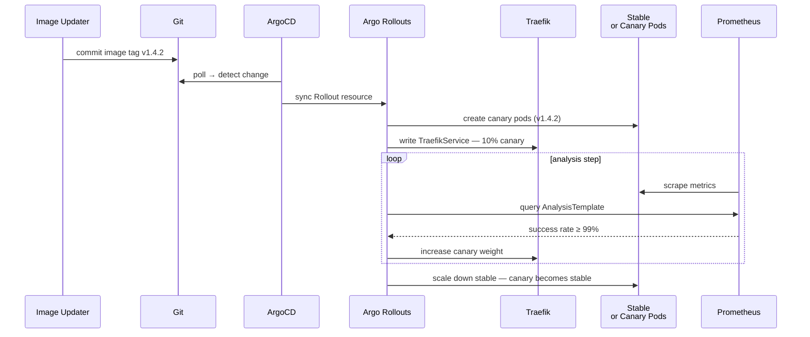

<div class="lecturetitle">GitOps and Progressive Delivery</div>
<!-- .slide: data-state="hide-menubar" -->
---

---
## Manual Push-Based Deployments

Simplest way to ship changes: push from a developer's laptop
- Engineers build and push images to a registry
- Run `kubectl apply` or `helm upgrade` manually
- Cluster's kubeconfig lives on the laptop with cluster-admin rights

Works for one person and one cluster, but breaks down fast
- What actually runs in the cluster depends on who last ran which command
- No record of who deployed what when

Continuous Integration / Continuous Delivery <comment>(CI/CD)</comment>
- A pipeline automates the manual steps
- CI: build, test, and push immutable artifacts <comment>(container images)</comment>
- CD: pipeline takes artifacts and deploys to the target environment

---
## CI/CD: The Push-Based Model

Continuous Integration / Continuous Delivery



Typical tools: [GitHub Actions](https://github.com/features/actions), [GitLab CI](https://docs.gitlab.com/ci/), [Jenkins](https://www.jenkins.io/), ...
- Pipeline runs `kubectl`/`helm` after every successful build
- Cluster credentials are stored as a pipeline secret <comment>(e.g. kubeconfig)</comment>
- Same script for every developer <comment>(reproducible, auditable in the CI log)</comment>

---
## CI/CD: GitHub Actions Example

```yaml
name: build-and-deploy

on:
  push:
    branches: [main]

jobs:
  build-and-deploy:
    runs-on: ubuntu-latest
    steps:
      - uses: actions/checkout@v4

      # 1. Build and push the container image
      - name: Build image
        run: |
          docker build -t ghcr.io/my-org/gridflex-api:${{ github.sha }} .
          docker push ghcr.io/my-org/gridflex-api:${{ github.sha }}

      # 2. Configure cluster access — pipeline holds the kubeconfig
      - name: Set up kubectl
        uses: azure/setup-kubectl@v4
      - name: Load kubeconfig
        run: echo "${{ secrets.KUBECONFIG }}" > $HOME/.kube/config

      # 3. Push the new state into the cluster
      - name: Deploy via Helm
        run: |
          helm upgrade --install gridflex ./helm-chart \
            --namespace gridflex-prod \
            --set image.tag=${{ github.sha }} \
            --wait
```
<!-- .element: style="font-size: 0.5em;" -->

---
## CI/CD: Gitlab CI Example

```yaml
# .gitlab-ci.yml
stages: [build, deploy]

variables:
  IMAGE: $CI_REGISTRY_IMAGE/gridflex-api:$CI_COMMIT_SHA

# 1. Build and push the container image
build:
  stage: build
  image: docker:25
  services: [docker:25-dind]
  script:
    - docker login -u $CI_REGISTRY_USER -p $CI_REGISTRY_PASSWORD $CI_REGISTRY
    - docker build -t $IMAGE .
    - docker push $IMAGE
  rules:
    - if: $CI_COMMIT_BRANCH == "main"

# 2./3. Configure cluster access and push the new state into the cluster
deploy:
  stage: deploy
  image: alpine/helm:3.14.0
  script:
    # KUBECONFIG is a CI/CD file variable — pipeline holds cluster credentials
    - export KUBECONFIG=$KUBECONFIG_FILE
    - helm upgrade --install gridflex ./helm-chart
        --namespace gridflex-prod
        --set image.tag=$CI_COMMIT_SHA
        --wait
  rules:
    - if: $CI_COMMIT_BRANCH == "main"
```
<!-- .element: style="font-size: 0.5em;" -->

---
## Problems with the Push-Based Model

Cluster's actual state is not continuously verified after deployment
- Drift between desired and actual state can occur <comment>(manual edits, failed deploys, out-of-band changes)</comment>
- Remains undetected until something breaks

Clusters must be accessible from the CI system
- VPNs, bastion hosts, and firewall rules add operational overhead

CI/CD tools store credentials for clusters/environments in one place
- Compromised pipeline or credential leaks can lead to cluster takeover
- Developers with push access have cluster-admin rights on production

No standard pipelines or conventions across teams
- Different teams use different pipelines with inconsistent conventions
- No single place to audit what was deployed and when

---
## GitOps Idea: Invert Control

Clusters pull their desired state from Git
- No push from the outside
- Clusters continuously reconcile themselves to match Git

Move the deployment trigger from the CI system into the cluster
- The cluster's credentials never leave the cluster
- Every change to production is a Git commit <comment>(visible, reviewable, revertible)</comment>

Git as the single source of truth for cluster state
- All desired state is stored in a Git repository
- E.g, Kubernetes manifests, Helm charts, Kustomize overlays, or a mix
- In-cluster operators continuously reconcile cluster with the Git state

---
## GitOps Principles

[OpenGitOps](https://opengitops.dev/) defines four principles
- Declarative <comment>(system is described declaratively)</comment>
- Versioned and immutable <comment>(desired state stored in a versioned store)</comment>
- Pulled automatically <comment>(approved changes are pulled from the source)</comment>
- Continuously reconciled <comment>(agents ensure correctness; alert on divergence)</comment>

Gitops is no replacement for CI
- Replaces only the CD part of the pipeline
- CI still builds, tests, and pushes images

Gitops does not guarantee zero downtime
- Still requires good deployment strategies and monitoring

---
## The Reconciliation Loop

In-cluster operator continuously turns configuration into running state



GitOps operator runs entirely inside the cluster
- No external system holds cluster credentials <comment>(pull, not push)</comment>

---
## Desired State and Drift

Drift: the actual cluster state diverges from the desired state in Git
- Manual `kubectl edit` or `kubectl delete` outside of Git
- A failed rollout that leaves resources in a partial state
- A background process that modifies or removes a resource

When the operator detects drift it can
- Report out-of-sync <comment>(always)</comment>
- Self-heal: automatically revert to the Git state <comment>(configurable)</comment>

Git becomes the authoritative record of what should run
- Audit trail: every change to the cluster is a Git commit
- Rollback: `git revert` undoes any past change

---
## State Stored in Git

Everything that describes the desired cluster state belongs in Git
- Kubernetes manifests <comment>(Deployments, Services, ConfigMaps, ...)</comment>, 
- Helm charts <comment>(with per-environment values)</comment> or Kustomize bases / overlays

Git is now a critical asset
- Stores secrets and platform configuration <comment>(e.g., observability, mesh)</comment>
- Requires access controls <comment>(e.g., branch protections, code reviews)</comment>
- Backup and disaster recovery are imperative

Some content categories require special handling
- Secrets: plain-text credentials must not be stored in Git
- Image tags: CI builds new images &rarr; tags in Git must be updated
- Deployment strategies: Git describes what runs but not how it ramps up

---
## Secrets in GitOps

Git repos are often broadly accessible
- Secrets cannot be committed as plain text

Encrypt-before-commit

- Secrets are encrypted before being written to Git
- Operator decrypts them inside the cluster using a cluster-held key

Reference-only

- Only a reference to the secret is stored in Git
- Operator fetches actual value from an external secrets manager

---
## Image Tag Updates

CI builds a new image
- Tag stored in Git still points to the old version

Two common approaches to automate the update of image tags in Git



---
## Promotion Between Environments

Promotion (e.g., from dev to prod)
- Pull request from `dev/values.yaml` into `prod/values.yaml`
- Merge is the deploy <comment>(no out-of-band `kubectl` or `helm upgrade`)</comment>
- Rollback is a `git revert`

Reviewers see exact changes <comment>(image tag, replica count, feature flag)</comment>
- Merge commit is the audit record <comment>(who promoted what, when, and why)</comment>

Practical implications
- A clean cluster and Git repo is enough to reproduce production
- Clusters are in sync with Git at all times, no drift
- Promotion becomes a normal code-review activity, not a deploy ticket

---
## Repository Layouts

Common ways to organise Git repository watched by the operator
- Choosing a layout is a design decision
- Shapes who can review what and how secrets are scoped
- Defines how promotion <comment>(e.g., from dev to staging to prod)</comment> works

Monorepo
- One repo for app code, manifests, and platform config

Polyrepo
- Many app repos + one platform/manifests repo for the agent

Split by environment
- Directory or branch per stage: dev, staging, prod

---
## Monorepo

One repository contains everything
- Code of multiple apps, Kubernetes manifests, and platform config
- Pros: atomic commits (code/manifests); single place to review and audit
- Cons: repo's access controls everything; scales poorly with many teams

Example structure

```bash
platform/                 # one repo for everything
├── services/             # multiple apps' code + charts live here
│   ├── gridflex/
│   │   ├── src/          # application code (Python, Go, Node, ...)
│   │   └── helm-chart/
│   └── billing/
│       ├── src/
│       └── helm-chart/
├── apps/                 # ArgoCD Application manifests
│   ├── platform.yaml     # observability, mesh, sealed-secrets, ...
│   ├── gridflex.yaml
│   └── billing.yaml
├── platform/             # platform components, pinned versions
│   ├── kube-prometheus-stack/
│   └── linkerd/
└── envs/                 # Helm values per environment
    ├── dev/values.yaml
    └── prod/values.yaml
```
<!-- .element: style="font-size: 0.5em;" -->

---
## Polyrepo

Many app repos plus a separate platform/manifests repo
- Only the platform repo is watched by the GitOps agent
- Pros: clear access boundaries; app repos move at their own pace
- Cons: no atomic code+manifest change; image tags must be propagated between repos <comment>(automation needed)</comment>

```bash
app-gridflex/             # application repo (code only)
└── src/

app-billing/              # another application repo
└── src/

platform-gitops/          # the only repo ArgoCD watches
├── apps/
│   ├── gridflex.yaml     # pins the gridflex chart version
│   └── billing.yaml
└── platform/
    ├── kube-prometheus-stack/
    └── linkerd/
```
<!-- .element: style="font-size: 0.7em;" -->

---
## Split by Environment-Repo

A directory (this example; or branch) per stage
- Shares a common base via Kustomize / Helm
- Pros: each environment is reviewable and revertible on its own
- Cons: branch-per-env complicates merges; directory-per-env can lead to copy-paste without automation

```bash
platform-gitops/
├── base/                        # one subdirectory per app
│   ├── gridflex/
│   │   └── deployment.yaml
│   ├── billing/
│   │   └── deployment.yaml
│   └── platform/                # shared platform components
└── envs/
    ├── dev/
    │   ├── kustomization.yaml   # references base/gridflex, base/billing, ...
    │   └── patches/
    │       ├── gridflex/        # dev overrides for gridflex only
    │       └── billing/         # dev overrides for billing only
    └── prod/
        ├── kustomization.yaml
        └── patches/
            ├── gridflex/        # prod overrides (HA, resource limits)
            └── billing/
```
<!-- .element: style="font-size: 0.5em;" -->

---
## GitOps Tools

Different tools implement the GitOps pattern

| Tool                                                                                                              | Type                                            | Notes                                        |
| ----------------------------------------------------------------------------------------------------------------- | ----------------------------------------------- | -------------------------------------------- |
| [AWS EKS Blueprints](https://aws-ia.github.io/terraform-aws-eks-blueprints/)                                      | Hyperscaler <comment>(AWS)</comment>            | Installs ArgoCD/Flux as EKS add-ons          |
| [Azure GitOps with Flux v2](https://learn.microsoft.com/en-us/azure/azure-arc/kubernetes/conceptual-gitops-flux2) | Hyperscaler <comment>(Azure)</comment>          | Managed Flux extension for AKS and Arc       |
| [GKE Config Sync](https://cloud.google.com/kubernetes-engine/enterprise/config-sync/docs/overview)                | Hyperscaler <comment>(Google Cloud)</comment>   | Google's own GitOps controller               |
| [Akuity Platform](https://akuity.io/)                                                                             | Commercial <comment>(Argo-based)</comment>      | Managed ArgoCD by its creators               |
| [Red Hat OpenShift GitOps](https://www.redhat.com/en/technologies/cloud-computing/openshift/gitops)               | Commercial <comment>(Argo-based)</comment>      | ArgoCD for OpenShift                         |
| [Rancher Fleet](https://fleet.rancher.io/)                                                                        | Open source <comment>(SUSE/Rancher)</comment>   | Multi-cluster delivery at scale              |
| [ArgoCD](https://argoproj.github.io/cd/)                                                                          | Open source <comment>(CNCF graduated)</comment> | Monolithic server with built-in UI, API, CLI |
| [Flux](https://fluxcd.io/)                                                                                        | Open source <comment>(CNCF graduated)</comment> | Composable controllers, third-party UI       |
<!-- .element: style="margin-left: 20px; width: 95%;font-size: 0.62em;" -->

Frequent choice: ArgoCD or Flux
- Both are mature, widely adopted, and CNCF graduated
- ArgoCD has a built-in UI and a single server
- Flux has composable controllers and no built-in UI

---
## ArgoCD
<!-- .slide: data-name="ArgoCD" -->

[ArgoCD](https://argoproj.github.io/cd/) is a declarative GitOps controller for Kubernetes
- Watches one or more Git repositories and syncs them to the cluster
- Detects drift and can auto-heal or alert when the cluster deviates from Git

ArgoCD provides a web UI, CLI, and REST API
- Visualises application health, sync status, and resource topology
- Supports Helm, Kustomize, and raw YAML sources out of the box

Core CRD objects

| Object         | Purpose                                                                                    |
| -------------- | ------------------------------------------------------------------------------------------ |
| Application    | Links a Git source <comment>(path, revision)</comment> to a cluster destination            |
| AppProject     | Groups Applications and defines access boundaries per team                                 |
| ApplicationSet | Generates many Applications from a template <comment>(e.g., one per environment)</comment> |

---
## ArgoCD: Application

Minimal building block: one Application per deployed workload
- References a Git source <comment>(repo URL, path, revision)</comment>
- Points to cluster destination <comment>(e.g., <https://kubernetes.default.svc>)</comment>



ArgoCD continuously reconciles the cluster to match that Git path
- Detects drift and reports out-of-sync
- Can self-heal by reverting manual changes in the cluster back to Git state

---
## ArgoCD: Application Example

Sync a Helm release from a Git repository

```yaml
apiVersion: argoproj.io/v1alpha1
kind: Application
metadata:
  name: grafana
  namespace: argocd
spec:
  # Default project has no access restrictions
  project: default
  source:
    repoURL: https://github.com/my-org/my-gitops-repo
    targetRevision: main
    path: helm/grafana           # path inside the repository
    helm:
      valueFiles:
        - values-production.yaml
  destination:
    server: https://kubernetes.default.svc
    namespace: monitoring
  syncPolicy:
    automated:
      prune: true                # remove resources deleted from Git
      selfHeal: true             # revert manual changes in the cluster
```
<!-- .element: style="font-size: 0.65em;" -->

---
## ArgoCD: ApplicationSet

One Application per environment means copy-paste
- ApplicationSet avoids this by defining a [template](https://argo-cd.readthedocs.io/en/stable/operator-manual/applicationset/Template/) and a [generator](https://argo-cd.readthedocs.io/en/stable/operator-manual/applicationset/Generators/)
- Generates one Application per entry in the generator
- Preferred over the [App of Apps](https://argo-cd.readthedocs.io/en/stable/operator-manual/app-of-apps/) pattern for "normal" applications


<!-- .element: style="width: 50%;" -->

---
## ArgoCD: ApplicationSet Example

Uses the [List Generator](https://argo-cd.readthedocs.io/en/stable/operator-manual/applicationset/Generators-List/) with a shared Helm chart
- Each environment has a `values.yaml` under `envs/<stage>/`

```yaml
apiVersion: argoproj.io/v1alpha1
kind: ApplicationSet
metadata: { name: gridflex-environments, namespace: argocd }
spec:
  generators:
    - list:
        elements:
          - { env: dev,     namespace: gridflex-dev     }
          - { env: staging, namespace: gridflex-staging }
          - { env: prod,    namespace: gridflex-prod    }
  template:
    metadata: { name: 'gridflex-{{env}}' }
    spec:
      project: default
      source:
        repoURL: https://github.com/my-org/platform-gitops
        targetRevision: main
        path: helm-chart
        helm: { valueFiles: ['../envs/{{env}}/values.yaml'] }
      destination:
        server: https://kubernetes.default.svc
        namespace: '{{namespace}}'
      syncPolicy: { automated: { prune: true, selfHeal: true } }
```
<!-- .element: style="font-size: 0.55em;" -->

---
## ArgoCD: Other Generators

Different [Generators](https://argo-cd.readthedocs.io/en/stable/operator-manual/applicationset/Generators/) available
- Define how many Applications are created and with which parameters

Some generator types

| Generator Type | Description                                                                                                      | Example                                                         |
| -------------- | ---------------------------------------------------------------------------------------------------------------- | --------------------------------------------------------------- |
| List           | Static list of parameters                                                                                        | `[{env: dev}, {env: staging}, {env: prod}]`                     |
| Git Directory  | One Application per directory in a Git repo <comment>(e.g., one per `envs/<stage>`)</comment>                    | Each folder under `envs/` becomes one Application               |
| Cluster        | One Application per cluster registered in ArgoCD <comment>(multi-cluster setup)</comment>                        | Deploy the same app to every registered edge cluster            |
| Matrix         | Applications from the Cartesian product of multiple lists of parameters                                          | `[dev, prod]` × `[eu, us]` → four Applications                  |
| Merge          | Applications from the merge of multiple lists of parameters <comment>(e.g., per-environment overrides)</comment> | `[dev, prod]` + `[eu, us]` → two Applications (dev-eu, prod-us) |
| Pull Request   | One Application per open pull request in a Git repository <comment>(preview environments)</comment>              | PR #42 → `gridflex-pr-42` namespace spun up automatically       |
| Webhook        | Call a webhook for parameters <comment>(e.g., for ad-hoc environments)</comment>, combine with Matrix/Merge      | API call with parameters → one Application created              |
<!-- .element: style="font-size: 0.55em;  width: 100%;" -->

---
## ArgoCD: AppProject

Optional guard rail for multi-team clusters
- If not set, Applications use ArgoCD's `default` project <comment>(no restrictions)</comment>
- AppProject limits which repos and namespaces Applications may use
- Prevents one team from deploying into another team's namespace

Relationship between AppProject and Application
- Also applies to Applications generated by an ApplicationSet



---
## ArgoCD: AppProject Example

Applications reference their AppProject by name
- ArgoCD enforces the AppProject's rules at sync time

```yaml
apiVersion: argoproj.io/v1alpha1
kind: AppProject
metadata: { name: team-gridflex, namespace: argocd }
spec:
  sourceRepos:   # repos this project may pull from
    - https://github.com/my-org/gridflex
  destinations: # clusters/namespaces it may deploy to
    - server: https://kubernetes.default.svc
      namespace: gridflex-prod
  namespaceResourceBlacklist: # blacklisted resources
    - { group: '', kind: ResourceQuota }
```
<!-- .element: style="font-size: 0.6em;" -->

```yaml
apiVersion: argoproj.io/v1alpha1
kind: Application
metadata: { name: gridflex-prod, namespace: argocd }
spec:
  project: team-gridflex # Reference the AppProject
  source: { repoURL: https://github.com/my-org/gridflex, path: helm-chart }
  destination:
    server: https://kubernetes.default.svc
    namespace: gridflex-prod
```
<!-- .element: style="font-size: 0.6em;" -->

---
## ArgoCD: AppProject for Team Separation

Pattern: one AppProject per team
- Scoped to that team's repos and namespaces
- Developer teams can only deploy from own repos into their namespaces
- Platform team gets a separate AppProject with broader permissions

```yaml
# dev team: only gridflex repo, only dev namespace
kind: AppProject
metadata: { name: team-gridflex-dev }
spec:
  sourceRepos: ['https://github.com/my-org/gridflex']
  destinations:
    - { server: https://kubernetes.default.svc, namespace: gridflex-dev }
```
<!-- .element: style="font-size: 0.65em;" -->

```yaml
# platform team: any repo, any namespace
kind: AppProject
metadata: { name: team-platform }
spec:
  sourceRepos: ['*']
  destinations:
    - { server: https://kubernetes.default.svc, namespace: '*' }
```
<!-- .element: style="font-size: 0.65em;" -->

---
## ArgoCD: App-of-Apps 

Used for platform bootstrapping and multi-cluster management
- Allows one Application to manage other Applications as its children
- Bootstrap a cluster with a single `kubectl apply` 

A root Application points at a folder of child Applications in Git
- ArgoCD syncs the root and creates all child Applications
- This then deploys platform components
- New component: add and commit an Application to the `apps/` folder

Should not be used for "normal" applications
- No separation of concerns <comment>(platform and app config in the same repo)</comment>
- No AppProject boundaries <comment>(one Application grants cluster-wide access)</comment>
- Better use ApplicationSet with a Git generator for this use case

---
## ArgoCD: App-of-Apps Example

The root Application looks like any other Application 
- `path: apps` points to Applications, not Kubernetes workloads

```yaml
# Root Application — path points to Application manifests, not workloads
spec:
  source: # Contains Application CRDs, not Deployments
    path: apps/
  destination:
    namespace: argocd # argocd namespace, not a workload namespace
```
<!-- .element: style="font-size: 0.65em;" -->

Contains Applications like cert-manager, Keycloak, ...

```yaml
# apps/cert-manager.yaml — a child Application, not a Deployment
apiVersion: argoproj.io/v1alpha1
kind: Application
metadata: { name: cert-manager, namespace: argocd }
spec:
  source: { repoURL: https://gh.com/my-platform, path: helm/cert-manager }
  destination:
    server: https://kubernetes.default.svc
    namespace: cert-manager
  syncPolicy: { automated: { prune: true, selfHeal: true } }
```
<!-- .element: style="font-size: 0.65em;" -->

---
## ArgoCD: Repository Access

[Private repository access](https://argo-cd.readthedocs.io/en/stable/operator-manual/declarative-setup/#repositories) is configured separately from Applications
- Uses `Secret`s labelled `argocd.argoproj.io/secret-type: repository` <comment>(created by admins, not developers)</comment>
- Credentials never leave the cluster and are not visible to developers
- Supports Tokens, SSH keys, etc.

```yaml
apiVersion: v1
kind: Secret
metadata:
  name: gridflex-repo-https
  namespace: argocd
  labels:
    argocd.argoproj.io/secret-type: repository
stringData:
  type: git
  url: https://github.com/my-org/gridflex
  username: gridflex-bot
  password: ghp_xxx  # Personal Access Token / Deploy Token
```
<!-- .element: style="font-size: 0.7em;" -->

---
## ArgoCD: Remote Cluster Access

Also uses secrets for cluster credentials
- Labelled `argocd.argoproj.io/secret-type: cluster`
- The Secret holds the API server URL, CA certificate, and the token

```yaml
apiVersion: v1
kind: Secret
metadata:
  name: cluster-prod-eu
  namespace: argocd
  labels:
    argocd.argoproj.io/secret-type: cluster
stringData:
  name: prod-eu # display name in ArgoCD UI
  server: https://k8s.prod-eu.example.com # remote API server
  config: |
    {
      "bearerToken": "eyJhbGci...",
      "tlsClientConfig": {
        "caData": "<base64-encoded-CA-cert>"
      }
    }
```
<!-- .element: style="font-size: 0.65em;" -->


---
## Image Update Automation
<!-- .slide: data-name="Image Updates" -->

Updating code and configuration can lead to race conditions
- E.g., image tag is updated in Git before available in the registry
- CI pipelines take longer than expected, or image push is delayed or fails



Solution: separate code changes from image tag updates
- Should be automated to avoid manual errors and delays

---
## Image Update Automation: Approaches

Code and image tag update are two separate commits
- Needs a check whether the image is available before pushing new tags
- Should be automated to avoid manual errors and delays

Two common approaches for automating this process
1. CI commits new tag to the GitOps repo <comment>(simple, explicit pipeline step)</comment>
2. In-Cluster Controller watches registry and commits new tags

Second approach is more robust and decouples CI from Git
- CI only pushes new images <comment>(no Git credentials in the pipeline)</comment>
- In-cluster controller watches image registry for new tags and updates Git <comment>(no CI access to Git needed)</comment>

Several tools exist for both approaches
- See next slide

---
## Image Update Automation: Tools

Typical tools for the in-cluster controller approach

| Tool                                                                     | Type                                   | GitOps | Notes                                                                       |
| ------------------------------------------------------------------------ | -------------------------------------- | ------ | --------------------------------------------------------------------------- |
| [Dependabot](https://docs.github.com/en/code-security/dependabot)        | Commercial <comment>(GitHub)</comment> | Any    | GitHub-native; PRs for container and dependency updates                     |
| [JFrog Pipelines](https://jfrog.com/pipelines/)                          | Commercial                             | Any    | Registry-native trigger; part of JFrog platform                             |
| [Keel](https://keel.sh/)                                                 | Open source                            | —      | In-cluster controller; updates Deployments/Helm directly, no Git write-back |
| [Renovate](https://docs.renovatebot.com/)                                | Open source / commercial               | Any    | Opens PRs for image tag updates; broad ecosystem support                    |
| [Flux Image Automation](https://fluxcd.io/flux/components/image/)        | Open source                            | Flux   | Two controllers: ImageRepository + ImageUpdateAutomation                    |
| [**ArgoCD Image Updater**](https://argocd-image-updater.readthedocs.io/) | Open source                            | ArgoCD | Watches registry, commits new tag via Git or ArgoCD API                     |
<!-- .element: style="font-size: .8em;" -->

---
## ArgoCD Image Updater

[ArgoCD Image Updater](https://argocd-image-updater.readthedocs.io/) automates tag updates
- CI only pushes new images <comment>(no Git credentials in the pipeline)</comment>
- In-cluster controller watches image registry for new tags
- Updates tags in Git or by patching live Application resources


<!-- .element: style="width: 95%;" -->

---
## ArgoCD Image Updater: Configuration

Previous versions used annotations for configuration
- This has been deprecated in favor of CRD-based configuration
- More structured, easier to manage at scale, type-safe

Configuration is hierarchical
- Global &rarr; per-application &rarr; per-image
- More specific settings overriding the more general ones

Configuration via `ImageUpdater` CRD 
- Specifies which Applications/images to watch and how to update them
- Defines what tag patterns to watch and update strategies to apply
- Contains the write-back method <comment>(Git or ArgoCD API)</comment>

---
## ArgoCD Image Updater: Tag Patterns

Strategies determine tag patterns to watch
- [semver](https://argocd-image-updater.readthedocs.io/en/stable/basics/update-strategies/#strategy-semver) <comment>(e.g., `1.4.2`, `1.4.2-rc1`, `1.4.2-beta`)</comment>
- [newest-build](https://argocd-image-updater.readthedocs.io/en/stable/basics/update-strategies/#latestnewest-build-update-to-the-most-recently-built-image) <comment>(by date, supports ignore list, regex)</comment>
- [digest](https://argocd-image-updater.readthedocs.io/en/stable/basics/update-strategies/#digest-update-to-the-most-recent-pushed-version-of-a-given-tag) (mutable tags, e.g., `:dev`)
- [alphabetical](https://argocd-image-updater.readthedocs.io/en/stable/basics/update-strategies/#update-according-to-lexical-sort) <comment>(e.g., for [calver](https://calver.org/) versioning)</comment>

Example
- Different strategies and tag patterns per environment

| Environment | Strategy       | `allow-tags`              | Matches                     |
| ----------- | -------------- | ------------------------- | --------------------------- |
| prod        | `semver`       | `>=1.0.0`                 | `1.4.2` — never `1.4.2-rc1` |
| staging     | `semver`       | `>=1.0.0-0`               | `1.4.2-rc1`, `1.4.2`        |
| dev         | `newest-build` | <comment>(none)</comment> | newest build, any tag       |
| hotfix      | `alphabetical` | `regexp:^hotfix-.*`       | `hotfix-2024-05`            |
<!-- .element: style="font-size: 0.7em; margin-left: 20px; width: 95%;" -->

---
## ArgoCD Image Updater: Write-Back

Write-back to Git or ArgoCD CRDs

| Method   | Target                        | Notes                                                    |
| -------- | ----------------------------- | -------------------------------------------------------- |
| `git`    | `helmvalues:values-prod.yaml` | Commits updated tag to Git<br> (audit trail, revertible) |
| `git`    | `kustomization`               | Commits a Kustomize patch with the new tag to Git        |
| `argocd` | <comment>(default)</comment>  | Patches the live Application resource directly           |
<!-- .element: style="font-size: 0.7em; margin-left: 20px; width: 95%;" -->

Choice depends on trade-offs between simplicity and auditability
- `argocd`: simpler but doesn't leave a record of the change in Git
- `git`: more complex but provides an audit trail and allows reverts via Git

Git credentials for write-back
- Can re-use the same Secret as ArgoCD <comment>(if it has write permissions)</comment>
- May use a separate Secret <comment>(targeted permissions, e.g., specific paths)</comment>

---
## ArgoCD Image Updater: Example

```yaml
apiVersion: argocd-image-updater.argoproj.io/v1alpha1
kind: ImageUpdater
metadata:
  name: gridflex-prod
  namespace: argocd
spec:
  applicationRefs:
    - namePattern: "gridflex-prod"
      images:
        - alias: api
          imageName: registry.example/gridflex-api
          commonUpdateSettings:
            updateStrategy: semver
            allowTags: ">=1.0.0"
  writeBackConfig:
    method: "git:secret:argocd/git-creds"
    gitConfig:
      branch: main
      writeBackTarget: "helmvalues:values-prod.yaml"
```
<!-- .element: style="font-size: 0.8em;" -->


---
## Progressive Delivery
<!-- .slide: data-name="Progressive Delivery" -->

GitOps describes what runs in which version
- Image Updater automates how new versions get into Git
- Progressive delivery describes how those versions are gradually rolled out

Can apply different ramp-up strategies to a rollout
- Canary: shift a percentage of traffic to the new version
- Blue-green: run two versions in parallel, switch all traffic at once
- A/B testing: route traffic based on user attributes <comment>(e.g., region, device)</comment>

GitOps agent applies them
- A Git commit or Application update triggers the rollout
- A progressive-delivery controller drives the traffic shift
- Metrics <comment>(Prometheus, service mesh)</comment> check the health of the new version
- Controller decides whether to promote or rollback

---
## Progressive Delivery Tools

Commercial and open-source tools for progressive delivery

| Tool                                                        | Type                                | GitOps       | Traffic layer                                                                         | Automated analysis |
| ----------------------------------------------------------- | ----------------------------------- | ------------ | ------------------------------------------------------------------------------------- | ------------------ |
| [AWS CodeDeploy](https://aws.amazon.com/codedeploy/)        | Commercial <comment>(AWS)</comment> | —            | ALB, ECS, Lambda                                                                      | Yes                |
| [Google Cloud Deploy](https://cloud.google.com/deploy)      | Commercial <comment>(GCP)</comment> | —            | GKE, Cloud Run                                                                        | Yes                |
| [Flagger](https://flagger.app/)                             | Open source                         | Flux, ArgoCD | Istio, Linkerd, Traefik, App Mesh, NGINX                                              | Yes                |
| [Spinnaker](https://spinnaker.io/)                          | Open source                         | Any          | Any                                                                                   | Yes                |
| [Linkerd](https://linkerd.io/) / [Istio](https://istio.io/) | Open source                         | —            | Native CRDs <comment>(`TrafficSplit` / `VirtualService`)</comment>                    | No                 |
| [**Argo Rollouts**](https://argo-rollouts.readthedocs.io/)  | Open source                         | ArgoCD       | Replica count <comment>(default)</comment> or Istio, Linkerd, Traefik, NGINX, AWS ELB | Yes                |
<!-- .element: style="font-size: 0.7em; margin-left: 20px; width: 95%;" -->

---
## Argo Rollouts

Progressive delivery controller for ArgoCD
- Seamlessly integrates with ArgoCD's GitOps workflow
- Provides deployment strategies <comment>(blue-green, canary, and more)</comment>

Replaces the standard `Deployment` with a `Rollout` CRD
- Developers define a `Rollout` instead of a `Deployment` in Git
- Argo Rollouts manages the rollout process and traffic shifting

Uses a coarse-grained approach by default
- Shifts replica count only <comment>(approximate weights, no real traffic split)</comment>
- Works with any Kubernetes cluster

Fine-grained requires a traffic provider
- E.g., Istio, Linkerd, Traefik, NGINX, AWS ELB
- Applies exact weights written to the provider's CRD

---
## Argo Rollouts: Promotion and Rollback

Metrics are key to safe rollouts
- Metrics <comment>(e.g., latency, error rate)</comment> are the basis for promotion and rollback
- Rollouts can proceed automatically or wait for manual approval
- Reads success metrics from Prometheus <comment>(e.g., error rate, latency)</comment>

Automated promotion / rollback
- Promotes to the next step if metrics are healthy
- Aborts the rollout if metrics exceed thresholds
- Traffic is shifted back to the stable version

Manual approval
- Rollout pauses and waits for an explicit `promote` command
- Metrics are still available for decision-making
- Useful when human sign-off is required before going further

---
## Argo Rollouts: Component Interaction



Fine-grained canary with Traefik
- Argo Rollouts writes a `TraefikService` CRD with exact weights
- Prometheus scrapes both pod sets; Argo Rollouts queries it
- Threshold breach: weights revert to 0% canary, stable pods 100%

---
## Argo Rollouts: Canary Strategy

Example (excerpt): canary rollout without a traffic provider
```yaml
apiVersion: argoproj.io/v1alpha1
kind: Rollout
metadata:
  name: gridflex-api
spec:
  replicas: 5
  selector:
    matchLabels:
      app: gridflex-api
  template:
    metadata:
      labels:
        app: gridflex-api
    spec:
      containers:
        - name: api
          image: registry.example/gridflex-api:v2
  strategy:
    canary:
      canaryService: gridflex-api-canary  # Service pointing at canary pods
      stableService: gridflex-api-stable  # Service pointing at stable pods
      steps:
        - setWeight: 10
        - pause: { duration: 2m }         # wait for metrics; manual if omitted
        - setWeight: 50
        - analysis:
            templates:
              - templateName: success-rate # AnalysisTemplate name
        - setWeight: 100
```
<!-- .element: style="font-size: 0.5em;" -->

---
## Argo Rollouts: Automated Promotion

`AnalysisTemplate` queries Prometheus 
- Marks the run as successful or failed
- Metric above threshold: rollout promotes to the next step automatically
- Below threshold: rollout pauses or rolls back

```yaml
apiVersion: argoproj.io/v1alpha1
kind: AnalysisTemplate
metadata:
  name: success-rate
spec:
  metrics:
    - name: http-success-rate
      interval: 30s
      successCondition: result[0] >= 0.99   # promote if error rate < 1 %
      failureLimit: 3   # abort after 3 consecutive failures
      provider:
        prometheus:
          address: http://prometheus.monitoring.svc:9090
          query: |
            sum(rate(gridflex_http_requests_total{status=~"2.."}[1m]))
            /
            sum(rate(gridflex_http_requests_total[1m]))
```
<!-- .element: style="font-size: 0.6em;" -->

---
## ArgoCD: Summary

ArgoCD: GitOps engine reconciling the cluster to match Git
- `Application` links a Git path to a cluster namespace
- `ApplicationSet` generates many from a template
- `AppProject` enforces team boundaries <comment>(repos/namespaces for a team)</comment>
- App-of-Apps for bootstrapping and multi-cluster management

ArgoCD Image Updater: no Git credentials in the CI pipeline
- In-cluster controller polls the registry and commits new tags automatically
- Two write-back modes: Git <comment>(auditable, revertible)</comment> or live patch <comment>(simpler)</comment>

Argo Rollouts adds progressive delivery on top of GitOps
- Replaces `Deployment` with `Rollout` for traffic splitting 
- Prometheus metrics drive automated promotion and rollback

---
## ArgoCD: Exercise

<a data-exercise="gitops" data-part="2">GitOps Exercises</a>

---
## Flux: A Composable Alternative
<!-- .slide: data-name="Flux" -->

[Flux](https://fluxcd.io/) takes a different architectural choice from ArgoCD
- Many small controllers instead of one server
- No built-in UI <comment>(pairs with [Capacitor](https://github.com/gimlet-io/capacitor) or Grafana dashboards)</comment>

Each concern handled by a dedicated controller 

| Controller              | Responsibility                                               |
| ----------------------- | ------------------------------------------------------------ |
| Source Controller       | Watches Git and Helm repositories for changes                |
| Helm Controller         | Reconciles HelmRelease resources against a Helm chart source |
| Kustomize Controller    | Applies Kustomize overlays from a Git source                 |
| Image Automation        | Updates Git with new image tags from the registry            |
| Notification Controller | Alerts on sync failures or drift via Slack, email, ...       |

Install selectively via the [Flux CLI](https://fluxcd.io/flux/cmd/)

```bash
flux install \
  --namespace=flux \
  --components="source-controller,helm-controller"
```

---
## Flux: Helm Operator

The Source and Helm Controllers
- `HelmRepository`: CRD pointing at a Helm chart repository
- `HelmRelease`: CRD describing a desired Helm release
- The Helm Controller reconciles each HelmRelease into a real release

Example: Helm Repository for Grafana
- Operator pulls charts from the Grafana Helm repository
- Makes the chart available for HelmRelease resources to consume

```yaml
apiVersion: source.toolkit.fluxcd.io/v1
kind: HelmRepository
metadata:
  name: grafana-repo
  namespace: flux
spec:
  interval: 720m
  url: https://grafana.github.io/helm-charts
```

---
## Flux: HelmRelease Example

Describes a concrete Helm release in the cluster
- References the HelmRepository as a source
- Values are specified inline <comment>(but can also be pulled from a Git repository via the Source Controller)</comment>

```yaml
apiVersion: helm.toolkit.fluxcd.io/v2
kind: HelmRelease
metadata:
  name: grafana-demo
  namespace: flux
spec:
  chart:
    spec:
      chart: grafana
      sourceRef:
        kind: HelmRepository
        name: grafana-repo
  values:
    service:
      type: LoadBalancer
```

---
## ArgoCD vs. Flux

ArgoCD and Flux are mature and widely-used
- Both implement pull-based GitOps
- Choice is mostly about operator experience and existing tooling

| Axis             | ArgoCD                                                                                  | Flux                                                           |
| ---------------- | --------------------------------------------------------------------------------------- | -------------------------------------------------------------- |
| Architecture     | Monolithic server (single deployment)                                                   | Modular controllers (install only what you need)               |
| UI               | Built-in web UI                                                                         | CLI-first; third-party dashboards optional (e.g. Weave GitOps) |
| Multi-tenancy    | Built-in project and RBAC model                                                         | Kubernetes-native RBAC                                         |
| Helm             | Native support, reconciles releases internally                                          | Dedicated Helm Controller with `HelmRelease` CRD               |
| Image automation | [ArgoCD Image Updater](https://argocd-image-updater.readthedocs.io/) (separate install) | Built-in Image Automation Controllers                          |
| CNCF status      | Graduated                                                                               | Graduated                                                      |

---
## Exercise: ArgoCD Hands-On

<a data-exercise="argocd" data-part="2">ArgoCD Hands-On</a>

---
## Summary
<!-- .slide: data-name="Summary" -->

GitOps replaces push-based pipelines with pull-based reconciliation
- Git is the single source of truth, the cluster eventually matches it
- Drift detection, audit, and rollback come from Git, not from the CI system
- Repository structure, App-of-Apps, and ApplicationSets scale GitOps across teams and environments
- Secrets and image tags need explicit patterns to live in Git
- Progressive delivery sits on top of GitOps, not next to it
