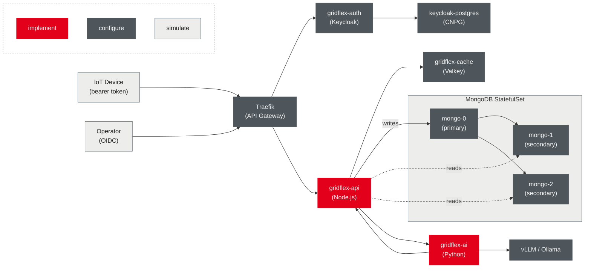

Exercise Track

<!-- .slide: data-name="Use Case" -->

---
<!-- ---------------------------------------------------------------------------------- -->
<!-- ---------------------------------------------------------------------------------- -->
# Use Case
<!-- ---------------------------------------------------------------------------------- -->
<!-- ---------------------------------------------------------------------------------- -->

Electricity grids were designed for stable, predictable generation 
- Renewables break that assumption

When solar and wind produce more than the grid needs
- Prices turn negative <comment>(&gt; 300h in Germany in 2024)</comment>
- Wind turbines and solar farms are curtailed, wasting clean energy
- Grid operators pay producers to switch off

When demand exceeds what renewables can deliver
- Grid frequency drops below 50 Hz, threatening stability
- Expensive gas peaker plants are activated within minutes

---
## Demand Response as a Service

EU Electricity Market Directive mandates demand response
- The market is opening by law
- Shift consumption to when grid needs it
- Grid operators pay GridFlex to balance the grid
- GridFlex takes platform fee and pays participants for their flexibility

Idea: Aggregate controllable loads
- Eg., Heat pumps, EV chargers, home batteries enroll once

Can report current power draw and available flexibility in real time
- Wallbox EV chargers can reduce power for 30 minutes without inconveniencing the user
- Heat pumps can pause for 15 minutes without affecting comfort

---
## How GridFlex Works: A Grid Event

Every 10 seconds each device sends telemetry
- Current power draw and available flexibility; gridflex-api caches the latest reading per device in Valkey

Example: grid frequency drops to 49.85 Hz
1. Grid operator: reduce 8 MW for 15 min at €50/MWh
2. gridflex-api: 423 heat pumps online with 8.3 MW total flexibility
3. Devices detect active event and throttle their consumption
4. All devices simultaneously confirm the throttling
5. After 15 minutes, the devices return to normal operation
6. Participants are credited for their flexibility

Event ends: devices return to normal; participants credited
- Revenue: 8.1 MW × 0.25 h × €50/MWh = €101.25 distributed in 15 minutes

---
## GridFlex:Cloud-Native Infrastructure

GridFlex has a working prototype and its first pilot customers
- Now it needs to grow and scale the platform accordingly

| Domain challenge                                              | Cloud-native mechanism required                          |
| ------------------------------------------------------------- | -------------------------------------------------------- |
| Millions IoT devices/second send telemetry                    | Horizontal scaling, HPA on API pods                      |
| Read-heavy telemetry queries must scale independently         | MongoDB StatefulSet with primary/secondary read routing  |
| Spiking load when a grid event triggers all devices           | Event-driven autoscaling with KEDA on Valkey queue depth |
| Grid events must reach all connected services without polling | Valkey pub/sub — no polling, no missed events            |
| Devices can forge telemetry; operators need a login           | Keycloak OAuth2 bearer tokens, Kong JWT validation       |
| Misbehaving devices can overload the API                      | Kong rate limiting plugin on the telemetry endpoint      |

---
## Why GridFlex Naturally Requires Cloud-Native Infrastructure

Every cloud-native concept in this course appears as a direct consequence of growth

| Domain challenge                                           | Cloud-native mechanism required                                                         |
| ---------------------------------------------------------- | --------------------------------------------------------------------------------------- |
| Regulators require audit trails for every market operation | Structured event logging <comment>(distributed tracing as optional extension)</comment> |
| An undetected outage means financial and grid risk         | Observability <comment>(metrics, dashboards, alerts)</comment>                          |
| Multiple teams deploy services independently               | Helm packaging with per-environment values files                                        |
| Operators need answers without writing database queries    | Function-calling SLM served via OpenAI-compatible API                                   |
| LLM inference must run on laptops for dev and GPUs in prod | Single Helm chart, device flag and resource limits differ                               |

---
## The Application: GridFlex

GridFlex evolves from single container to a full platform

---
## GridFlex: Domain Model

Core domain model

| Resource     | Key fields                                                                                        |
| ------------ | ------------------------------------------------------------------------------------------------- |
| Device       | id, name, type <comment>(heat_pump / ev_charger / battery)</comment>, capacity_kw, status, region |
| Telemetry    | device_id, timestamp, current_power_w, available_flexibility_kw                                   |
| GridEvent    | id, start_time, end_time, requested_flexibility_kw, price_eur_per_kwh, status                     |
| DeviceClient | client_id, device_id, scopes, rate_limit_rpm <comment>(registered in Keycloak)</comment>          |

<!-- .element: style="margin-left: 20px; width: 100%; font-size: 0.6em;" -->

API endpoints

| Method  | Path                       | Description                                                             |
| ------- | -------------------------- | ----------------------------------------------------------------------- |
| `GET`   | `/api/devices`             | List all registered devices                                             |
| `POST`  | `/api/devices`             | Register a new device                                                   |
| `GET`   | `/api/devices/:id`         | Get a single device                                                     |
| `PATCH` | `/api/devices/:id/status`  | Update device status <comment>(online / offline / responding)</comment> |
| `POST`  | `/api/telemetry`           | Submit a telemetry reading                                              |
| `GET`   | `/api/telemetry/:deviceId` | Get latest telemetry for a device                                       |
| `GET`   | `/api/events`              | List all grid events                                                    |
| `POST`  | `/api/events`              | Create a grid event                                                     |
| `POST`  | `/api/events/:id/confirm`  | Device confirms participation in a grid event                           |

<!-- .element: style="margin-left: 20px; width: 100%; font-size: 0.6em;" -->

---
<!-- ---------------------------------------------------------------------------------- -->
<!-- ---------------------------------------------------------------------------------- -->
# Exercise Script
<!-- ---------------------------------------------------------------------------------- -->
<!-- ---------------------------------------------------------------------------------- -->

---
## Manual App Deployment on IaaS

Configure and setup your environment
- Log into [DHBWCloud](https://stack.dhbw.cloud) <comment>(accessible from DHBW networks and VPN)</comment>
- Locate (or create) your public SSH key (cf. [this tutorial](https://docs.github.com/en/authentication/connecting-to-github-with-ssh))
- Upload your public SSH key to DHBWCloud

Run a simple [Node.js](https://nodejs.org) app in the cloud
- Create a VM with a public IP (Ubuntu 26,~ 2 vCPU & 4 GB RAM)
- SSH into the VM and install Node.js (`sudo apt update`; `sudo apt install -y nodejs npm`)

Create a simple Express app
- Listens on port 3000 and responds to `GET /` with "Hello GridFlex!" and the current date and time
- Test access by [curl-ing](https://curl.se/docs/tutorial.html) the public IP from your local machine

